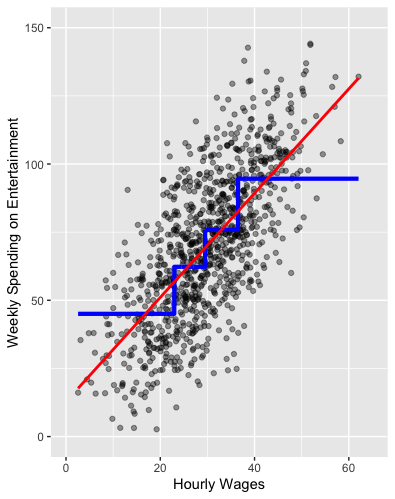

```{r setup, include=FALSE}
knitr::opts_chunk$set(echo = TRUE,error=TRUE,warning = FALSE,message = FALSE)
```

## Overview

So far, we've been using just the simple mean to make predictions. Today, we'll continue using the simple mean to make predictions, but now in a complicated way. Before, when we calculated conditional means, we did so in certain "groupings" of variables. When we run linear regression, we no longer need to do so. Instead, linear regression allows us to calculate the conditional mean of the outcome at *every* value of the predictor. If the predictor takes on just a few values, then that's the number of conditional means that will be calculated. If the predictor is continuous and takes on a large number of values, we'll still be able to calculate the conditional mean at every one of those values.

As an example, consider the following plot of weekly spending on entertainment (movies, video games, streaming, etc) as a function of hourly wages.


If we're asked to summarize the relationship between wages and spending, we could use conditional means. That's what the blue line above does: for each of the four quartiles of hourly wages, it provides the average spending on entertainment. We could expand this logic and include both more levels of hourly wages and other variables with which to calculate the mean-- for example, hourly wages and level of education. The problem is that this approach gives us lots of numbers back.

The graphic below fits a line (in red) to the data:



The line has the general function y=12+(2\*x). We're saying that if hourly wages were 0, the person would be predicted to spend 12 on entertainment (who knows where they got it). As hourly wages go up, the line predicts that weekly spending goes up \$2 for every \$1 increase in hourly wages. The line we fit to this data summarizes the relationship using just two numbers: the intercept (value of the y when x=0) and slope-- the amount that y increases as a function of x. We call the slope the *coefficient* on x.

The general model we posit for regression is as follows:

$$Y=\alpha+\beta_1 x_1 +\beta_2 x_2+ ... \beta_k x_k + \epsilon$$

It's just a linear, additive model. Y increases or decreases as a function of x, with multiple x's included. $\epsilon$ is the extent to which an individual value is above or below the line created. $\beta$ is the amount that $Y$ increases or decreases for a one unit change in $x$. $\alpha$ (sometimes referred to as $\beta_0$) is the intercept that tells the value of $Y$ when all the $x_1,\dots,x_k$ are equal to zero. With the simplifying assumption of linearity, we can summarize what we know about the relationship between the independent and dependent variable in a very parsimonious way. The trade-off is that an assumption of linearity may not always be warranted.

Note that this general model is the empiricist's **theory**. We have to make choices about what $x_1,\dots,x_k$ will be. For example, should we include wages and family structure into a model of spending on entertainment? Theoretically, we might think that, as your family gets bigger, you must spend more money on entertainment!

When we actually apply this model to data, we obtain **predictions** for both $Y$ *and* each of the $\beta$ parameters. We denote predicted values with a "hat": $\hat{Y}, \hat{\beta_1}$, etc. So how do we actually DO this? 

## College Data

We are going to go back to two previous datasets to get started. Our main focus will be on the college debt data from the beginning of the semester. Recall our previous work where we looked at the relationship between SAT scores and future earnings. All else equal, we expect that future earnings ($Y$) are positively related with SAT scores ($X$).

Let's load the data and packages first.

```{r}
require(tidyverse)
require(plotly)
sc_debt <- read_rds('https://github.com/jbisbee1/DS1000_S2024/raw/main/data/sc_debt.Rds')
```

Now let's look at our two variables of interest before we do anything else. Are these continuous? Categorical?

```{r}
sc_debt %>%
  select(sat_avg,md_earn_wne_p6)
```

As we can see, they both appear to be continuous measures, although we can see that many schools don't report the average SAT scores of their students. Let's use the `summary()` function to count how much missing data we are dealing with.

```{r}
summary(sc_debt %>% select(sat_avg,md_earn_wne_p6))
```

240 schools don't report the future earnings of their recent graduates, and a whopping 1,317 schools don't report SAT scores!

Let's now look at both variables with univariate plots.

```{r}
sc_debt %>%
  ggplot(aes(x = sat_avg)) + 
  geom_histogram()
```

```{r}
sc_debt %>%
  ggplot(aes(x = md_earn_wne_p6)) + 
  geom_histogram()
```

Both variables are mildly skewed, but not enough for us to worry about transforming them.

Now let's plot them as a scatter plot.

```{r}
sc_debt %>%
  ggplot(aes(x = sat_avg,y = md_earn_wne_p6)) + 
  geom_point()
```

As we can see just by looking at the data, there is a positive relationship, where schools with higher SAT averages produce recent graduates with higher median earnings. However, note that there are a few outliers. Let's use `plotly` to help is identify these outliers.

```{r}
p <- sc_debt %>%
  ggplot(aes(x = sat_avg,y = md_earn_wne_p6,text = instnm)) + 
  geom_point()

ggplotly(p)
```

The University of Health Sciences and Pharmacy in St. Louis produces really wealthy recent graduates, despite having a middle-of-the-pack SAT score! (Why might this be?)

Now let's overlay the line of best fit using `geom_smooth(method = 'lm')`. 

```{r}
sc_debt %>%
  ggplot(aes(x = sat_avg,y = md_earn_wne_p6)) + 
  geom_point() + 
  geom_smooth(method = 'lm')
```

This line tells us that, on average, schools with average SAT scores of 1,000 produce recent graduates with incomes of roughly $30,000 annually.

Similarly, schools with average SAT scores of 1,400 produce graduates with median incomes of roughly $45,000.

# The Linear Regression Model

Under the hood, `ggplot` is using a specific function to draw this line called the `lm()` function, which stands for "linear model". The function is choosing values of $\alpha$ and $\beta$ that minimize the errors for every school in the dataset. We can access this function directly ourselves!

The `lm()` function takes two inputs that we must define. The first is the `formula`, and the second is the `data`.

The `formula` is literally just us writing the regression equation from above, but in terms `R` can understand. It takes the format of `Y ~ X`, which means $Y = \alpha + \beta X$. (We don't need to tell `R` about $\alpha$ and $\beta$ in the `formula`...it calculates these values for us.)

In our setting, we want to set $Y$ to `md_earn_wne_p6` and $X$ to `sat_avg`, just like we drew them on the axes in our plot. Thus our formula becomes `md_earn_wne_p6 ~ sat_avg`. We also need to tell `R` which data we are using, in this case our `sc_debt` object. We then save the entire regression model to an object, that I'll call `model_earn_sat`

```{r}
model_earn_sat <- lm(formula = md_earn_wne_p6 ~ sat_avg,data = sc_debt)
```

We can then look at the model results using the `summary()` function.

```{r}
summary(model_earn_sat)
```

The model gives us a lot of information. The results tell us that the `(Intercept)` (which is the same as $\alpha$ in our theory equation, and $\hat{\alpha}$ in our results) is equal to -12054.87, and that the `sat_avg` (which is the same as $\beta$ in our theory equation, and $\hat{\beta}$ in our results) is equal to 42.60. 

Substantively, we interpret these as follows:

- If a school has an average SAT score of 0, its recent grads are predicted to have median earnings of -$12,053.87.
- For each additional point the school has in terms of average SAT scores, its recent grad earnings are predicted to increase by $42.60.

Obviously, the $\alpha$ value (the `(Intercept)`) is somewhat meaningless. There are no schools whose average SAT scores are zero...the minimum possible SAT score can't even be zero!

But the $\beta$ value is very interesting and directly speaks to the research question, theory, and hypothesis! According to this model, each additional point on the SATs yields an increase in earnings of $42! 

# Reading a Regression Table

There are many other numbers in this table, including the Standard Error (`Std. Error`), the t-statistic (`t value`), and the p-value (`Pr(>|t|)`). It turns out that the t-statistic is just the coefficient (`Estimate`) divided by the standard error (`Std. Error`), and the p-value is a way of converting the t-statistic into a measure of uncertainty! You don't need to know these steps in detail for this course. However, you do need to remember that the p-value is just 1 minus the confidence level. The smaller the p-value, the **more** confident we are that the $\beta$ coefficient is not zero (i.e., that there is a relationship). 

In this case, the p-value is basically zero, meaning we are basically 100% confident that the relationship between `md_earn_wne_p6` and `sat_avg` is positive!

# Another Example

Let's ask a different research question: what is the relationship between future earnings and the admissions rate?

**Theory**: Can you come up with a theory? I would assume that more selective schools have more rigorous training, which then leads to wealthier recent graduates.

**Hypothesis**: What is your hypothesis? Mine is that the relationship between the admissions rate and future earnings is *negative*.

Let's test it!

First, we want to again look at both univariate and multivariate visualizations of our $Y$ and $X$ variables.

```{r}
sc_debt %>%
  ggplot(aes(x = adm_rate)) + 
  geom_histogram()
```

```{r}
sc_debt %>%
  ggplot(aes(x = md_earn_wne_p6)) + 
  geom_histogram()
```

As above, there is some mild skew, but nothing to be too worried about.

Let's also check on missingness, just so we know how many schools we **don't** have in our data.

```{r}
summary(sc_debt %>% select(md_earn_wne_p6,adm_rate))
```
As above, 240 schools don't report recent graduate earnings, and almost 1,000 don't report on their admissions rate! This is an important aspect of the data to recognize, since it limits how generalizable our conclusions might be.

Now let's plot the multivariate relationship.

```{r}
sc_debt %>%
  ggplot(aes(x = adm_rate,y = md_earn_wne_p6))+ 
  geom_point() + 
  geom_smooth(method = 'lm')
```

We find some evidence of a downward sloping relationship, although it is less steep than what we saw with SAT scores.

Now let's run the regression again. What do you conclude? How confident are you in this conclusion?

```{r}
# INSERT CODE HERE
```


