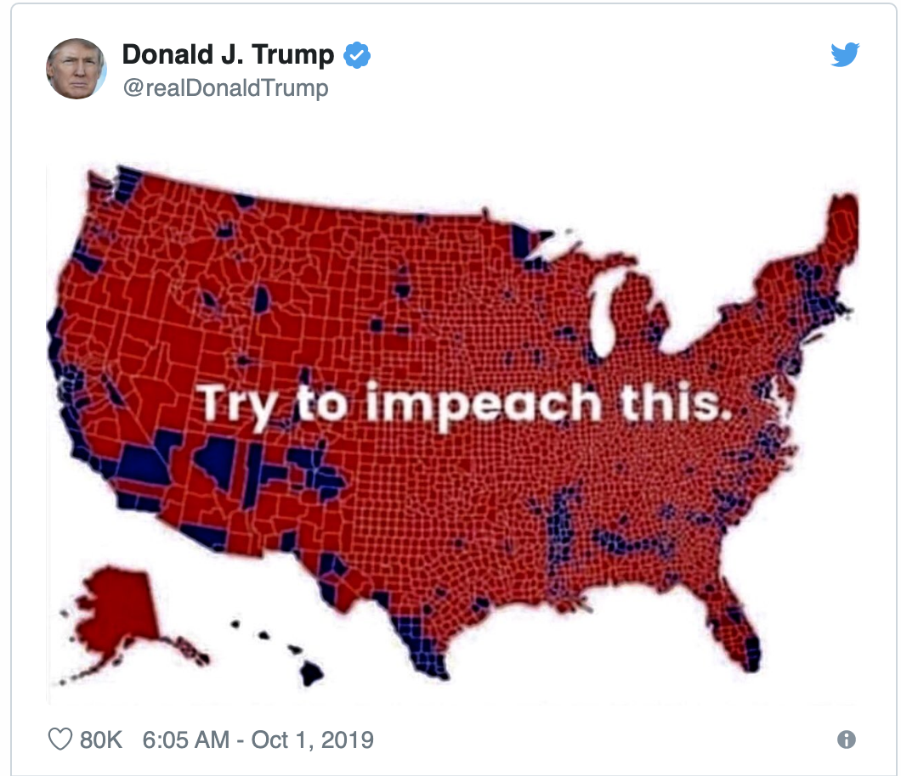
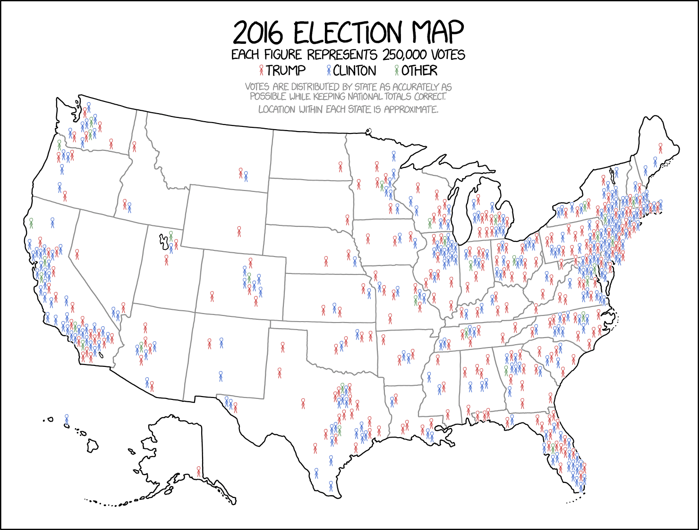

#   Today

- Maps in `ggplot` (one way).
- Animations in R (using maps)

# Maps in R

There are several packages that let you do maps in R.  Let us use one called `maps`.

```{r}
#install.packages("maps")   # Install this if you don't already have it!
library(maps)
library(tidyverse)
#install.packages("magick") 
library(magick)
```

- This package contains the data needed to produce a map that we extract using the function `map_data`.
- The dimensions of `states48` are large because this is an object that contains the points of latitude and longitude needed to draw the map.

```{r}
states48 <- map_data("state")
dim(states48)
states48[1,]
```

```{r}
counties48 <- map_data("county")
dim(counties48)
```

```{r}
worldpac <- map_data("world")
dim(worldpac)
```

Now let's plot.  Notice I have changed some things when defining the R chunk.

```{r fig.height=4, fig.width=4, fig.align='center'}
states48 %>%
  ggplot() + 
  geom_polygon(aes(x=long, y=lat, group=group),
                color="black", 
                fill="lightblue") +
  coord_fixed()
```

*Quick Exercise* Produce a map of US Counties

```{r}
counties48 %>%
  ggplot() + 
  geom_polygon(aes(x=long, y=lat, group=group),
                color="black", 
                fill="lightblue") +
  coord_fixed()
```

We can also plot the entire world.

```{r}
worldpac %>%
  ggplot() + 
  geom_polygon(aes(x=long, y=lat, group=group),
                color="black", 
                fill="lightblue") +
  coord_fixed() 
```

Note that all of our `ggplot` tools still apply.  So we can set limits and breaks.  So if we want to exclude Antarctica and remove the axes labels

```{r}
worldpac %>% 
  ggplot() + 
  geom_polygon(aes(x=long, y=lat, group=group),
                color="black", 
                fill="lightblue") +
  coord_fixed() +
  labs(x="",y="",title = "World Map") +
  scale_y_continuous(limits=c(-55,90),labels=NULL,breaks=NULL) +
  scale_x_continuous(labels=NULL,breaks=NULL)
```

Can use limits to focus your attention.  Try changing the limits yourself and see how things change. If you exclude points included in an object being plotted by your choice of limits, things can look weird. To see this, make the limits used below smaller and see what happens.

```{r}
worldpac %>%
  ggplot() + 
  geom_polygon(aes(x=long, y=lat, group=group),
                color="black",
                fill=NA) +
  coord_fixed() +
  labs(x="",y="",title = "Africa") +
  scale_y_continuous(limits=c(-35,41),labels=NULL,breaks=NULL) +
  scale_x_continuous(limits=c(-20,52),labels=NULL,breaks=NULL)
```

But this is not ideal. Better would be to use our wrangling skills to select the states we wish to plot.

```{r}
mystates <- states48 %>%
            filter(region=="new york" | region=="new jersey" | region=="california" | region == "tennessee")
```

```{r}
mystates %>%
  ggplot() + 
  geom_polygon(aes(x=long, y=lat, group=group),
                color="black", 
                fill="lightblue" ) + 
  labs(y = "",x = "",title="States I have lived in") + 
  scale_x_continuous(breaks=NULL, labels=NULL) + 
  scale_y_continuous(breaks=NULL, labels=NULL) + 
  coord_fixed() + 
    theme(
    panel.border = element_blank(),
    panel.background = element_blank(),
    panel.grid.major = element_blank(),
    panel.grid.minor = element_blank()
    ) 
```


# Creating the canvas

- The map is drawn using `geom_polygon` which uses the `long` and `lat` to draw the points in `ggplot`. 
- Note that the default is pretty ugly (and distracting)

```{r}
states48 %>%
  ggplot() + 
  geom_polygon(aes(x=long, y=lat, group=group),
                color="black", 
                fill="lightblue" )
```

Let's clean in up and save it as an object to be used later.  (Note that we can create a custom theme to apply to a `ggplot`)

```{r}
plotmap <- states48 %>%
  ggplot() + 
  geom_polygon(aes(x=long, y=lat, group=group),
                color="black", 
                fill="lightblue" ) + 
  labs(y = "") + 
  labs(x = "") + scale_x_continuous(breaks=NULL, labels=NULL) + 
  scale_y_continuous(breaks=NULL, labels=NULL) + 
    theme(
    panel.border = element_blank(),
    panel.background = element_blank(),
    panel.grid.major = element_blank(),
    panel.grid.minor = element_blank()
    )

plotmap
```

# Get Some Data!

Load in our data

```{r}
PollDat <- read_rds(file="https://github.com/jbisbee1/DS1000_F2024/raw/main/data/PresStatePolls04to20.Rds") %>%
  rename(region=state.name)
```

Now mutate it and group it to have the observation be a state-year.

```{r}
PollDat <- PollDat %>%
  group_by(year,region) %>%
      summarize(DemPct = mean(dem.poll, na.rm = TRUE),
                RepPct = mean(rep.poll, na.rm = TRUE),
                DemVote = first(dem.vote),
                RepVote = first(rep.vote),
                region = first(region))
```

Now pull out 2020 vote to start

```{r}
polls2020 <- PollDat %>%
  filter(year == 2020)
```


First, some wrangling.  

- `inner_join()` merge dataframes if common in both (must have same name)

- `full_join()` merge dataframes if in either

(There is also a `left_join` (all observations from the 1st tibble), a `right_join` (all observations from second tibble), an `anti_join` (all unmatched observations))

```{r}
inner.join <- inner_join(states48,polls2020)
glimpse(inner.join)
```

```{r}
full.join <- full_join(states48,polls2020)
glimpse(full.join)
```

So let's actually do the tibble we want?

```{r}
states48.join <- inner_join(states48,polls2020)
glimpse(states48.join)
```

First, Produce a map that indicates predicted winners depending on the average polling done in each state using different polygons.

```{r}
plotmap + 
  geom_polygon(data=states48.join, 
               aes(x=long, y=lat, group=group)) + 
  geom_polygon(data=filter(states48.join,DemPct > RepPct), 
               aes(x=long, y=lat, group=group),fill="Blue") +
  geom_polygon(data=filter(states48.join,DemPct < RepPct), 
               aes(x=long, y=lat, group=group),fill="Red") 
```

But we can do the same thing using `fill` -- here defined to be which candidate is larger.

```{r}
statewinner <- plotmap + 
  geom_polygon(data=states48.join, 
               aes(x=long, y=lat, group=group,
                   fill=DemPct > RepPct),
               color="white", size = .1) 

statewinner
```

- We can also add more nuanced information by denoting the location of states where the predicted margin is less than 5 -- i.e., very close.
- Because we are adding on top of the canvass we are just "repainting" the impacted states.

```{r}
statewinner +
  geom_polygon(data=filter(states48.join,
               DemPct > RepPct & DemPct - RepPct < 5), 
               aes(x=long, y=lat, group=group),
               fill="light blue") + 
  geom_polygon(data=filter(states48.join,
               DemPct < RepPct & RepPct - DemPct < 5), 
               aes(x=long, y=lat, group=group),
               fill="pink") 
```

*Quick Exercise* Can you plot the location of "Blow out" states using a different color?  How do you define "blow-out" states?

```{r}
# INSERT CODE HERE
```

Note that we could also use this to define a subset of the states to be plotted!

*Quick Exercise* Can you plot _just_ the close states?  HINT: first filter based on closeness, then plot.

```{r}
# INSERT CODE HERE
```


# Using Fill as a variable

- Instead of using different colors to define categories of difference we can also use the `fill` to try to convey information about the variation of continuous differences -- e.g., the level of support.

NOTE THAT `fill` is an aesthetic (and included in `aes`) when it varies!

```{r}
plot1 <- plotmap + 
  geom_polygon(data=states48.join,
               aes(x=long, y=lat, group=group,
                   fill=DemPct/100),
               color="WHITE", size = .1)

plot1
```

This is the default.  Ugly.

And we can also define the scale in terms of the color associated with the min and max values.
```{r}
plot1 + scale_fill_continuous(name="Biden Pct", 
                      low = "Red", high = "Blue")
```


# Changing the Geography: plotting counties

_OPTIONAL_ Here is some code that I used to create the `countycovid.Rds` file we are using.  We are not going to cover it in class, but I wanted to show you what I did -- and what you could also do -- using the tools we have talked about (and a slight extension using the `stringr` library to parse a string variable and separate it into 2 string variables).

Let's grab the data from out plotting assignment that had votes and pandemic information at the county level.  Need to change the county fips code (a standard unqiue identifier used by the US Government to identify counties) to numeric.

```{r,eval=F}
covidvote <- read_rds(file="https://github.com/jbisbee1/DS1000_F2024/raw/main/data/COVID.Death.Voting.Rds") 
covidvote <- covidvote %>%
  mutate(fips = as.numeric(fips.code))
```

Now join `covidvote` with a dataset in `maps` that connects the county name to the fips code for merging.  Then parse this and break it apart.

```{r,eval=F}
covidvote <- inner_join(covidvote,county.fips)
library(stringr) 
covidvote <- covidvote %>%
  mutate(region = word(polyname,1,sep=","),
         subregion = word(polyname,2,sep=","))

countycovid  <- inner_join(covidvote,counties48)
```


_LECTURE COVERAGE STARTS HERE:_

Load in the data!

```{r}
countycovid <- read_rds(file="https://github.com/jbisbee1/DS1000_F2024/raw/main/data/countycovid.Rds")
```

Now lets just see what happens if we plot.

```{r}
countycovid  %>%
  ggplot() +
    geom_polygon(aes(x=long, y=lat, group=group),
                 color="black",
                fill="lightblue" )
```

Let's plot the number of deaths in each county using `deaths` as the `fill`.  Note we are using `scale_fill_continuous` to refine the default colors being using.

```{r}
countycovid %>%
  ggplot() +
    geom_polygon(aes(x=long, y=lat, group=group, 
                fill=deaths),
                color="black")
```

Maybe we should remove the county buondaries as they take up so much of the graphic.

```{r}
countycovid %>%
  ggplot() +
    geom_polygon(aes(x=long, y=lat, group=group, 
                fill=deaths)) + 
  scale_fill_continuous(name="Deaths", 
                      low = "white", high = "red")
```

If we want to focus on a particular state, recall that we can filter!

```{r}
countycovid %>%
  filter(region =="new york") %>%
  ggplot() +
    geom_polygon(aes(x=long, y=lat, group=group, 
                fill=deaths),
                color="black") +
    scale_fill_continuous(name="COVID Deaths", 
                      low = "white", high = "red")
```

If we want to make the fill a different function -- say the number of deaths per 100k in the population all we need to do is to first mutate, then plot!

```{r}
countycovid %>%
  mutate(death100k = 100000*(deaths/population)) %>%
  ggplot() +
    geom_polygon(aes(x=long, y=lat, group=group, 
                fill=death100k)) +
      scale_fill_continuous(name="COVID Deaths per 100k", 
                      low = "white", high = "red")
```

We can also change the variables. If we want to avoid the pandemic and instead plot the percentage of votes Trump received in each county we can mutate and plot!


```{r}
countycovid %>%
  mutate(TrumpPct = trump.votes/turnout.2020) %>%
    ggplot() +
    geom_polygon(aes(x=long, y=lat, group=group, 
                fill=TrumpPct)) +
  scale_fill_continuous(name="Trump %",
                        low = "blue", high = "red")
```


*Quick Exercise* Can you plot the county-level vote for just the states of Georgia, North Carolina, and Virginia?

```{r}
# INSERT CODE HERE
```

#   Now let's do this over time!

```{r}
PollDat <- read_rds(file="https://github.com/jbisbee1/DS1000_F2024/raw/main/data/PresStatePolls04to20.Rds") %>%
  rename(region=state.name)
```


```{r}
PollDat <- PollDat %>%
  group_by(year,region) %>%
      summarize(DemPct = mean(dem.poll, na.rm = TRUE),
                RepPct = mean(rep.poll, na.rm = TRUE))
```

```{r}
states48.join.hist <- inner_join(states48,PollDat)
states48.join.hist[1,]
```

```{r}
plotmap +
  geom_polygon(data=filter(states48.join.hist), 
               aes(x=long, y=lat, group=group)) + 
  geom_polygon(data=filter(states48.join.hist,year==2008 & (DemPct > RepPct)), 
               aes(x=long, y=lat, group=group),fill="Blue") +
  geom_polygon(data=filter(states48.join.hist,year==2008 & (DemPct < RepPct)), 
               aes(x=long, y=lat, group=group),fill="Red") +
  labs(title = "2008 Election")
```

```{r}
plotmap +
  geom_polygon(data=filter(states48.join.hist), 
               aes(x=long, y=lat, group=group)) + 
  geom_polygon(data=filter(states48.join.hist,year==2012 & (DemPct > RepPct)), 
               aes(x=long, y=lat, group=group),fill="Blue") +
  geom_polygon(data=filter(states48.join.hist,year==2012 & (DemPct < RepPct)), 
               aes(x=long, y=lat, group=group),fill="Red") +
  labs(title = "2012 Election")
```


Let's create an animated GIF!  We are going to do a map of the elections over time

```{r}
e2004 <- plotmap +
  geom_polygon(data=filter(states48.join.hist), 
               aes(x=long, y=lat, group=group)) + 
  geom_polygon(data=filter(states48.join.hist,year==2004 & (DemPct > RepPct)), 
               aes(x=long, y=lat, group=group),fill="Blue") +
  geom_polygon(data=filter(states48.join.hist,year==2004 & (DemPct < RepPct)), 
               aes(x=long, y=lat, group=group),fill="Red") +
  labs(title = "2004 Election")
ggsave(filename = "e2004.png", plot=e2004,width=5,height=5,units="in",scale=1)
p2004 <- image_read("e2004.png")
```

Now get the rest of the years

```{r}
e2008 <- plotmap +
  geom_polygon(data=filter(states48.join.hist), 
               aes(x=long, y=lat, group=group)) + 
  geom_polygon(data=filter(states48.join.hist,year==2008 & (DemPct > RepPct)), 
               aes(x=long, y=lat, group=group),fill="Blue") +
  geom_polygon(data=filter(states48.join.hist,year==2008 & (DemPct < RepPct)), 
               aes(x=long, y=lat, group=group),fill="Red") +
  labs(title = "2008 Election")
ggsave(filename = "e2008.png", plot=e2008,width=5,height=5,units="in",scale=1)
p2008 <- image_read("e2008.png")

e2012 <- plotmap +
  geom_polygon(data=filter(states48.join.hist), 
               aes(x=long, y=lat, group=group)) + 
  geom_polygon(data=filter(states48.join.hist,year==2012 & (DemPct > RepPct)), 
               aes(x=long, y=lat, group=group),fill="Blue") +
  geom_polygon(data=filter(states48.join.hist,year==2012 & (DemPct < RepPct)), 
               aes(x=long, y=lat, group=group),fill="Red") +
  labs(title = "2012 Election")
ggsave(filename = "e2012.png", plot=e2012,width=5,height=5,units="in",scale=1)
p2012 <- image_read("e2012.png")

e2016 <- plotmap +
  geom_polygon(data=filter(states48.join.hist), 
               aes(x=long, y=lat, group=group)) + 
  geom_polygon(data=filter(states48.join.hist,year==2016 & (DemPct > RepPct)), 
               aes(x=long, y=lat, group=group),fill="Blue") +
  geom_polygon(data=filter(states48.join.hist,year==2016 & (DemPct < RepPct)), 
               aes(x=long, y=lat, group=group),fill="Red") +
  labs(title = "2016 Election") 
ggsave(filename = "e2016.png", plot=e2016,width=5,height=5,units="in",scale=1)
p2016 <- image_read("e2016.png")

e2020 <- plotmap +
  geom_polygon(data=filter(states48.join.hist), 
               aes(x=long, y=lat, group=group)) + 
  geom_polygon(data=filter(states48.join.hist,year==2020 & (DemPct > RepPct)), 
               aes(x=long, y=lat, group=group),fill="Blue") +
  geom_polygon(data=filter(states48.join.hist,year==2020 & (DemPct < RepPct)), 
               aes(x=long, y=lat, group=group),fill="Red") +
  labs(title = "2020 Election") 
ggsave(filename = "e2020.png", plot=e2020,width=5,height=5,units="in",scale=1)
p2020 <- image_read("e2020.png")
```

Now let's put the plots together and save as a GIF.  We then want to open the GIF in a browser to see what we got.

```{r}
img <- c(p2004,p2008,p2012,p2016,p2020)
image_append(image_scale(img, "x100"))

my.animation<-image_animate(image_scale(img, "600x600"), fps = 1, dispose = "previous")
image_write(my.animation, "PollingPredictions.gif")
```

*Quick Exercise* The data also has information on the actual votes that were received: `rep.vote` and `dem.vote` for the states in which a poll was recorded.  Can you use that to create a map of what actually happened?

```{r}
# INSERT CODE HERE
```

*Quick Exercise* The data also has information on the actual votes that were received: `rep.vote` and `dem.vote` for the states in which a poll was recorded.  Can you use that to create a map of state-level polling error?

```{r}
# INSERT CODE HERE
```

# Do we need/want a map?






- But how much better is this than a histogram?  Does the geography really matter here?  

- Why a histogram and not a barplot?  What would a barplot look like?

```{r, echo=FALSE, warning=FALSE}
polls2020 %>% ggplot() + 
  scale_x_continuous(breaks= seq(30,70,by=5)) +
  labs(x="Biden Polling Average in State",
       y="Number of States",
       title="2020 Biden Overall Polling Average Across States") +
    geom_histogram(mapping = aes(DemPct), fill = "blue", binwidth=2.5)
```
