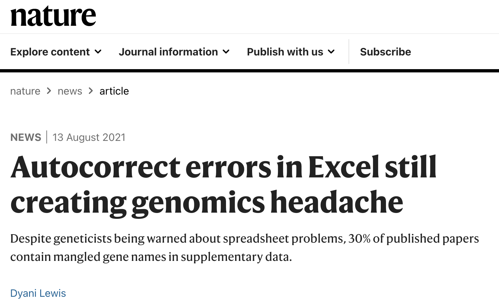

# Learning Objectives

- Review: how to get data into R?

- What is "wrangling" and how do we do it?

- Fun with pipes in R: `%>%` ("and then")

- Functions: `filter` , `select` , `mutate` , `summarize`, `arrange`, `count`

- Applications: 2020 National Election Poll Michigan Exit Poll 


## Data Wrangling?

{scale=50%}

*Data Wrangling:* The process of getting the data ready for analysis, including: accessing data, reformatting in appropriate ways (format, orientation), creating variables, recoding values, and selecting variables and/or observations of interest for analysis.

How you process and recode data is critical!  Primciples that should guide us include:

- *Replication:* Can others do what you did? Art depends on _personality_, science depends on _replication_.

- *Understanding:* Can others understand what you did and why?  Can you follow what you did if you come back to the code in a year?

We want to do things that are understandable and sensible.  Always imagine that you are handing the code off to someone else -- can they understand what you are doing? Can they follow what you have done to the data?  The goal in data wrangling is to provide a set of steps that will take you from the raw data to the data being analyzed in clear and understandable steps so that others can see exactly the choices that you have made (and make other choices if desired to see the robustness of your inferences).

- *Robustness:* Does your code "break" easily? You cannot (easily) fix in your analysis what you screw up in your data! (Especially if you are unaware!)

Data wrangling in R gives us the ability to do this because we can document and explain the exact steps we are taking to organize the data. Using code to make changes means anyone and everyone can observe what we did. 

{width=50%}

In contrast, if you make changes to your data in a spreadsheet like Excel or Google Sheets or Numbers it can be impossible for someone else to figure out what you did.  What variables did you rename, what transformations did you do, how did you recode values?  

People using Excel for analysis have been identified as being (partially) responsible for what is widely believed to be a [failed global economic policy](https://www.washingtonpost.com/news/wonk/wp/2013/04/16/is-the-best-evidence-for-austerity-based-on-an-excel-spreadsheet-error/).  

{width=50%}

And using Excel for data entry has resulted in well-documented errors in [Medical Research](https://www.nature.com/articles/d41586-021-02211-4) due to "auto-correct" changing value names.

{width=50%}

In fact, Dr. Jennifer Byrne - named a top 10 person in science in 2017 because of her data sleuthing in [2017](https://www.nature.com/immersive/d41586-017-07763-y/index.html) has developed an entire program to find and correct errors produced by data entry in Excel! Link [here](https://www.eurekalert.org/news-releases/810347).

{width=50%}

So the goal of this topic is to give you some basic tools to be able to manipulate data and get it ready for analysis.  This includes inspecting your data and getting a sense of the type of data you have.

## RECAP: Starting out

When you start out (in this class) it is always a good idea to have a clean -- i.e., empty -- workspace so that your analysis is based on the code that you are doing rather than some manipulations that were done previously.  Do not be one of those students at the end of the class who has every dataset they worked with in class saved and loaded in their Environment. 

If you are starting out with an empty workspace your R Studio should say the "Environment is empty" in the Environment tab. it is always a good idea to always start with an empty environment because the data manipulations we are doing will not be cumulative.  

{width=50%}

To that end, when you quit RStudio, **DO NOT** save workspace image.  This will ensure that you are always starting with a clean and empty workspace which means that there is never a possibility of using "old" data in your analyses. If you are working on a larger project across several sessions it sometimes makes sense to save it, but for this class you should get in the practice of writing self-contained code that reads and wrangles the data you need to analyses every time rather than relying on earlier work.

{width=25%}

When starting out it can be easy to forget that R needs to be told where to look to find things!

1. For **every** assignment/lecture create a new folder on your computer (e.g., "Topic 3").  
2. Download the code and data into this folder. (Or move them from the Download folder to that folder).  Or create a new RMarkdown file and  _save_ the code to this folder.  

3. In the Console window of RStudio figure out where R thinks it is by looking at the title bar or using `getwd` (get working directory)!

```{r}
getwd()
```
If this is different than where your code and data is there will be trouble!

Because R is object-oriented, we can actually save this as an object and use it!

```{r}
mydir <- getwd()
```


4. Manually set the working directory to be the directory where your code and data is located using `setwd` (set working directory) and the location we just saved to the object `mydir`!

```{r, eval=FALSE}
setwd(mydir)
```

We can also use RStudio to accomplish the same task.

1. Open your code in R-Studio.

2.  {width=50%}

3. The GUI will automatically change the directory, but you should also copy and paste the resulting code snippet in Console to your code!

**Warning!**

What R "sees" when working in the Console window (or using an R Script) is different from what it "sees" using RMarkdown! You can `Knit` a RMarkdown document to conduct analysis without any object ever appearing in the Global Environment.

- Knitting RMarkdown (*.RMD) files does _not_ create tibbles/objects in the Global Environment!

*Quick Exercise*  Clear out the Global Environment and `Knit` this document.  Confirm that the code will run and nothing will be created in the Global Environment.

While this makes sense once the code/project is completed, it can make coding more difficult because we often want to be able to manipulate the code and objects while working.  To do so we are going to write and evaluate chunks one-at-a-time to ensure the objects are created in the Global Environment.

So getting started we _always_ start our code by:

1. Loading the `tidyverse` library and any other libraries we are going to use.

```{r, message=FALSE}
library(tidyverse)
```

2. Checking to sure that R is looking in right spot to find your data and code.  It typically makes sense to `setwd` to tell R where in your computer it should be looking for additional data (and code).

```{r, eval=FALSE}
getwd()
setwd()
```

3. Now get that data!  One method is to use the Graphical User Interface (GUI) to select menus that will find and read in the data of interest.  If you are getting data from some other format (e.g., data saved in a basic text format (comma or tab delimted) or in another statistical package (e.g., STATA or SAS)) we want to `Import Dataset`.  

{width=50%}
If you are loading in data that is already formatted in R then you go to the RStudio menu: `File > Open File...`.  (Note that this menu also has the `File > Import Dataset` option.) 

Because we want to document what dataset we are using, for replicability we want to copy and paste the resulting code into our RMarkdown file so that next time we can run the code directly!

A second way to access data is to use some functions directly in R.  This is what the GUI is actually doing behind the scenes.  We are going to focus on three functions in this class:
- `load`
- `read_rds`
- `url`

A `tidyverse` function we will sometimes use is `read_rds` (Read R Data Structure).  This will load a single object into memory.  Here we are reading in a subset of the 2020 Michigan Exit Poll and naming it the tibble `mi_ep`.  

```{r}
mi_ep <- read_rds("../data/MI2020_ExitPoll_small.rds")
```

The first part of the code is defining a new object called `mi_ep` (short for Michigan exit poll) and then assigning (`<-`) that object to be defined by the dataset being read in by the `read_rds` function. 

To highlight the syntax, consider what happens when you run the following code?

```{r, eval= FALSE}
read_rds("../data/MI2020_ExitPoll_small.rds")
```

If we read in data without assigning it to an object R will simply print the results to the console window.  Nothing will be saved and we cannot use the data in future analyses!  When reading in an R data object using `read_rds` we always need to define a new object associated with that file!

Before moving on, let's clean up our Environment -- always a good idea between lectures and assignments! -- using either the broom icon in the Environment GUI to delete every object or the `rm` (remove) command to remove specific objects.  Since we only have one object in our Environment so far we can use `rm` to remove it.

```{r}
rm(mi_ep)
```

A nice thing about R is that it can have multiple objects in the Global Environment at the same time. This allows you to work with multiple datasets and objects.  Instead of loading them all into memory one at a time using `read_rds`, we can also use the `load` function to load several R objects that have been saved into a single file (using the `save` function) all at once.  

In the file named `MI2020_ExitPoll.Rdata` I have previously saved the entire 2020 Michigan Exit Poll (the object named `MI_final`) as well as a subset of the exit poll that focuses on variables we are going to analyze in class (named `MI_final_small`).  To give you a chance to do your own analyses, I have saved both files together so you can access either one.

Note that when we are `load`ing an `.Rdata` file we **do not** need to assign it to an object because the objects are already defined within the `.Rdata` object.  You can see this when you use the `objects` function to print to the console window the objects that are loaded into memory (which will also match the Global Environment list when we run the code chunk-by-chunk):

```{r}
load(file = "../data/MI2020_ExitPoll.Rdata")
objects()
```

Relatedly, because we are loading several objects at once the name of the file will not be the same as the name of the objects being loaded.

NOTE: R will look for this file relative to where it is (as is given by `getwd`). Here I have created a `data` folder located within the current directory and telling R to look for my data in that folder!

We can also read in non-R files. For example, we can read in comma-delimited files (`read.csv`), tab-delimited files (`read.delim`), Excel-created files (`read.xls`, `read.xlsx`), and files from other statistical languages (e.g., `read.dta`, `read.sav`). Reading in non-R objects/data requires reading in the data and also assigning the data to a new R object.

# Trouble with tibbles?

- Data objects in `tidyverse` are called `tibbles`.  Why?  As with most things, it seems Twitter is to blame...

{width=50%}


- `tibbles` can be thought of as a matrix with rows and columns and we can extract the dimensions of the data using the `dim` (dimensions) command where the output is a vector of length two consisting of the number of rows -- here `r dim(MI_final_small)[1]` and then the number of columns `r dim(MI_final_small)[2]`.

```{r}
dim(MI_final_small)
```

In most of the work that we will do in DSCI 1000 rows typically refer to observations -- e.g., survey respondents -- and columns refer to characteristics of those observations (e.g., survey responses) which we call variables.

We can use matrix indexing to examine/extract specific rows and columns of tibbles/dataframes.  To select the first three rows we would use:

```{r}
MI_final_small[1:3,]
```
To select the first three columns...

```{r}
MI_final_small[,1:3]
```

Selecting the first two rows and first four columns

```{r}
MI_final_small[1:2,1:4]
```

Selecting a collection/combination of rows and all columns we would use:

```{r}
MI_final_small[c(1:2,45,100),]
```

# Outline for the Next Few Lectures

- Introduce some basic tools and techniques to answer a series of questions relevant for politics, political science, society, etc.

- Think about the data we have available data and its' limitations!

- Enable you to be the next political-media star.

# 2020 MI Exit Poll

To do our data wrangling we are going to wrangle the 2020 National Exit Poll from the National Election Pool in the state of Michigan.

- We are going to use the actual data we got on Election Night!  

- To answer some of the same questions we were answering.

- But not much has been cleaned up since then so lots of work to do! (Ugh...)

# Exit Polls in US Elections

Exit polls are polls that are done on (or immediately before) elections in the United States.  They are used to help interpret the meaning of an election -- i.e., why voters voted the way they did, whether some types of voters were more likely to support one candidate over the  other, etc. -- but intelligent prognosticators do not use them to actually project who is going to win.  Put differently, they are used to help intepret an election, but they are not used to predict it (which is what voting data is used for).

{width=50%}

In class we are goign to focus on an Exit Poll from the National Election Pool for the state of Michigan.  Michigan is increasingly thought of as a ``swing state" that could be won by either a Democrat or a Republican in a presidential contest following is surprising support for President Trump in the 2016 presidential election.  Michigan is also a rather diverse state in terms of its population and interests and some have worked to identify groups of like-minded voters within the state.  (Note that we will also do this when we get to the "clustering" topic!)

{width=50%}

The Exit Poll data we will analyze is based on the following questionaire that reports the precise questions that were asked, as well as the value labels associated with each response.  So while the data that we will read in will have responses that are coded as a "1" or "3" or "4", interpreting the meaning of those values requires comparing the values to the questions below.

{width=50%}

#    Lots of interesting questions!

*Predictive:* Use the data to _predict_ an outcome of interest.

- How many voters report voting for Biden vs. Trump?
- What predicts who supports Trump? And Biden?

*Descriptive:* Use the data to _describe_ an event.

- How did the support for Trump and Biden vary by: gender? race? age? education?
- When did they make up their minds?
- _Why_ did voters choose to vote for Trump? Or Biden?
- How do Trump and Biden voters vary in their opinions toward: COVID? Race relations?

THINKING: Is any of it *causal*?  Can we determine what causes a voter to support a candidate from this data?

Whenever we do anything using data we should first inspect our data to make sure it makes sense. The function `glimpse` gives us a quick summary by printing the first few observations of every variable to the screen.  Note that the presentation of the data is flipped (technically transposed) so that the columns are presented as rows.

```{r}
glimpse(MI_final_small)
```

This is a useful representation as we can immediately see what variables we have as well as what some of the values are.  Here, for example, we see that we have missing data -- denoted as `NA` in R - in quite a few variables.  We also see that some variables have numbers for values while others have strings of letters (e.g., `QLT20`, `preschoice`).

This variation highlights the fact that there are several types of data:

1. `<dbl>` Double.  "Numbers as a number." Numbers stored to a high level of scientific precision. Mathematical operations are defined. (At least in theory!) e.g., `SEX`

2. `<int>` Integer.  "Numbers as a number." Mathematical operations are defined. (At least in theory!) R treats `<dbl>` and `<int>` as largely interchangeable.

3. `<chr>` Character.  A variable with letter and/or number values.  Mathematical operations are _not_ defined, but other functions exist (e.g., extract the first and last characters, etc.) e.g., `preschoice`

4. `<fct>` Factor.  A variable defining group membership. Mathematical operations are _not_ defined, but they can be used in special ways in R. e.g. `QLT20`.  Note how the values of a character variable like `preschoice` are in quotes while the values of a factor variable like `QLT20` are not.  Factor variable can "look" like numeric or character variables in that the values they take on may be numbers or letters (or both), but R interprets them differently than numeric and character variables and they can be used to do special things.

NOTE: There are also `list` objects, but we will cover them when needed.

A second way to get a sense of the data is to use the `summary` command which will report the quantiles for any integer or numeric variable, the count of every value for a factor variable, and a note if the variable is a character variable.  Unlike `glimpse` which gives you a rough approximation of how much the data may vary, `summary` quantifies the variation of each numeric variable in a bit more detail.

```{r}
summary(MI_final_small)
```

This is useful because it can reveal potential issues that we need to deal with.  If we look at the maximum value for `AGE10` for example, we can see that it has a value of `99` even though the Exit Poll questionaire indicates that the largest value should only be a `10` (for those selecting "75 and over").  This is because respondents who skipped that question were coded as having a value of 99.  We also see that in other variables (e.g., `PARTYID`) there are values of `9` even though there is no value associated with that in the questionannire.  These are again missing data!

Recall that this is the actual data that was used and we we see right away that while some variables have explicit missing data (e.g., `LGBT`, `BRNAGAIN`, `RACISM20`, `QLT20`) others have missing data that is not recognized as missing by R because of how it was coded.  Moreover, the code for missing data varies between variables in this case!  A `9` indicates missing data in `PARTYID` but it means something real in `AGE10` (which uses `99` to denote missing data).

There are several functions depending on the type of data.  For data that takes on discrete values -- either numeric or character -- it can be helpful to see the distribution of values that occur within a variable.  To do so we are going to get a `count` of each unique value associated with a variable in a tibble.

In the code that follows we are using the `tidyverse` pipe command `%>%` which you should interpret as meaning "and then". Using piping (`%>%`), we can `count` the variable `preschoice` within the tibble `MI_final`.  This is what we will do as we are going to pipe multiple commands to accomplish our intended tasks. Note that the default reporting is to arrange the rows from lowest to smallest according to the values of the **variable being counted** (here `preschoice` which is being reported in alphabetical order).

```{r}
MI_final_small %>% 
  count(preschoice)
```

Note that here we are printing creating a table that is printed to the console window and disappears.

*Quick Exercise* Can you create a tibble containing a table of vote choice?

```{r}
# INSERT CODE HERE
```

If we try to count several variables what R will do is to present the count within each ordered value.  So the following code will first `count` each value of `preschoice` and then count how that breaks down according to the values given in the variable `SEX`.

```{r}
MI_final_small %>% 
  count(preschoice,SEX)
```

This is an important reminder to always inspect your data and then you often, if not always, need to wrangle data before doing analysis!


*Quick Exercise* How many Democrats and Republicans are in our sample?

```{r}

# INSERT CODE HERE

```

Note that `count` is not useful for many-valued (continuous) variables because each value is likely to occur only a small number of times.

```{r}
MI_final %>% 
  count(WEIGHT)
```

Here the `summary` function is more useful for describing the variation in our data.  In addition to summarizing the entire dataset we can also `select` a specific variable and use `summary`.

```{r}
MI_final %>% 
  select(WEIGHT) %>%
  summary(WEIGHT) 
```

# Selecting Variables and Observations

Once we load a dataset into active memory and take a look to get a sense of what we have we often want to be able to focus on particular variables or observations.  Not every variable or observation will be valuable for the analyses that we do and we want the ability to extract the relevant data either for future analyses (e.g., creating a new tibble with just the relevant data) or for the analysis that we want to do right now (e.g., perform a calculation using a specific variable in the tibble on a subset of the observations).  If we are interested in the how respondents who self-identify as "born again" reported voting in 2020 in Michigan, for example, we only need to analyze the presidential vote choice of born-again voters.

For the data in this class, columns are variables and rows are observations. That is, each row is a unique data point and each column is a description of one feature of that data point.  When doing analysis we often want to focus on observations with particular features -- e.g., voters from a particular state in a nationwide survey.

## Selecting variables (columns) using `select`

To begin, let's create a new tibble called `MI_small` by extracting/selecting 4 variables from `MI_final`.  If we have a large dataset it can be useful to create a smaller dataset to save computer memory and speed processing time.  This is not a concern for any of the data we will use, but it is a useful illustration.  Beyond creating new tibbles that are a subset of existing tibbles, the other use of `select` is to extract particular variables for analysis within the tibble. 

In the code that follows we are using the `tidyverse` pipe command `%>%` which you should interpret as meaning "and then".  So, in English we would read this code as: "MI_Small is defined to be MI_final and then select the variables SEX, AGE10, PRSMI20, PARTYID and then glimpse the results".

```{r}
MI_small <- MI_final_small %>%
  select(SEX,AGE10,PRSMI20,PARTYID) %>%
  glimpse()
```

What this code does is to create a new tibble called `MI_small` that consists of the variables `SEX`, `AGE10`, `PRSMI20`, and `PARTYID` from the `MI_final` tibble and then prints a glimpse of the new tibble to the screen so we can check to confirm that it did what we wanted it to do.  While `MI_final` had a dimension of `r dim(MI_final)`, the new tibble `MI_small` has a dimension of `r dim(MI_small)`.

We can also drop variables from a tibble by negatively selecting them. To drop `AGE10` we just "subtract" the variable from the selection as follows:

```{r}
MI_small %>% 
  select(-AGE10) %>%
  glimpse()
```

Note that I am piping through the `glimpse` to confirm that the code is doing what I think it is doing.  A large number of coding and analysis mistakes are caused by differences in what the data scientists *thinks* the data is relative to what the data *actually* is so it is usually a good ideal to confirm that you have done what you think you have done

*Quick Exercise* Create a new tibble called `MI_small_2` that contains the variables `EDUC18`, `PARTYID`, and `SEX`.

```{r}

# INSERT CODE HERE

```

We can also `select` variables based on features of the variable names.  To select all variables that start with the letter "P", for example, we would use:

```{r}
MI_small %>%
  select(starts_with("P")) %>%
  glimpse()
```

Why would we ever do this?  If you are working with a large number of variables it can sometimes be useful to have uniform naming conventions (e.g., have all demographic variables start with the prefix "d_" as in "d_age").

We can also select variables that end with (or do not end with) a particular set of values.  The code below selects all variables that **do not** -- hence the `!` that tells R to do the opposite of the function (i.e., "does not") -- end in a `0`.

```{r}
MI_small %>% 
  select(!ends_with("0")) %>%
  glimpse()
```

These functions are admittedly a bit specific and we won't really use them much in class, but it is good to know the functionality exists.  Note that we are not limited to a single character, we could select variables that `starts_with("PAR")` or `ends_with("20")`.

We can also select a range of variables using the sequence notation `:` (all values between) that takes all variables between the two variables-- including the two variable. For example, to select all variables between `SEX` and `PRSMI20` in the tibble we could do the following.

```{r}
MI_final_small %>% 
  select(SEX:PRSMI20) %>%
  glimpse()
```

Before reading the next sentence, can you think why this is **not** good coding practice?  Answer: it makes the code depend on the arrangement of the variables in your data such that a different arrangement of variables will produce differences in output.  We always want our code to be replicable and it is therefore desirable to use coding practices that are not going to be affected by reorderings that do not change the underlying data.

## Reordering observations (rows) using `arrange`

When working with the rows of a tibble it can sometimes be useful to rearrange their order.  The exit poll data we are working with, for example, has no natural ordering -- the order of the data is the order in which it was collected.  But we may want to rearrange the data to sort it in increasing (or decreasing) order according to selected variables.  To do so we can use the `arrange` function to sort the tibble according to the values of the specified variables.  To rearrange the `MI_small` tibble by `SEX` (from smallest value to largest value)  we would use:

```{r}
MI_final_small %>% 
  arrange(SEX) %>%
  glimpse()
```

Note now how all of the values for `SEX` being glimpsed consist of the value `1`.  Also note that we have **not** saved this rearrangement - we have just rearranged the tibble.  How would you save the rearrangement?  

The default is to sort from smallest to largest, but to sort from largest to smallest we need to tell R to take the variable in descending (`desc`) order as follows.

```{r}
MI_small %>% 
  arrange(desc(SEX)) %>%
  glimpse()
```


*Quick Exercise* Sort the new tibble `MI_small_2` you created by education level and save the sorted data.

```{r}

# INSERT CODE HERE

```

We can also sort using multiple variables. If we arrange using several variables R will process them sequentially --- sort by the first variable, then sort again within each of the sorted variables according to the values of the second variable, and so on.  So if we wanted to sort by age by gender in ascending order we would use:

```{r}
MI_small %>% 
  arrange(SEX, AGE10) %>%
  glimpse()
```

So you can now see that the data is sorted by `AGE10` within each value of `SEX`.  There is no limit to the number of sorts we can do, or to whether we sort by ascending or descending order.

As a test of what we have done so far, can you predict what the following code will produce?

```{r}
MI_small %>% 
  select(SEX,AGE10,PARTYID) %>%
  arrange(SEX, AGE10, desc(PARTYID)) %>%
  glimpse()
```

To be honest, we don't really do much with `arrange` other than if we are inspecting the data visually or if we are making the output a bit more sensible.  
Recall that the `count` function produces a tibble that is sorted according to the values of the variable being counted.  This is not always sensible as we may want to sort the tibble according to the most-frequently occuring value in the data.  If we wanted to produce a table of values sorted in descending order so that the top row was the most frequently occurring value we could `arrange` after piping thru a `count`.^[Note that in this instance we could also use `arrange(-n)` to sort in descending order.  We use `desc` because it is slightly more generic (i.e., if we tried to use `arrange(-SEX)` above it would not work).]  

```{r}
MI_final_small %>% 
  count(preschoice) %>%
  arrange(desc(n))
```

## Selecting observations (rows) using `filter`

So far all we have done is to rearrange the observations (rows) in a tibble.  If we want to extract particular observations then we need to use the `filter` function.

To select all the male respondents (i.e., `SEX` takes on the value of "1"), we could use `filter` as follows:

```{r}
MI_final_small %>%
  filter(SEX == 2) %>%
  glimpse()
```

When we glimpse the results we can see that every value for `SEX` is a `2` as requested.

Note the syntax: we use `==` to denote "is equal to" and we use the value `2` because it is a numeric. 

We can also obviously combine `filter` with `select` to extract a subset of variables and observations as follows: 
```{r}
MI_final_small %>%
  select(SEX,PARTYID,preschoice) %>%
  filter(SEX == 2) %>%
  glimpse()
```

If we wanted to select observations for based on a character or factor variable the syntax would be somewhat different because of the difference in a numeric and character value.  To select only respondents who supported Joe Biden using the `preschoice` variable, for example, we would use quotes to denote that the value we are filtering is a character:

```{r}
MI_final_small %>%
  filter(preschoice == "Joe Biden, the Democrat") %>%
  glimpse()
```

# Selecting and Filtering based on conditional statements

Many times we want to select observations (and/or variables) depending on whehter or not several conditions are satisfied.  To do so we use the fact that:

- `&` (AND) selects if _all_ conditions are true.

- `|` (OR) selects if _any_ condition is true

So if we are considering condition A and condition B, filtering based on `&` will select observations for which both A and B are satisfied (i.e., the intersection) whereas `|` will select observations for which either A or B are satisfied (i.e., the union). Note that there is no limit to the number of conditions we can use and we can also combine them.

- `A | B` means either condition A or B is satisfied.
- `A & B` means that both conditions A and B are satisfied.
- `A | B | C` means that either condition A OR condition B OR condition C are satisfied.
- `(A & B) | C` means that either conditions A and B OR condition C is satisfied.
- `A & (B | C)` means that condition A AND conditions B or C are satisfied.

** _SELF-TEST:_ If A = self-identified Democrat, B = self-identified Republican, and C = self-identified Independent how would you interpret each of the conditions above in terms of which respondents would be filtered? 

Let's see how to implement this in R. According to the values coded in the Michigan Exit Poll we see that:

- `SEX`: 1 = Male, 2 = Female
- `AGE10`: 1 = "under 24", ... , 9 = "64-75", 10 = "75+"

To select the self-reported vote choices of females under the age of 24 we would want to select observations from individuals who are both female **and** under the age of 24.  To do so, we use the following (note that we are `select`ing to focus on the most relevant variables as practice -- the code also works without this step):

```{r}
MI_final_small %>%
  select(SEX,AGE10,preschoice) %>%
    filter(SEX == 2 & AGE10 == 1) %>%
    glimpse()
```

OK, but it is hard to know what to take away from this. How about pulling together content from above to produce the following?

```{r}
MI_final_small %>%
    filter(SEX == 2 & AGE10 == 1) %>%
    count(preschoice) %>%
    arrange(desc(n))
```

Note that here we have dropped the `select` code because the point of our code is summarize the distribution of self-reported voting behavior, not produce a new tibble for subsequent analysis.  Because we are using the `count` function applied to the variable `preschoice` the piping will automatically select the relevant variable.  

Notice the difference in the nature and dimensions of the resulting tibbles from these two code snippets.  The first code snippet produced a tibble with 17 observations and 3 columns -- it is a new data set we can analyze (if we had saved it!).  But the second code snippet is a tibble that consists only of 3 observations and 2 columns because it is counting the number of times that each of the 3 unique values occur among the filtered set of respondents.

*Quick Exercise* Replicate the analysis using male respondents (i.e., `SEX==1`)?  What do you observe about the number and distribution of vote choice?

```{r}

# INSERT CODE HERE
```

In addition to selecting cases for which both conditions are satisfied we can also select conditions for which either condition A or condition B is satisfied. If we want to focus on voters who voted for either Biden or Trump -- and ignore those who self-reported voting for some other candidate -- we can `filter` the data accordingly:

```{r}
MI_final_small %>%
    filter(preschoice == "Joe Biden, the Democrat" | preschoice == "Donald Trump, the Republican") %>%
    glimpse()
```

Note that this produces a new tibble that could be used for subsequent analysis containing only respondents who report voting for either Biden or Trump.  Because the number of rows decreases from `1231` in `MI_Final_small` to `1182` after the filter we have just performed, we can determine that `49` respondents reported voting for a candidate other than Biden or Trump.

To reiterate how piped functions can change the meaning of a tibble, consider how the size and content of the code we just ran compares to the following:

```{r}
MI_final_small %>%
    filter(preschoice == "Joe Biden, the Democrat" | preschoice == "Donald Trump, the Republican") %>%
    count(preschoice) %>%
    arrange(desc(n))
```

Again, once we pipe (`%>%`) thru the `count` function to the filtered tibble, the tibble changes from being organized by observations (1182 x 14) to being organized by the number of unique values in the variable being counted (2).  Moreover, the meaning of the columns changes from being variables associated with each observation to being the number of observations taking on each value.

**Always know what your tibble looks like and what it contains!**

NOTE:  We can also use conditionals when `select`ing variables.  For example:

- Select variables "if and only if" multiple conditions are true:  `&` (AND)

```{r}
MI_final %>%
  select(SEX & starts_with("P")) %>%
  glimpse()
```

- Select variables "if and only if" any condition is true:  `|` (OR)

```{r}
MI_final %>%
  select(SEX | starts_with("P")) %>%
  glimpse()
```

## Combining filters and tibbles 

Using piping (`%>%`), we  `count` the variable `preschoice` within the tibble `MI_final`.  This is what we will do as we are going to pipe multiple commands to accomplish our intended tasks.

```{r}
MI_final_small %>% 
  count(preschoice)
```

Note that here we are printing creating a table that is printed to the console window and disappears.  

If we wanted to save it for later we could assign this to a new object and then manipulate it.

```{r}
MI_prescount <- MI_final_small %>% 
  count(preschoice)
```

To access this I can then manipulate it. Note that calling `MI_prescount` directly reveals that it contains two variables -- a variable of value labels with the same name as the variable that was counted (here `preschoice`) and a variable of the number of observations associated with each value (here `n`).

```{r}
MI_prescount
```

You can then access this using all of the tools we have already talked about.  For example, to get the number of Biden supporters we can select the relevant row using `filter` via

```{r}
MI_prescount %>%
  filter(preschoice == "Joe Biden, the Democrat")
```

*Quick Exercise* Extract the number of respondents who chose either Biden or Trump.

```{r}

# INSERT CODE HERE

```

Consider what happens if we instead do:

```{r}
MI_final_small %>% 
  select(preschoice) %>%
  count()
```
What did we do ?!?! Now we have selected the variable `preschoice` and then counted up the number of observations.  Before, we were counting the variable `preschoice` which was counting each value.

# Missing Data

Several of our variables were only asked of half the sample (the 2020 Michigan exit poll used two different sets of questionaires to try to ask more questions) and it is important to account for that when thinking about the amount of data we have and what might be possible.

For example, let's see why respondents reported voting for a candidate.

```{r}
MI_final_small %>%
  count(Quality)
```

So here we see based on the number of `NA` that nearly half of the respondents do not have a valid reply.  We can use the `drop_na` function to remove missing data _that R recognizes_ (more on this next lecture!). Note that the responses also contain an actual value for missing data, but we will deal with that later.

If we want to drop all of the missing observations in `Quality` we can use the following -- note that `drop_na` is essentially applying a filter to remove missing data.

```{r}
MI_final_small %>%
    drop_na(Quality) %>%
    count(Quality)
```

We can include multiple variables in this list. Note that if we do not supply a list of variables it will default to the entire data set!  Given that some questions are only asked to half of the sample, why does the following code produce a tibble with 0 rows?

```{r}
MI_final_small %>%
    drop_na() %>%
    count(Quality)
```

This highlights the importance of knowing what your data looks like in terms of missing data and also why it can be important to use `select` to first remove the variables of most interest.  You do not want to remove data because of missingness in variables that you do not care about!  As we will see, some functions have a built-in parameter to deal with missing data (e.g., `mean`) while others do not so always know your data!
