# What is ".red[data] .blue[science]"?

--

- What is .red[data]?

--

- What is .blue[science]?

---

# What is .red[data]?

--

- "It is a capital mistake to theorize before one has data." Sherlock Holmes
  
--

  - Data **informs**
    
--

-  "Torture the data, and it will confess to anything." Ronald Coase, Nobel Prize Laureate in Economics 

--

  - Data **lies**
    
--

- “Here’s an open secret of the big data world: all data is dirty. All of it.” Meredith Broussard, _Artificial Unintelligence: How Computers Misunderstand the World_

--

  - Data is **invalid**


---

# What is .blue[science]?

--

- Simplification, codification, abstraction

--

  - Science identifies patterns in data...
  
--

  - ...to make predictions about the future
  
--
  
- As such, it is inherently:

--

  - Causal
  
--

  - Empirical
  
--

  - Theoretical

---

# What is data science?

--

- Data: informs / lies / invalid

--

- Science: simplification / codification / abstraction

--

- Data + science = ?

--

background-image: url(https://us.123rf.com/450wm/snak/snak2102/snak210200007/164459427-jolly-roger-white-skull-and-crossbones-on-a-red-sign-warning-of-the-danger-of-landmines.jpg?ver=6)
background-size: 30%
background-position: 50% 80%

---

# Why are you here?

--

background-image: url(./figs/DataScienceVCompProgramming.png)
background-size: contain

--

background-image: url(./figs/fight_ds_econ.PNG)
background-size: contain

--

background-image: url(./figs/fight_ds_ps.PNG)
background-size: contain

--

background-image: url(./figs/fight_ds_cs.PNG)
background-size: contain

--

background-image: url(./figs/fight_ds_stats.PNG)
background-size: contain

--

background-image: url(./figs/fight_ds_stem.PNG)
background-size: contain

---

# Is this all just a fad?

--

- No

--

.center[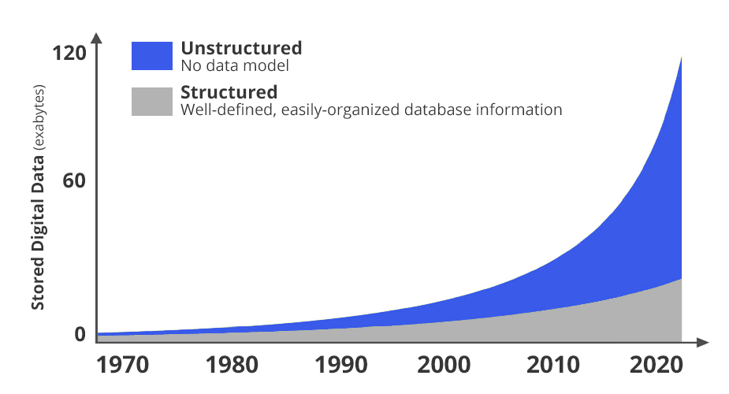]


---

class: center, bottom, inverse

# Data at a scale commensurate to our capacity for wonder

--

background-image: url(./figs/DOMO_2020.jpg)
background-size: contain

---

# Is this all just a fad?

--

- But there are faddish qualities

--

.center[]


---


# Wait so WHAT is data science?

--

- A series of examples

--

- Data science is for **everybody**


---

# Historians: Identify Shakespear

--

.leftcol[

- Use .red[original texts] written by Shakespeare and Marlowe (among others)

- Apply .blue[natural language processing (NLP)] to characterize styles of writing

- Demonstrate that Shakespeare was at least heavily influenced by collaborators

]


.rightcol[

]


---

# Biologists: Identify Cancer

--

.leftcol[

- Use .red[x-rays] of patients

- Apply .blue[image analysis] to identify cancerous areas

- Reproduce expert analysis, facilitating early detection

]


.rightcol[

]


---

# Astronomers: Detect Dark Matter

--

.leftcol[

- Use .red[satellite photos] of deep space

- Apply .blue[machine learning] to detect gravitational lensing

- Streamline analysis

]


.rightcol[

]

---

# Economists: Predict stock prices

--

.leftcol[

- Use .red[time series data] of stock prices

- Apply .blue[Long Short Term Memory Networks (LSTM)] to predict future prices

- Make KEE$SH!!

]


.rightcol[

]

---

# Social Scientists: Measure Poverty

--

.leftcol[

- Use .red[cell phone data]

- Apply .blue[machine learning] to learn relationships between calling and wealth

- Empower aid agencies around the globe

]


.rightcol[

]


---

# Musicologists: Describe Music

--

.leftcol[

- Use .red[audio recordings] and ethnographic labels

- Apply .blue[factor analysis] to distill labels to three dimensions

- Bring the world closer together / anger traditional musicologists

]


.rightcol[

]

---

# Political Scientists: Predict Polls

--

.leftcol[

- Use .red[tweets] written by candidates

- Apply .blue[basic algebra] to predict winner

- Start a blog

]


.rightcol[

]


---


# WHAT IS DATA SCIENCE?!

--

- How is data science different from science that uses data?

--

- .red[Readymade] versus .blue[custommade]

- .red[Prediction] camp versus .blue[Research] camp

---

# DS Vs. Science with Data

--

.leftcol[
Readymade

]

.rightcol[
Custommade

]

---

# So what IS data science?

- Split into two camps

--

1. .blue[Research] camp

--

  - Focused on **answering a research question**
  
  - Follows the "scientific method"
  
  - Goal: contribute to knowledge
  
  - Domain: academia
  
--
  
2. .red[Prediction] camp

--

  - Focused on **making a prediction**
  
  - Typically unconcerned with theory or *why* a model works
  
  - Goal: inform a decision / policy
  
  - Domain: private sector
  
---

# The Two Camps

<center></center>

---

# The Two Camps

<center></center>

---

# The Two Camps

<center></center>

---

# .blue[Research] Camp

- The scientific method

  1. .red[Observation] &rarr; .blue[Question]

--

  2. .blue[Theory] &rarr; .blue[Hypothesis]

--

  3. .red[Data Collection / Wrangling] &rarr; .red[Analysis]

--

  4. .red[Results] &rarr; .blue[Conclusion]
  
--

```{r,echo=F,fig.height=3,fig.align='center',warning=F,message=F}
require(tidyverse)
data.frame(step = c('Observation','Question','Theory','Hypothesis','Data Collection',
                    'Analysis','Results','Conclusion'),
           Framework = c('Data','Science','Science','Science','Data','Data','Data','Science'),
           x = c(.5,1.5,2.5,3.5,4.5,5.5,6.5,7.5),
           xend = c(1.5,2.5,3.5,4.5,5.5,6.5,7.5,8.5),
           y = c(-.5,-1,-2,-.75,-2,-1,-.75,-.5),
           yend = c(.5,1,2,.75,2,1,.75,.5)) %>%
  ggplot(aes(x = x,y = y,fill = Framework)) + 
  geom_rect(aes(xmin = x,ymin = y,xmax = xend,ymax = yend)) + 
  # geom_rect(xmin = c(2.5),ymin = c(-2),xmax = c(3.5),ymax = c(2),fill = NA,color = 'black',lwd = 2,
  #           inherit.aes = F) + 
  # geom_rect(xmin = c(4.5),ymin = c(-2),xmax = c(5.5),ymax = c(2),fill = NA,color = 'black',lwd = 2,
  #           inherit.aes = F) + 
  scale_fill_manual(values = c('red','blue')) +
  theme(axis.text.y = element_blank(),
        panel.background = element_rect(fill = 'grey90'),
        panel.grid.major = element_blank(), panel.grid.minor = element_blank(),
        axis.ticks = element_blank(),
        plot.background = element_rect(
          fill = "grey90" #,
          # colour = "black",
          # size = 1
        ),
        axis.text.x = element_text(angle = 45,hjust = 1,size = 14)) + 
  scale_x_continuous(breaks = seq(1,8,by = 1),labels = c('Observation','Question','Theory','Hypothesis','Data Prep',
                                                         'Analysis','Results','Conclusion')) + 
  xlab(NULL) + ylab(NULL)
```


---

# .blue[Research] Camp

- The scientific method

  1. .red[Observation] &rarr; .blue[Question]

  2. .blue[Theory] &rarr; .blue[Hypothesis]

  3. .red[Data Collection / Wrangling] &rarr; .red[Analysis]

  4. .red[Results] &rarr; .blue[Conclusion]

```{r,echo=F,fig.height=3,fig.align='center',warning=F,message=F}
require(tidyverse)
data.frame(step = c('Observation','Question','Theory','Hypothesis','Data Collection',
                    'Analysis','Results','Conclusion'),
           Framework = c('Data','Science','Science','Science','Data','Data','Data','Science'),
           x = c(.5,1.5,2.5,3.5,4.5,5.5,6.5,7.5),
           xend = c(1.5,2.5,3.5,4.5,5.5,6.5,7.5,8.5),
           y = c(-.5,-1,-2,-.75,-2,-1,-.75,-.5),
           yend = c(.5,1,2,.75,2,1,.75,.5)) %>%
  ggplot(aes(x = x,y = y,fill = Framework)) + 
  geom_rect(aes(xmin = x,ymin = y,xmax = xend,ymax = yend)) + 
  geom_rect(xmin = c(2.5),ymin = c(-2),xmax = c(3.5),ymax = c(2),fill = NA,color = 'black',lwd = 2,
            inherit.aes = F) + 
  geom_rect(xmin = c(4.5),ymin = c(-2),xmax = c(5.5),ymax = c(2),fill = NA,color = 'black',lwd = 2,
            inherit.aes = F) + 
  scale_fill_manual(values = c('red','blue')) +
  theme(axis.text.y = element_blank(),
        panel.background = element_rect(fill = 'grey90'),
        panel.grid.major = element_blank(), panel.grid.minor = element_blank(),
        axis.ticks = element_blank(),
        plot.background = element_rect(
          fill = "grey90" #,
          # colour = "black",
          # size = 1
        ),
        axis.text.x = element_text(angle = 45,hjust = 1,size = 14)) + 
  scale_x_continuous(breaks = seq(1,8,by = 1),labels = c('Observation','Question','Theory','Hypothesis','Data Prep',
                                                         'Analysis','Results','Conclusion')) + 
  xlab(NULL) + ylab(NULL)
```


---

# .blue[Research] Camp

--

<center></center>

---

# .blue[Research] Camp

1. **.red[Observation]** &rarr; **.blue[Question]**
  
--

  - Observation is facilitated by .red[data] (Descriptive analysis)

--


---

# .blue[Research] Camp

1. **.red[Observation]** &rarr; **.blue[Question]**

  - Observation is facilitated by .red[data] (Descriptive analysis)


---

# .blue[Research] Camp

1. **.red[Observation]** &rarr; **.blue[Question]**

  - Observation is facilitated by .red[data] (Descriptive analysis)


---

# .blue[Research] Camp

1. **.red[Observation]** &rarr; **.blue[Question]**

  - The question pertains to .blue[science]
  
--

  - I.e., does YouTube's algorithm put users into "echo chambers"?

--

<center></center>

---

# .blue[Research] Camp

<ol start = 2>

<li> **.blue[Theory]** &rarr; **.blue[Hypothesis]**
  
--

  - Theorizing requires abstraction & simplification

  - I.e., people (in general) avoid conflict

--

<center></center>

---

# .blue[Research] Camp

<ol start = 2>

<li> **.blue[Theory]** &rarr; **.blue[Hypothesis]**

  - Theorizing requires abstraction & simplification

  - I.e., people (in general) avoid conflict

<center>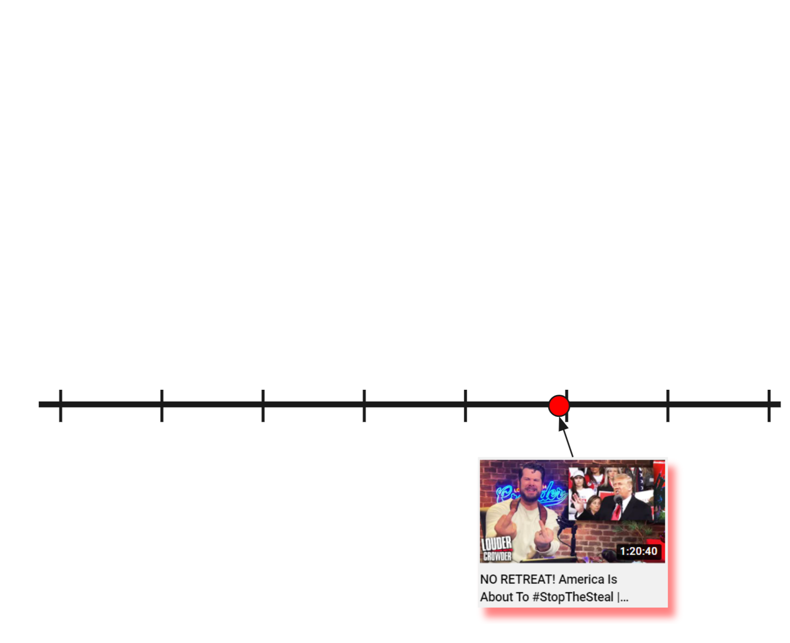</center>

---

# .blue[Research] Camp

<ol start = 2>

<li> **.blue[Theory]** &rarr; **.blue[Hypothesis]**

  - Theorizing requires abstraction & simplification

  - I.e., people (in general) avoid conflict

<center>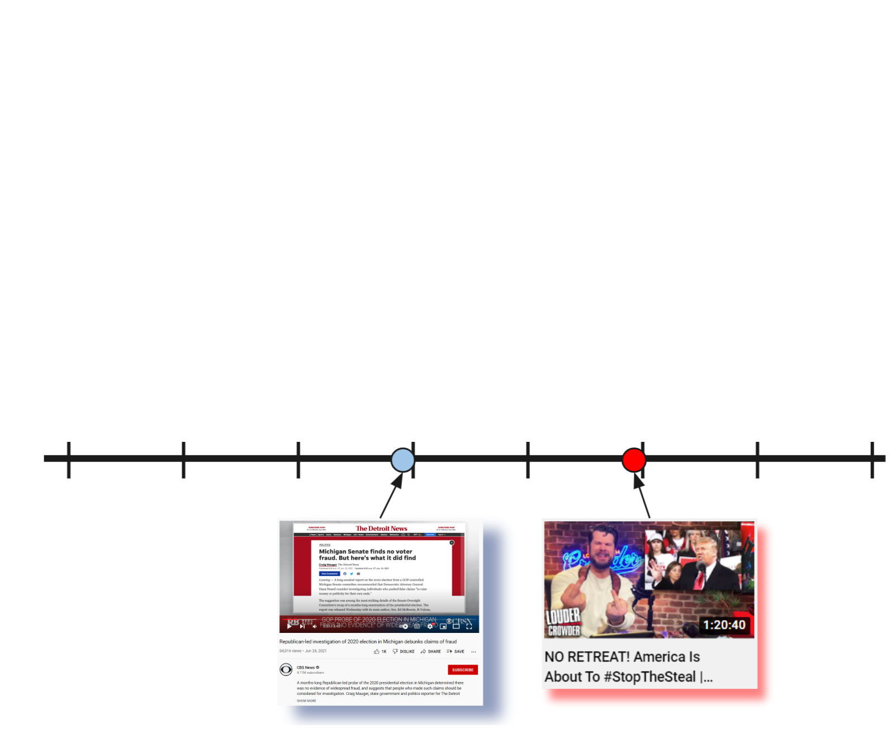</center>

---

# .blue[Research] Camp

<ol start = 2>

<li> **.blue[Theory]** &rarr; **.blue[Hypothesis]**

  - Theorizing requires abstraction & simplification

  - I.e., people (in general) avoid conflict

<center></center>


---

# .blue[Research] Camp

<ol start = 2>

<li> **.blue[Theory]** &rarr; **.blue[Hypothesis]**

  - Theorizing requires abstraction & simplification

  - I.e., people (in general) avoid conflict

<center>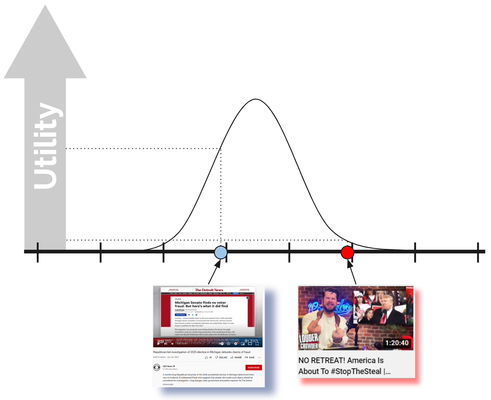</center>

---

# .blue[Research] Camp

<ol start = 2>

<li> **.blue[Theory]** &rarr; **.blue[Hypothesis]**

  - Theorizing requires abstraction & simplification

  - I.e., people (in general) avoid conflict
  
  - YouTube wants users to watch more videos

--

.leftcol[

]

--

.rightcol[

]


---

# .blue[Research] Camp

<ol start = 2>

<li> **.blue[Theory]** &rarr; **.blue[Hypothesis]**

  - Theorizing requires abstraction & simplification

  - I.e., people (in general) avoid conflict
  
  - YouTube wants users to watch more videos

- Hypotheses fall out naturally from well-done theory

--

- **H1:** *YouTube's recommendation algorithm should suggested liberal content to liberals and conservative content to conservatives.*


---

# .blue[Research] Camp

<ol start = 3>

<li> **.red[Data Collection / Wrangling]** &rarr; **.red[Analysis]**

  - Data collection separates "Data Science"...
  
  - ...from "Science, with data"
  
<center></center>

---

# .blue[Research] Camp

<ol start = 3>

<li> **.red[Data Collection / Wrangling]** &rarr; **.red[Analysis]**

  - Data collection separates "Data Science"...
  
  - ...from "Science, with data"
  
<center></center>

---

# .blue[Research] Camp

<ol start = 3>

<li> **.red[Data Collection / Wrangling]** &rarr; **.red[Analysis]**

  - Data collection separates "Data Science"...
  
  - ...from "Science, with data"
  
<center></center>

---

# .blue[Research] Camp

<ol start = 3>

<li> **.red[Data Collection / Wrangling]** &rarr; **.red[Analysis]**

  - Data collection separates "Data Science"...
  
  - ...from "Science, with data"
  
<center></center>

---

# .blue[Research] Camp

<ol start = 3>

<li> **.red[Data Collection / Wrangling]** &rarr; **.red[Analysis]**

--

- Analysis is informed by the .red[data] you have collected...

- ...and the .blue[hypotheses] you have generated

--

<center></center>

---

# .blue[Research] Camp

<ol start = 3>

<li> **.red[Data Collection / Wrangling]** &rarr; **.red[Analysis]**

- Analysis is informed by the .red[data] you have collected...

- ...and the .blue[hypotheses] you have generated

<center></center>

---

# .blue[Research] Camp

<ol start = 3>

<li> **.red[Data Collection / Wrangling]** &rarr; **.red[Analysis]**

- Analysis is informed by the .red[data] you have collected...

- ...and the .blue[hypotheses] you have generated

<center></center>

---

# .blue[Research] Camp

<ol start = 3>

<li> **.red[Data Collection / Wrangling]** &rarr; **.red[Analysis]**

- Analysis is informed by the .red[data] you have collected...

- ...and the .blue[hypotheses] you have generated

<center></center>

---

# .blue[Research] Camp

<ol start = 3>

<li> **.red[Data Collection / Wrangling]** &rarr; **.red[Analysis]**

- Analysis is informed by the .red[data] you have collected...

- ...and the .blue[hypotheses] you have generated

<center></center>

---

# .blue[Research] Camp

<ol start = 3>

<li> **.red[Data Collection / Wrangling]** &rarr; **.red[Analysis]**

- Analysis is informed by the .red[data] you have collected...

- ...and the .blue[hypotheses] you have generated

<center></center>

---

# .blue[Research] Camp

<ol start = 3>

<li> **.red[Data Collection / Wrangling]** &rarr; **.red[Analysis]**

- Analysis is informed by the .red[data] you have collected...

- ...and the .blue[hypotheses] you have generated

<center></center>

---

# .blue[Research] Camp

<ol start = 3>

<li> **.red[Data Collection / Wrangling]** &rarr; **.red[Analysis]**

- Analysis is informed by the .red[data] you have collected...

- ...and the .blue[hypotheses] you have generated

<center></center>

---

# .blue[Research] Camp

<ol start = 3>

<li> **.red[Data Collection / Wrangling]** &rarr; **.red[Analysis]**

- Analysis is informed by the .red[data] you have collected...

- ...and the .blue[hypotheses] you have generated

<center>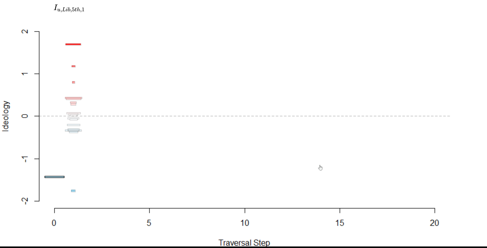</center>

---

# .blue[Research] Camp

<ol start = 3>

<li> **.red[Data Collection / Wrangling]** &rarr; **.red[Analysis]**

- Analysis is informed by the .red[data] you have collected...

- ...and the .blue[hypotheses] you have generated

<center></center>

---

# .blue[Research] Camp

<ol start = 3>

<li> **.red[Data Collection / Wrangling]** &rarr; **.red[Analysis]**

- Analysis is informed by the .red[data] you have collected...

- ...and the .blue[hypotheses] you have generated

<center></center>

---

# .blue[Research] Camp

<ol start = 3>

<li> **.red[Data Collection / Wrangling]** &rarr; **.red[Analysis]**

- Analysis is informed by the .red[data] you have collected...

- ...and the .blue[hypotheses] you have generated

<center></center>

---

# .blue[Research] Camp

<ol start = 3>

<li> **.red[Data Collection / Wrangling]** &rarr; **.red[Analysis]**

- Analysis is informed by the .red[data] you have collected...

- ...and the .blue[hypotheses] you have generated

<center>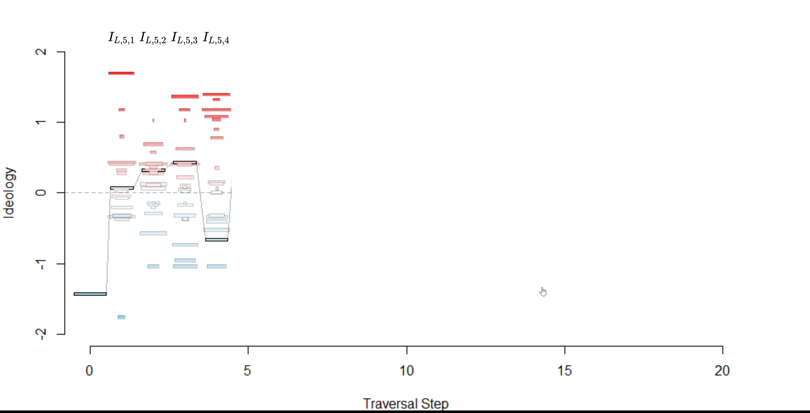</center>

---

# .blue[Research] Camp

<ol start = 3>

<li> **.red[Data Collection / Wrangling]** &rarr; **.red[Analysis]**

- Analysis is informed by the .red[data] you have collected...

- ...and the .blue[hypotheses] you have generated

<center>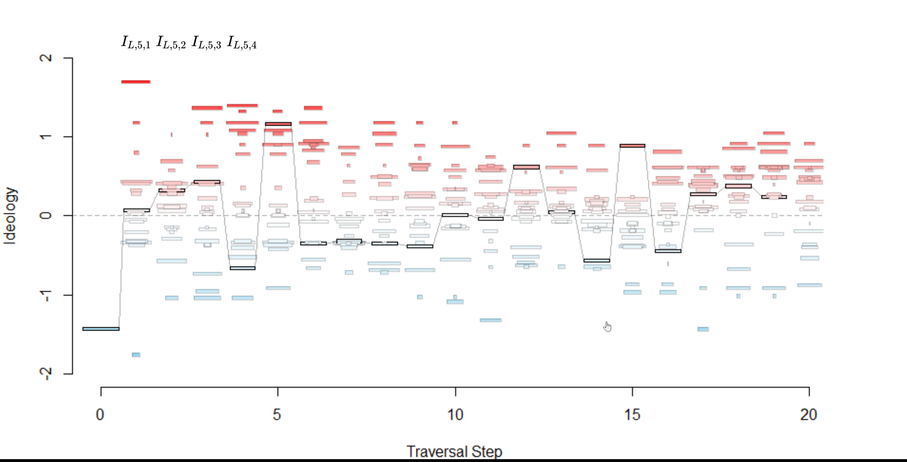</center>

---

# .blue[Research] Camp

<ol start = 4>

<li> **.red[Results]** &rarr; **.blue[Conclusion]**

--

  - Results fall out naturally from the analysis...
  
  - ...and must be interpreted in terms of the theory and hypotheses...
  
  - ...to draw conclusions
  
--

<center></center>

---

# .blue[Research] Camp

<ol start = 4>

<li> **.red[Results]** &rarr; **.blue[Conclusion]**

  - Results fall out naturally from the analysis...
  
  - ...and must be interpreted in terms of the theory and hypotheses...
  
  - ...to draw conclusions

<center>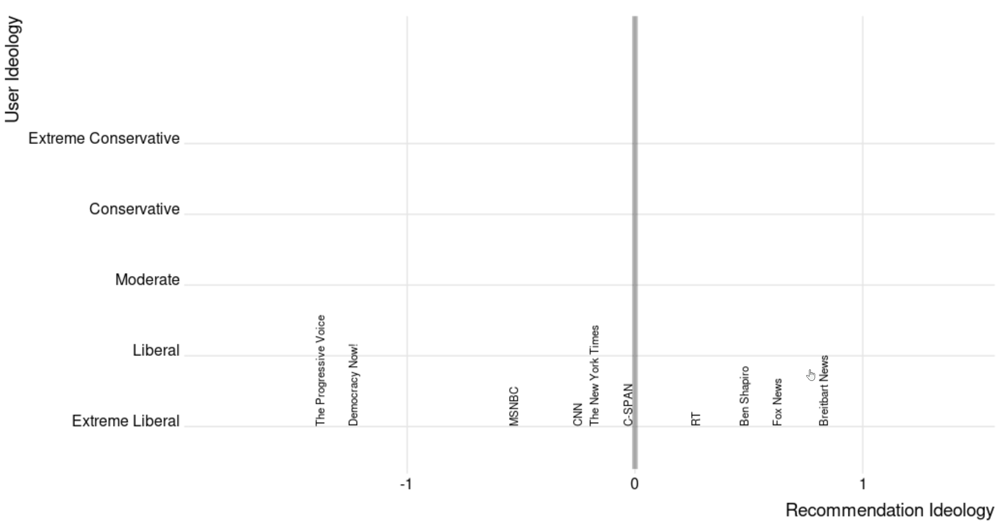</center>

---

# .blue[Research] Camp

<ol start = 4>

<li> **.red[Results]** &rarr; **.blue[Conclusion]**

  - Results fall out naturally from the analysis...
  
  - ...and must be interpreted in terms of the theory and hypotheses...
  
  - ...to draw conclusions

<center>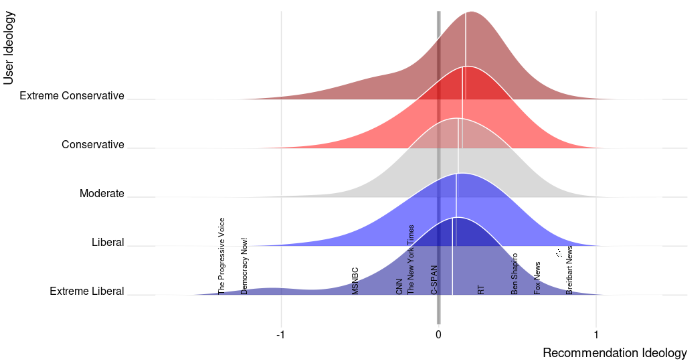</center>

---

# The Two Camps

<center></center>

---

# .red[Prediction] Camp

- **Goal/Problem/Challenge**: Measure the ideology of a YouTube

---

# .red[Prediction] Camp

- **Data Wrangling**: Get matrix of links shared on political subreddits

--

<center></center>

---

#.red[Prediction] Camp

- **Data Wrangling**: Get matrix of links shared on political subreddits

<center>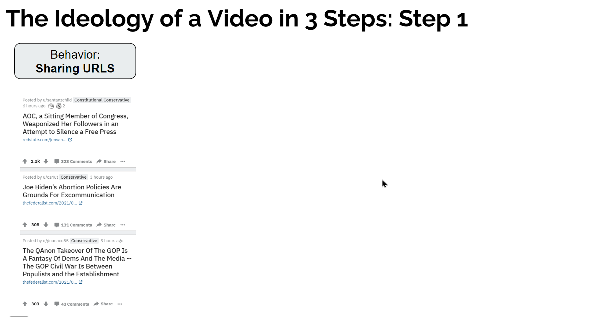</center>

---

#.red[Prediction] Camp

- **Data Wrangling**: Get matrix of links shared on political subreddits

<center></center>

---

#.red[Prediction] Camp

- **Data Wrangling**: Get matrix of links shared on political subreddits

<center></center>

---

#.red[Prediction] Camp

- **Data Wrangling**: Correspondence Analysis to estimate ideology scores for subreddits

<center></center>

---

#.red[Prediction] Camp

- **Data Wrangling**: Get matrix of YouTube videos shared on scored subreddits

<center></center>

---

#.red[Prediction] Camp

- **Data Wrangling**: Get matrix of YouTube videos shared on scored subreddits

<center>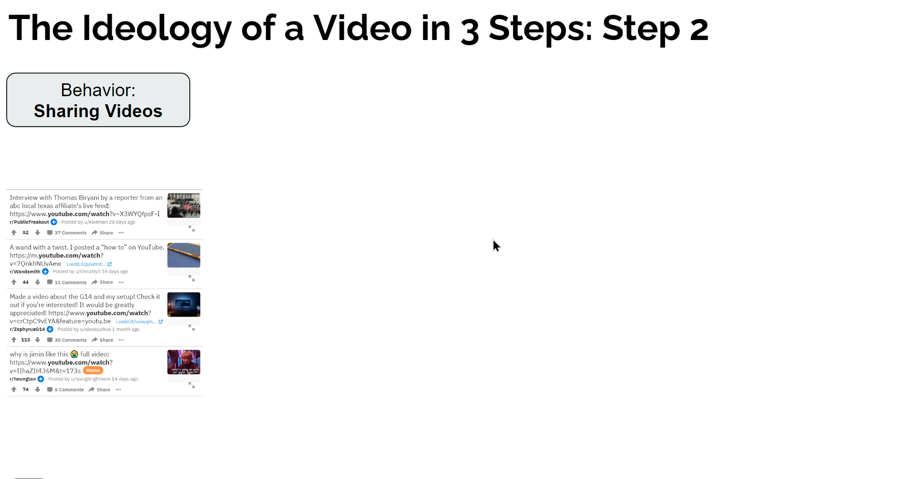</center>

---

#.red[Prediction] Camp

- **Data Wrangling**: Get matrix of YouTube videos shared on scored subreddits

<center>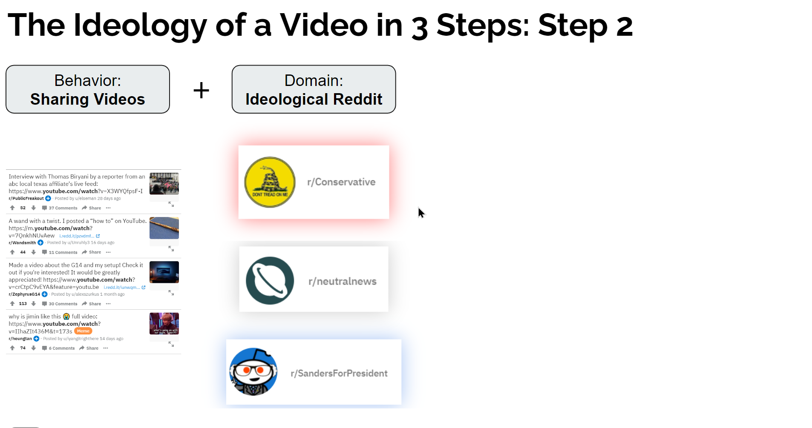</center>

---

#.red[Prediction] Camp

- **Data Wrangling**: Get matrix of 60k YouTube videos shared on scored subreddits

<center></center>

---

#.red[Prediction] Camp

- **Data Wrangling**: Calculate video ideology as weighted mean of subreddits

<center>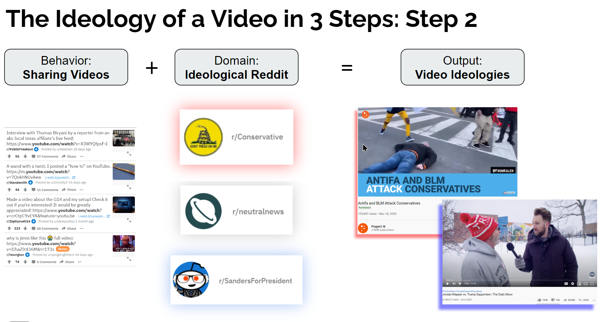</center>

---

#.red[Prediction] Camp

- **Model Training**: BERT transformer trained on 60k videos

<center>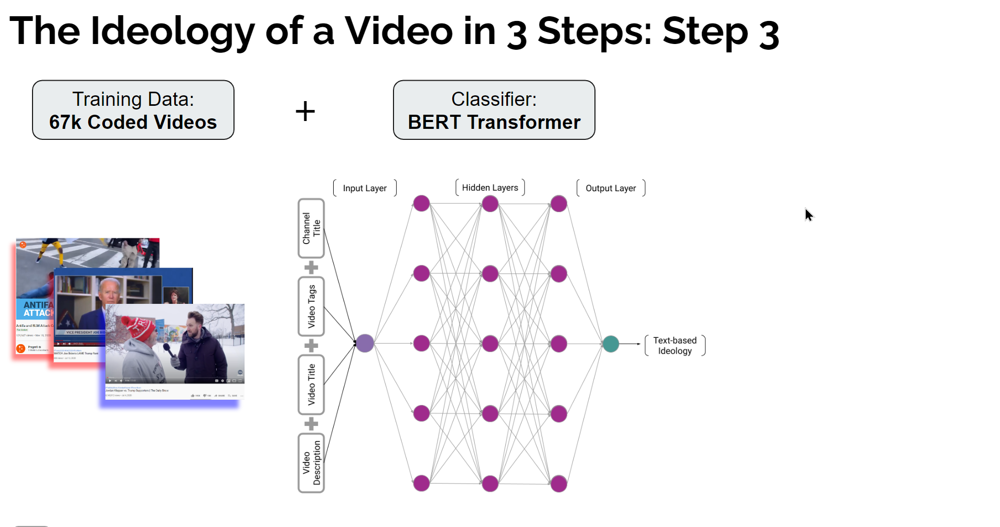</center>

---

#.red[Prediction] Camp

- **Prediction**: Measure the ideology of a YouTube video

<center></center>

---

# Data science is...

- ...the use of .red[readymade] data...

--

- ...and .blue[custommade] data...

--

- ...to answer .blue[research questions]...

--

- ...and make .red[predictions]...

--

- ...to expand human knowledge
