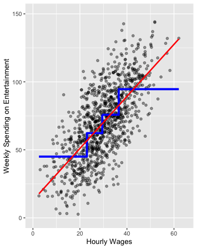
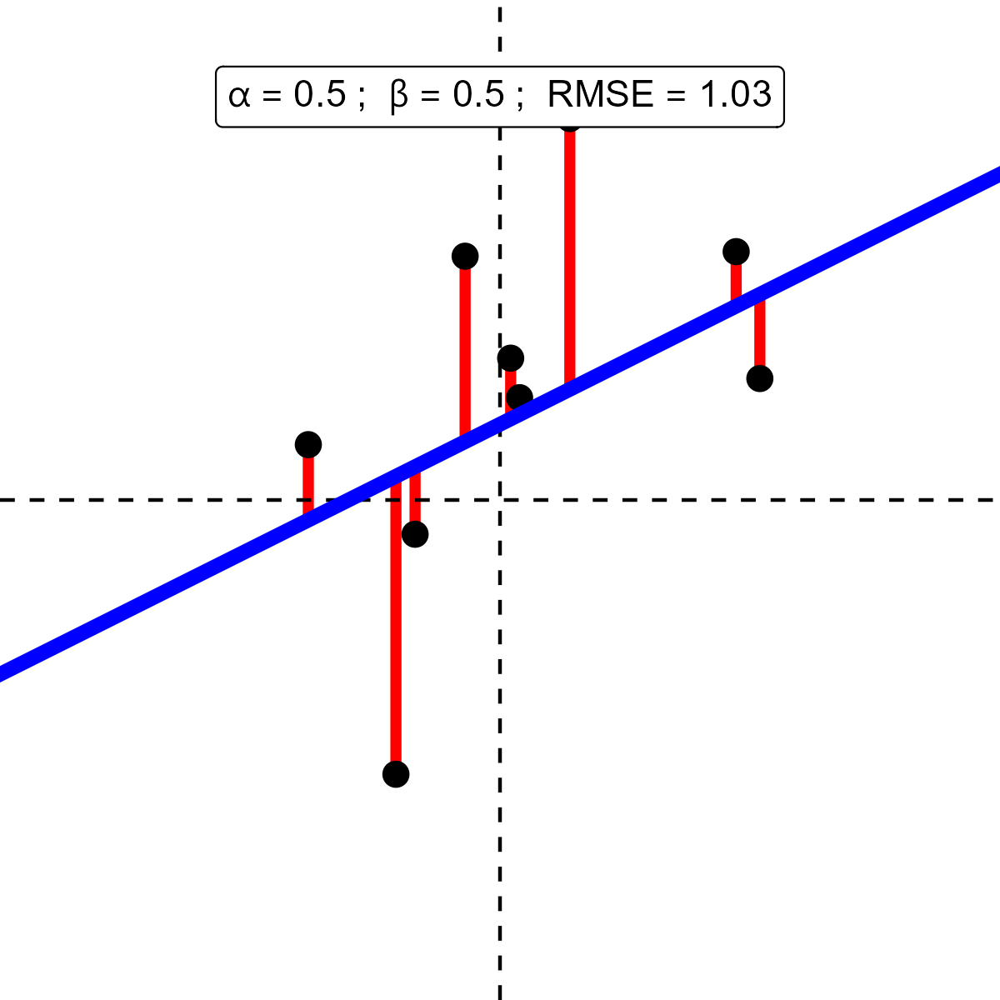
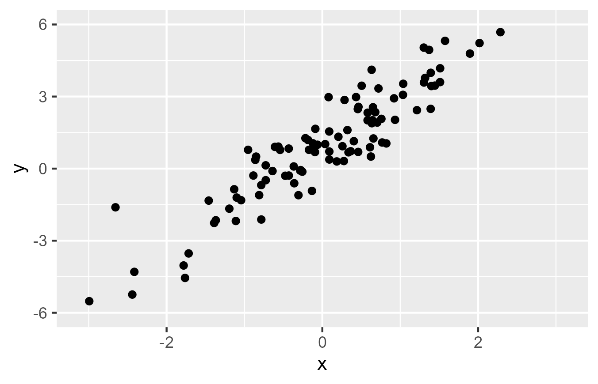

```{css,echo = F}
.small .remark-code { /*Change made here*/
  font-size: 85% !important;
}
.tiny .remark-code { /*Change made here*/
  font-size: 50% !important;
}
```

```{r,include=F}
set.seed(123)
options(width=60)
knitr::opts_chunk$set(fig.align='center',fig.width=9,fig.height=5,message=F,warning=F)
def.chunk.hook  <- knitr::knit_hooks$get("chunk")
knitr::knit_hooks$set(chunk = function(x, options) {
  x <- def.chunk.hook(x, options)
  ifelse(options$size != "normalsize", paste0("\n \\", options$size,"\n\n", x, "\n\n \\normalsize"), x)
})
```

# Agenda

1. Modeling Conditional Variation

2. Adding Regression to the **Process**

3. Introducing the Data

4. Demonstrating Regressions

---

# Regression & Conditional Analysis

--

- Recall our discussion of **conditional** analysis

--

  - Conditional &rarr; **depends on**
  
--

  - Analyze with **conditional means**
  
---

# Reminder of the **Process**

--

1. Determine variable **type**

--

  - I.e., categorical (ordered, unordered, binary) or continuous
  
  - In `R` terms: `chr`, `fct` for categorical, `dbl` for continuous
  
--

2. Type informs **univariate analysis**

--

  - I.e., histograms for continuous, barplots for categorical
  
--

3. Combination of types informs **conditional analysis**

--

  - Categorical X Categorical: proportions by categories (`geom_bar`)
  
  - Binary X Continuous: histograms by categories (`geom_histogram` / `geom_density`)
  
  - Categorical X Continuous: distributions by categories (`geom_boxplot` / `geom_violin`)
  
  - Continuous X Continuous: scatter plots (`geom_point`)
  
---

# What is regression?

--

- Conditional means for continuous data

--

<center></center>

---

# What is regression?

- People with hourly wages < $20 spend ~$50 on entertainment per week

<center></center>

---

# What is regression?

- People with hourly wages > $40 spend ~$95 on entertainment per week

<center></center>

---

# What is regression?

- .blue[Theory]: the more you earn, the more you spend

<center></center>

---

# What is regression?

- But **conditional means** make a lot of mistakes. Can we do better?

<center></center>


---

# What is regression?

- But **conditional means** make a lot of mistakes. Can we do better?

<center></center>


---

# Regression

--

- Calculating a **line** that minimizes mistakes *for every observation*

--

  - NB: could be a curvey line! For now, just assume straight
  
--

- Recall from geometry how to graph a straight line

--

- $Y = a + bX$

  - $a$: the "intercept" (where the line intercepts the y-axis)
  - $b$: the "slope" (how much $Y$ changes for each increase in $X$)

--

- (Data scientists use $\alpha$ and $\beta$ instead of $a$ and $b$ b/c nerds)

--

- Regression analysis simply chooses the best line

--

  - "Best"?

--

  - The line that minimizes the mistakes (the **line of best fit**)

---

# Linear Regression

```{r,message=F,warning=F,echo=F}
set.seed(123)
require(tidyverse)

X <- rnorm(9)
Y <- .5 + .5*X + rnorm(9)
p <- data.frame(X = X,Y = Y) %>%
  ggplot(aes(x = X,y = Y)) + 
  geom_point(size = 3) + 
  geom_vline(xintercept = 0,linetype = 'dashed') + 
  geom_hline(yintercept = 0,linetype = 'dashed') + 
  theme_void() + 
  lims(x = c(-3,3),y = c(-3,3))

ggsave(plot = p,filename = paste0('./scaffolding/regPlotFirst_0.png'),device = 'png',width = 4,height = 4)
```

.leftcol[

<center></center>

]

.rightcol[


]

---

# Linear Regression

```{r,message=F,warning=F,echo=F}
p <- data.frame(X = X,Y = Y) %>%
  ggplot(aes(x = X,y = Y)) + 
  geom_point(size = 3) + 
  geom_vline(xintercept = 0,linetype = 'dashed') + 
  geom_hline(yintercept = 0,linetype = 'dashed') + 
  theme_void() +
  geom_abline(intercept = 0,slope = 1,color = 'blue',size = 2) + 
  lims(x = c(-3,3),y = c(-3,3)) + 
  # annotate(geom = 'rect',xmin = -.5,ymin = .5,xmax = .5,ymax = 1) + 
  annotate(geom = 'label',x = 0,y = Inf,label = list(bquote(alpha==0~'; '~beta==1)),vjust = 2.1,parse = T)
ggsave(plot = p,filename = paste0('./figs/regPlotFirst_1.png'),device = 'png',width = 4,height = 4)
```

.leftcol[

<center></center>

]

.rightcol[


]
---

# Linear Regression

```{r,message=F,warning=F,echo=F}
p <- data.frame(X = X,Y = Y) %>%
  ggplot(aes(x = X,y = Y)) + 
  geom_segment(x = X[1],y = Y[1],xend = X[1],yend = X[1],color = 'red',size = 1.5) + 
  geom_point(size = 3) + 
  geom_vline(xintercept = 0,linetype = 'dashed') + 
  geom_hline(yintercept = 0,linetype = 'dashed') + 
  theme_void() + 
  geom_abline(intercept = 0,slope = 1,color = 'blue',size = 2) + 
  annotate(geom = 'text',x = X[1],y = Y[1],hjust = 2.1,vjust = 1.5,label = bquote(u[i]),color = 'red') + 
  lims(x = c(-3,3),y = c(-3,3)) + 
    annotate(geom = 'label',x = 0,y = Inf,label = list(bquote(alpha==0~'; '~beta==1)),vjust = 2.1,parse = T)
ggsave(plot = p,filename = paste0('./figs/regPlotFirst_2.png'),device = 'png',width = 4,height = 4)
```

.leftcol[

<center></center>

]

.rightcol[

- **Error/Residual**: mistake made by a line

  - In math: $u_i = y_i - \hat{y}_i$
  
  - In English: difference between true outcome value ( $y_i$ ) and prediction ( $\hat{y}_i$ )

]

---

# Linear Regression

```{r,message=F,warning=F,echo=F}
RMSE <- sqrt(mean((Y - (X*1 + 0))^2))
p <- data.frame(X = X,Y = Y) %>%
  ggplot(aes(x = X,y = Y)) + 
  geom_segment(x = X,y = Y,xend = X,yend = X,color = 'red',size = 1.5) + 
  geom_point(size = 3) + 
  geom_vline(xintercept = 0,linetype = 'dashed') + 
  geom_hline(yintercept = 0,linetype = 'dashed') + 
  theme_void() + 
  geom_abline(intercept = 0,slope = 1,color = 'blue',size = 2) + 
  lims(x = c(-3,3),y = c(-3,3)) + 
  annotate(geom = 'label',x = 0,y = Inf,label = list(bquote(alpha==0~'; '~beta==1)),vjust = 2.1,parse = T)
ggsave(plot = p,filename = paste0('./figs/regPlotFirst_3.png'),device = 'png',width = 4,height = 4)
```

.leftcol[

<center></center>

]

.rightcol[

- Use **errors** to find **line of best fit**

- **RMSE** (**R**oot **M**ean **S**quared **E**rror)

  - Square the errors
  
  - Take their average
  
  - Take the square root
  
- **RMSE** = `r round(RMSE,2)`

]

---

# Linear Regression

```{r,message=F,warning=F,echo=F}
a <- 1
b <- -.5
RMSE <- sqrt(mean((Y - (X*b + a))^2))
p <- data.frame(X = X,Y = Y) %>%
  ggplot(aes(x = X,y = Y)) + 
  geom_segment(x = X,y = Y,xend = X,yend = X*b+a,color = 'red',size = 1.5) + 
  geom_point(size = 3) + 
  geom_vline(xintercept = 0,linetype = 'dashed') + 
  geom_hline(yintercept = 0,linetype = 'dashed') + 
  theme_void() + 
  geom_abline(intercept = a,slope = b,color = 'blue',size = 2) + 
  lims(x = c(-3,3),y = c(-3,3)) + 
  annotate(geom = 'label',x = 0,y = Inf,label = list(bquote(alpha==.(a)~'; '~beta==.(b)~'; '~RMSE==.(round(RMSE,2)))),vjust = 2.1,parse = T)
ggsave(plot = p,filename = paste0('./figs/regPlotFirst_4.png'),device = 'png',width = 4,height = 4)
```

.leftcol[

<center></center>

]

.rightcol[

- Use **errors** to find **line of best fit**

- **RMSE** (**R**oot **M**ean **S**quared **E**rror)

  - Square the errors
  
  - Take their average
  
  - Take the square root
  
- **RMSE** = `r round(RMSE,2)`

]

---

# Linear Regression

```{r,message=F,warning=F,echo=F}
a <- -1
b <- 2
RMSE <- sqrt(mean((Y - (X*b + a))^2))
p <- data.frame(X = X,Y = Y) %>%
  ggplot(aes(x = X,y = Y)) + 
  geom_segment(x = X,y = Y,xend = X,yend = X*b+a,color = 'red',size = 1.5) + 
  geom_point(size = 3) + 
  geom_vline(xintercept = 0,linetype = 'dashed') + 
  geom_hline(yintercept = 0,linetype = 'dashed') + 
  theme_void() + 
  geom_abline(intercept = a,slope = b,color = 'blue',size = 2) + 
  lims(x = c(-3,3),y = c(-3,3)) + 
  annotate(geom = 'label',x = 0,y = Inf,label = list(bquote(alpha==.(a)~'; '~beta==.(b)~'; '~RMSE==.(round(RMSE,2)))),vjust = 2.1,parse = T)
ggsave(plot = p,filename = paste0('./figs/regPlotFirst_5.png'),device = 'png',width = 4,height = 4)
```

.leftcol[

<center></center>

]

.rightcol[

- Use **errors** to find **line of best fit**

- **RMSE** (**R**oot **M**ean **S**quared **E**rror)

  - Square the errors
  
  - Take their average
  
  - Take the square root
  
- **RMSE** = `r round(RMSE,2)`

]


---

# Linear Regression

```{r,message=F,warning=F,echo=F}
a <- .5
b <- .5
RMSE <- sqrt(mean((Y - (X*b + a))^2))
p <- data.frame(X = X,Y = Y) %>%
  ggplot(aes(x = X,y = Y)) + 
  geom_segment(x = X,y = Y,xend = X,yend = X*b+a,color = 'red',size = 1.5) + 
  geom_point(size = 3) + 
  geom_vline(xintercept = 0,linetype = 'dashed') + 
  geom_hline(yintercept = 0,linetype = 'dashed') + 
  theme_void() + 
  geom_abline(intercept = a,slope = b,color = 'blue',size = 2) + 
  lims(x = c(-3,3),y = c(-3,3)) + 
  annotate(geom = 'label',x = 0,y = Inf,label = list(bquote(alpha==.(a)~'; '~beta==.(b)~'; '~RMSE==.(round(RMSE,2)))),vjust = 2.1,parse = T)
ggsave(plot = p,filename = paste0('./figs/regPlotFirst_6.png'),device = 'png',width = 4,height = 4)
```

.leftcol[

<center></center>

]

.rightcol[

- Use **errors** to find **line of best fit**

- **RMSE** (**R**oot **M**ean **S**quared **E**rror)

  - Square the errors
  
  - Take their average
  
  - Take the square root
  
- **RMSE** = `r round(RMSE,2)`

]

---

# Visual Intuition

<center></center>


---

# Visual Intuition

<center></center>

---

# Regression

--

- The line is .blue[substantively meaningful]

--

- Red line on scatter plot of spending and wages: $Y = 12 + 2*X$

--

- $\alpha$ tells us the value of $Y$ when $X$ is zero

--

  - People who don't make any money spend $12 per week on entertainment
  
--

- $\beta$ tells us how much $Y$ increases for each additional $X$

--

  - People spend an additional $2 per week for each additional $1 in hourly wages
  
---

# Regression

- These are called **"linear models"**

--

  - **Not** because the line is straight (it might not be)
  
  - but because the components are additive ( $\alpha + \beta X$ )
  
--

- Can extend to multiple predictors ( $X$ 's)

--

  - $Y = \alpha + \beta_1 X_1 + \beta_2 X_2 + \dots + \varepsilon$
  
--

  - $X_1$ might be wages and $X_2$ might be age (for example)
  
--

  - The final term $\varepsilon$ measures how bad our mistakes are
  
---

# Regression

--

- Let's demonstrate with the `debt` data

```{r,message = F,warning=F}
require(tidyverse)

debt <- read_rds('https://github.com/jbisbee1/DS1000_F2024/raw/main/data/sc_debt.Rds')

glimpse(debt)
```

---

# Research Camp

- .blue[Research Question]: What is the relationship between SAT scores and median future earnings?

--

- .blue[Theory]: Students with higher SAT scores work harder and have learned more. Employers reward these attributes with higher wages in the private market.

--

- .blue[Hypothesis]: The relationship between SAT scores and future earnings should be positive.

--

  - **NB**: Important caveats to this simplistic theory!
  
--

  - Socioeconomic status: predicts both higher SAT scores and higher wages
  
--

  - **Correlation $\neq$ Causation**
  
---

# Set Up

- Linking .blue[Theory] to .red[Data]

--

- Our SAT scores are theorized to explain future earnings

--

  - Thus the SAT scores are the independent / explanatory / predictor variable $X$
  
  - And earnings are the dependent / outcome variable $Y$

---

# Regression

- There is a simple recipe to follow

--

- And it is exactly how the syllabus for the class is designed!

--

  1. Look at your data to identify missingness (**Wrangling: Lecture 5**)
  
  2. **Univariate** visualization of your variables (**Lecture 6**)
  
  3. **Multivariate** visualization of your variables (**Lectures 7-10**)
  
  4. **Regression** (today)
  
  5. Evaluation of **errors** (next lecture)

---

# Step 1: Look

- Why worry about **missingness**?

--

1. **Substantive:** external validity

2. **Technical:** cross validation won't work! (Wednesday's lecture)

--

```{r}
summary(debt %>% select(sat_avg,md_earn_wne_p6))
```

---

# Step 2: Univariate Viz

- Why visualize both $Y$ and $X$?

--

1. **Substantive:** *See* which units you are talking about

2. **Technical:** Adjust for *skew*

---

# Step 2: Univariate Viz

- Why visualize both $Y$ and $X$?

```{r,warning=F,message=F}
debt %>%
  ggplot(aes(x = sat_avg)) + 
  geom_histogram()
```

---

# Step 2: Univariate Viz

- Why visualize both $Y$ and $X$?

```{r,warning=F,message=F}
debt %>%
  ggplot(aes(x = md_earn_wne_p6)) + 
  geom_histogram()
```

---

# Step 3: Multivariate 

- Eyeball the relationship first!

--

```{r,warning=F,message=F}
debt %>%
  ggplot(aes(x = sat_avg,y = md_earn_wne_p6)) + 
  geom_point()
```

---

# Step 3: Multivariate Viz

- Adding regression line

```{r,warning=F,message = F}
debt %>%
  ggplot(aes(x = sat_avg,y = md_earn_wne_p6)) + 
  geom_point() + geom_smooth(method = 'lm',se = F)
```

---

# Step 3: Multivariate Viz

- Let's focus on two schools

```{r,warning=F,message=F}
toplot <- debt %>%
  mutate(hl = ifelse(unitid %in% c(100654,179265),'hl','none')) # Choosing two examples
p2 <- toplot %>%
  ggplot(aes(x = sat_avg, y = md_earn_wne_p6,color = hl,group = 1,alpha = hl)) + 
  geom_point(data = toplot %>% filter(hl == 'none')) + 
  geom_point(data = toplot %>% filter(hl == 'hl'),size =3) + 
  scale_alpha_manual(values = c(1,.3)) + 
  scale_color_manual(values = c('red','black')) + 
  geom_smooth(method = 'lm',se = F) + 
  theme(legend.position = 'none') + 
  labs(title = "Graduate Earnings and SAT Scores",
       subtitle = "By School",
       x = "Average SAT Score",
       y = "Median Earnings of Grads")
```

---

# Step 3: Multivariate Viz

- Adding regression line

```{r,warning=F,message=F}
p2
```

---

# Step 3: Multivariate Viz

- Defining $\varepsilon$

```{r,warning=F,message=F}
p3 <- toplot %>%
  ggplot(aes(x = sat_avg, y = md_earn_wne_p6,color = hl,group = 1,alpha = hl)) + 
  geom_point(data = toplot %>% filter(hl == 'none')) + 
  geom_point(data = toplot %>% filter(hl == 'hl'),size =3) + 
  scale_alpha_manual(values = c(1,.3)) + 
  scale_color_manual(values = c('red','black')) + 
  geom_smooth(method = 'lm',se = F) + 
  annotate(geom = 'segment',
           x = toplot %>% filter(hl == 'hl') %>% .$sat_avg,
           y = toplot %>% filter(hl == 'hl') %>% .$md_earn_wne_p6,
           xend = toplot %>% filter(hl == 'hl') %>% .$sat_avg,
           yend = c(27500,41000),color = 'red',lwd = 1.2) + 
  theme(legend.position = 'none') + 
  labs(title = "Graduate Earnings and SAT Scores",
       subtitle = "By School",
       x = "Average SAT Score",
       y = "Median Earnings of Grads")
```

---

# Step 3: Multivariate Viz

- Measuring errors

```{r,warning=F,message=F}
p3
```
---

# The Data Scientist's Trade-off

--

- Those mistakes seem pretty big!

--

- Why not use a curvier line?

```{r,echo = F}
p4 <- toplot %>%
  ggplot(aes(x = sat_avg, y = md_earn_wne_p6,color = hl,group = 1,alpha = hl)) + 
  geom_point(data = toplot %>% filter(hl == 'none')) + 
  geom_point(data = toplot %>% filter(hl == 'hl'),size =3) + 
  scale_alpha_manual(values = c(1,.3)) + 
  scale_color_manual(values = c('red','black')) + 
  geom_smooth(method = 'gam',se = F) + 
  annotate(geom = 'segment',
           x = toplot %>% filter(hl == 'hl') %>% .$sat_avg,
           y = toplot %>% filter(hl == 'hl') %>% .$md_earn_wne_p6,
           xend = toplot %>% filter(hl == 'hl') %>% .$sat_avg,
           yend = c(27500,41000),color = 'red',lwd = 1.2) + 
  theme(legend.position = 'none') + 
  labs(title = "Graduate Earnings and SAT Scores",
       subtitle = "By School",
       x = "Average SAT Score",
       y = "Median Earnings of Grads")

p5 <- toplot %>%
  ggplot(aes(x = sat_avg, y = md_earn_wne_p6,color = hl,group = 1,alpha = hl)) + 
  geom_point(data = toplot %>% filter(hl == 'none')) + 
  geom_point(data = toplot %>% filter(hl == 'hl'),size =3) + 
  scale_alpha_manual(values = c(1,.3)) + 
  scale_color_manual(values = c('red','black')) + 
  geom_smooth(method = 'loess',se = F,span = .1) + 
  annotate(geom = 'segment',
           x = toplot %>% filter(hl == 'hl') %>% .$sat_avg,
           y = toplot %>% filter(hl == 'hl') %>% .$md_earn_wne_p6,
           xend = toplot %>% filter(hl == 'hl') %>% .$sat_avg,
           yend = c(26500,43000),color = 'red',lwd = 1.2) + 
  theme(legend.position = 'none') + 
  labs(title = "Graduate Earnings and SAT Scores",
       subtitle = "By School",
       x = "Average SAT Score",
       y = "Median Earnings of Grads")

p6 <- toplot %>%
  ggplot(aes(x = sat_avg, y = md_earn_wne_p6,color = hl,group = 1,alpha = hl)) + 
  geom_point(data = toplot %>% filter(hl == 'none')) + 
  geom_point(data = toplot %>% filter(hl == 'hl'),size =3) + 
  scale_alpha_manual(values = c(1,.3)) + 
  scale_color_manual(values = c('red','black')) + 
  geom_smooth(method = 'loess',se = F,span = .025) + 
  annotate(geom = 'segment',
           x = toplot %>% filter(hl == 'hl') %>% .$sat_avg,
           y = toplot %>% filter(hl == 'hl') %>% .$md_earn_wne_p6,
           xend = toplot %>% filter(hl == 'hl') %>% .$sat_avg,
           yend = c(26500,43000),color = 'red',lwd = 1.2) + 
  theme(legend.position = 'none') + 
  labs(title = "Graduate Earnings and SAT Scores",
       subtitle = "By School",
       x = "Average SAT Score",
       y = "Median Earnings of Grads")

p7 <- toplot %>%
  ggplot(aes(x = sat_avg, y = md_earn_wne_p6,color = hl,group = 1,alpha = hl)) + 
  geom_point(data = toplot %>% filter(hl == 'none')) + 
  geom_point(data = toplot %>% filter(hl == 'hl'),size =3) + 
  scale_alpha_manual(values = c(1,.3)) + 
  scale_color_manual(values = c('red','black')) + 
  geom_line(color = 'black') + 
  theme(legend.position = 'none') + 
  labs(title = "Graduate Earnings and SAT Scores",
       subtitle = "By School",
       x = "Average SAT Score",
       y = "Median Earnings of Grads")
```

---

# The Data Scientist's Trade-off

- Those mistakes seem pretty big!

- Why not use a curvier line?

```{r,warning=F,message=F,echo = F}
p4
```

---

# The Data Scientist's Trade-off

- Those mistakes seem pretty big!

- Why not use a curvier line?

```{r,warning=F,message=F,echo = F}
p5
```

---

# The Data Scientist's Trade-off

- Those mistakes seem pretty big!

- Why not use a curvier line?

```{r,warning=F,message=F,echo = F}
p6
```

---

# The Data Scientist's Trade-off

- Those mistakes seem pretty big!

- Why not use a curvier line?

```{r,warning=F,message=F,echo = F}
p7
```

---

# The Data Scientist's Trade-off

--

- Want to **reduce complexity**

--

- But also want to be **accurate**

--

- What is the right answer?

--

  - It depends on your .blue[theory] and the .red[data]
  
--

  - It is context-dependent
  
--

- And this is still only using *linear regression models*!

--

  - This is a deep area of study, for those interested
  

---

# Step 4: Regression

- Introducing the `lm(formula,data)` function

--

- Two inputs to care about:

--

  - `formula`: Code for $Y = \alpha + \beta X$
  
  - `data`: What is the data we are using?
  
- `formula` is written as `Y ~ X`

--

  - `R` will calculate $\alpha$ and $\beta$ for us
  
  - Just need to tell it what is $Y$ (`md_earn_wne_p6`) and $X$ (`sat_avg`)
  
  - The tilde (`~`) is `R`'s version of the equals sign
  
--

- Save the model to an object

```{r}
model_earn_sat <- lm(formula = md_earn_wne_p6 ~ sat_avg,data = debt)
```

---

# Step 4: Interpretation

- What is in this object?

--

- The regression results! Look at them with `summary()`

```{r}
summary(model_earn_sat)
```

---

# Step 4: Interpretation

- Starting with the first column called `Estimate`

--

- 1st Row `(Intercept)` is $\alpha$: the predicted value of $Y$ when $X$ is zero

--

  - Schools with average SAT scores of 0 produce graduates who earn -$12,053.87
  
  - Sensible?
  
--

- 2nd Row `sat_avg` is the $\beta$: the increase in $Y$ when $X$ increases by one

--

  - For each unit increase in the average SAT score, recent graduates earn $42.60 more
  
  - Sensible?
  
---

# Step 4: Interpretation

- Other 3 columns?

--

  - `Std. Error` is the "standard error"
  
  - `t value` is the "t-statistic"
  
  - `Pr(>|t|)` is the "p-value"
  
--

- t-statistic = Estimate / standard error

- p-value = function(t-statistic)

--

  - Only really need to remember the p-value for this course
  
  - This is 1 minus confidence
  
  - The lower the p-value, the more confident we are that the `Estimate` is not zero
  
---

# Step 4: Interpretation

```{r}
summary(model_earn_sat)
```

---

# Another Example

- We will come back to the RMSE next class

--

- For now, let's try with a different research question!

--

- .blue[What is the relationship between admissions and future earnings?]

--

  - .blue[Theory]: More selective schools are more prestigious

  - .blue[Hypothesis]: There should be a negative relationship between the admissions rate and future earnings
  
---

# Do It Together!

1. Look at the data and acknowledge missingness

2. Univariate visualization of $X$ and $Y$

3. Multivariate visualization of $X$ and $Y$

4. Regression

---

# Quiz & Homework

- Go to Brightspace and take the **11th** quiz

--

  - The password to take the quiz is #### <!-- `r paste(sample(1:9,size = 4,replace = T),collapse = '')` -->
  
--

- **Homework:**

--
  
  1. Work through ds1000_hw_12.Rmd
  
  2. Problem set 7
