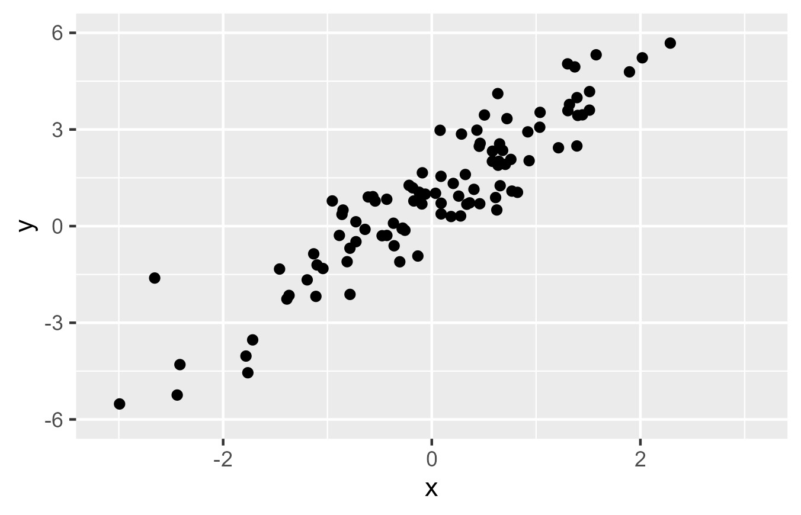

```{css,echo = F}
.small .remark-code { /*Change made here*/
  font-size: 85% !important;
}
.tiny .remark-code { /*Change made here*/
  font-size: 50% !important;
}
```

```{r,include=F}
set.seed(123)
options(width=60)
knitr::opts_chunk$set(fig.align='center',fig.width=9,fig.height=5,message=F,warning=F)
def.chunk.hook  <- knitr::knit_hooks$get("chunk")
knitr::knit_hooks$set(chunk = function(x, options) {
  x <- def.chunk.hook(x, options)
  ifelse(options$size != "normalsize", paste0("\n \\", options$size,"\n\n", x, "\n\n \\normalsize"), x)
})
```

# Agenda

1. Recap of regression and classification

2. Introducing (some) machine learning algorithms

---

# What is regression?

--

- Conditional means for continuous data

--


<center></center>

---

# Regression

--

- Calculating a **line** that minimizes mistakes *for every observation*

--

  - NB: could be a curvey line! For now, just assume straight
  
--

- Recall from geometry how to graph a straight line

--

- $Y = a + bX$

  - $a$: the "intercept" (where the line intercepts the y-axis)
  - $b$: the "slope" (how much $Y$ changes for each increase in $X$)

--

- (Data scientists use $\alpha$ and $\beta$ instead of $a$ and $b$ b/c nerds)

--

- Regression analysis simply chooses the best line

--

  - "Best"?

--

  - The line that minimizes the mistakes (the **line of best fit**)

---

# Visual Intuition

<center></center>


---

# Visual Intuition

<center></center>

---

# Two Camps Revisited

--

- Regression is great for **theory testing**

--

  - Results tell us something **meaningful** about our theory
  
--

- But if all we care about is **prediction**...?

--

  - Want to test every possible predictor (and combinations)
  
  - Don't care about **relationships**
  
  - Just care about **accuracy**
  
--

- Algorithms can save us time!

--

  - Random Forests
  
  - LASSO
  
---

# Random Forests

- Identify the best "partition" (split) that divides the data

--

<center></center>

--

- In `R`: `ranger`

--

  - `formula = Y ~ .`

---

# Random Forests

```{r,message=F,warning=F}
require(tidyverse)
require(scales)
require(tidymodels)
fn <- read_rds('https://github.com/jbisbee1/DS1000_F2024/raw/main/data/fn_cleaned_final.rds')
```


---

# Research Question

- What predicts whether you win at Fortnite?

```{r}
form.perf <- 'won ~ hits + assists + accuracy + head_shots + damage_to_players'

form.games <- 'won ~ eliminations + revives + distance_traveled + materials_gathered'

form.context <- 'won ~ mental_state + startTime + gameIdSession'

form.full <- 'won ~ hits + assists + accuracy + head_shots + damage_to_players + eliminations + revives + distance_traveled + materials_gathered + mental_state + startTime + gameIdSession'
```

---

# Comparing models

```{r}
m.perf <- lm(as.formula(form.perf),fn)
summary(m.perf)
```

---

# Comparing models

```{r}
m.games <- lm(as.formula(form.games),fn)
summary(m.games)
```

---

# Comparing models

```{r}
m.context <- lm(as.formula(form.context),fn)
summary(m.context)
```

---

# Evaluate Model Fit

```{r}
cvRes <- NULL
for(i in 1:100) {
  inds <- sample(1:nrow(fn),size = round(nrow(fn)*.8),replace = F)
  train <- fn %>% slice(inds)
  test <- fn %>% slice(-inds)
  
  # Train
  mTmp.perf <- lm(as.formula(form.perf),train)
  mTmp.games <- lm(as.formula(form.games),train)
  mTmp.context <- lm(as.formula(form.context),train)
  
  # Test
  toEval <- test %>%
    mutate(prob.p = predict(mTmp.perf,newdata = test),
           prob.g = predict(mTmp.games,newdata = test),
           prob.c = predict(mTmp.context,newdata = test),
           truth = factor(won,levels = c('1','0'))) 
  
  auc.p <- roc_auc(toEval,truth,prob.p) %>%
    mutate(model = 'performance')
  
  auc.g <- roc_auc(toEval,truth,prob.g) %>%
    mutate(model = 'games')
  
  auc.c <- roc_auc(toEval,truth,prob.c) %>%
    mutate(model = 'context')
    
  cvRes <- cvRes %>%
    bind_rows(auc.p) %>%
    bind_rows(auc.g) %>%
    bind_rows(auc.c) %>%
    mutate(cvInd = i)
}
```

---

# Evaluate Model Fit

```{r}
cvRes %>%
  ggplot(aes(x = .estimate,y = model)) + 
  geom_boxplot() + labs(x = 'AUC',y = 'Specification')
```

---

# Random Forests

```{r,message = FALSE}
require(ranger) # Fast random forests package
rf.f <- ranger(formula = as.formula(form.full),data = fn)

toEval <- fn %>%
  mutate(prob_won = rf.f$predictions) %>%
  mutate(truth = factor(won,levels = c('1','0')))

roc_auc(toEval,truth,prob_won)
```

---

# Random Forest Comparison

```{r}
cvRes <- NULL
for(i in 1:100) {
  inds <- sample(1:nrow(fn),size = round(nrow(fn)*.8),replace = F)
  train <- fn %>% slice(inds)
  test <- fn %>% slice(-inds)
  
  # Train
  mLM.f <- lm(as.formula(form.full),train)
  mRF.f <- ranger(as.formula(form.full),train)
  
  # Test
  # NEED TO RUN PREDICTION ON RF FIRST
  tmpPred <- predict(mRF.f,test)
  
  toEval <- test %>%
    mutate(prob.lm = predict(mLM.f,newdata = test),
           prob.rf = tmpPred$predictions,
           truth = factor(won,levels = c('1','0')))
  
  auc.lm <- roc_auc(toEval,truth,prob.lm) %>%
    mutate(model = 'linear')
  
  auc.rf <- roc_auc(toEval,truth,prob.rf) %>%
    mutate(model = 'random forest')

    cvRes <- cvRes %>%
    bind_rows(auc.lm) %>%
    bind_rows(auc.rf) %>%
    mutate(cvInd = i)
}
```

---

# Random Forest Comparison

```{r}
cvRes %>%
  ggplot(aes(x = .estimate,y = model)) + 
  geom_boxplot() + labs(x = 'AUC',y = 'Algorithm')
```

---

# What matters most?

- Random Forests are particularly suitable for investigating **variable importance**

--

  - I.e., which $X$ predictors are most helpful?
  
--

- A few options, but we rely on **permutation tests**

--

  - Idea: run the best model you have, then re-run it after "permuting" one of the variables
  
  - "Permute" means randomly reshuffle...breaks relationship
  
  - How much **worse** is the model when you break a variable?
  
---

# Variable Importance

- In `ranger()`, use `importance = "permutation"`

```{r}
rf.full <- ranger(formula = as.formula(form.full),data = fn %>%
                    mutate(mental_state = ifelse(mental_state == 'sober',1,0)),importance = 'permutation')

rf.full$variable.importance
```

---

# Variable Importance

.small[
```{r}
toplot <- data.frame(vimp = rf.full$variable.importance,
                     vars = names(rf.full$variable.importance))

toplot %>%
  ggplot(aes(x = vimp,y = reorder(vars,vimp))) + 
  geom_bar(stat = 'identity') + labs(x = 'VIMP',y = 'Predictor')
```
]


---

# LASSO

--

- "Least Absolute Shrinkage and Selection Operator"

--

- Concept: Make it hard for predictors to matter

--

  - Practice: $\lambda$ penalizes how many variables you can include
  
  - $\sum_{i = 1}^n (y_i - \sum_j x_{ij}\beta_j)^2 + \lambda \sum_{j=1}^p |\beta_j|$
  
  - Minimize the errors, but penalize for each additional predictor
  
  - You *could* kitchen-sink a regression and get super low errors
  
  - LASSO penalizes you from throwing everything into the kitchen sink

--

- In `R`, need to install a new package! `install.packages('glmnet')`

```{r,message = FALSE}
require(glmnet)
```

---

# LASSO

- Function doesn't use formulas

--

- Give it the raw data instead, divided into `Y` (outcome) and `X` (predictors)

--

```{r}
rhsVars <- str_split(gsub('won ~ ','',form.full),' \\+ ')[[1]]
fn <- fn %>%
  drop_na(all_of(rhsVars))
Y <- fn$won
X <- fn %>% select(all_of(rhsVars)) %>%
  mutate(mental_state = ifelse(mental_state == 'sober',1,0),
         startTime = as.numeric(startTime))
```


---

# LASSO

- Now estimate!

```{r}
lassFit <- glmnet(x = as.matrix(X),
                  y = as.matrix(Y))
```

---

# LASSO

```{r}
plot(lassFit)
```

---

# Has its own CV!

```{r}
cv.lassFit <- cv.glmnet(x = as.matrix(X),y = as.matrix(Y))

plot(cv.lassFit)
```

---

# Variable Importance

```{r}
best <- cv.lassFit$glmnet.fit$beta[,cv.lassFit$index[2,]]
vimpLass <- data.frame(vimp = best,
                       vars = names(best))
vimpLass %>%
  ggplot(aes(x = vimp,y = reorder(vars,vimp))) + 
  geom_bar(stat = 'identity')
```

---

# Conclusion

- Lots of powerful tools out there!

- Make sure to take **more classes** on these topics!

--
  
- Go to Brightspace and take the **16th** quiz

--

- **Homework:**

  - HW 17

