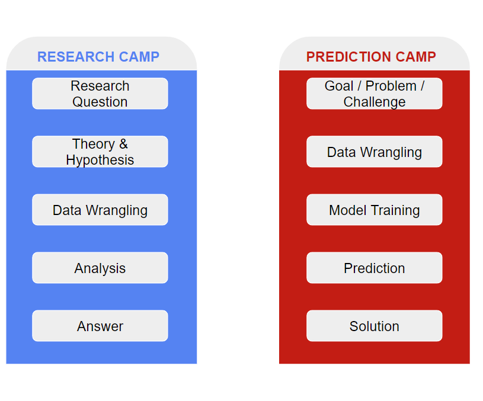
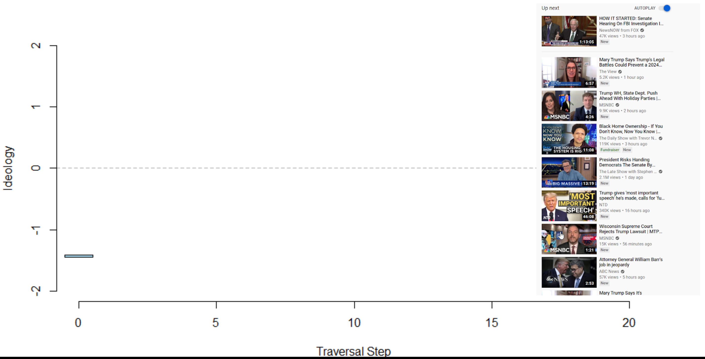
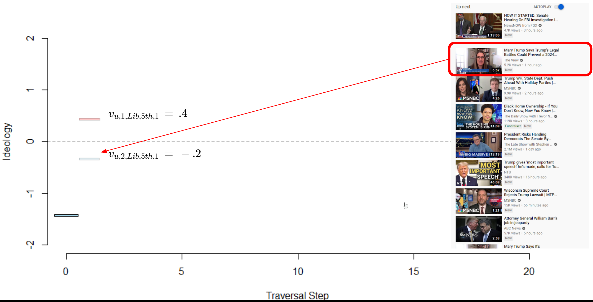
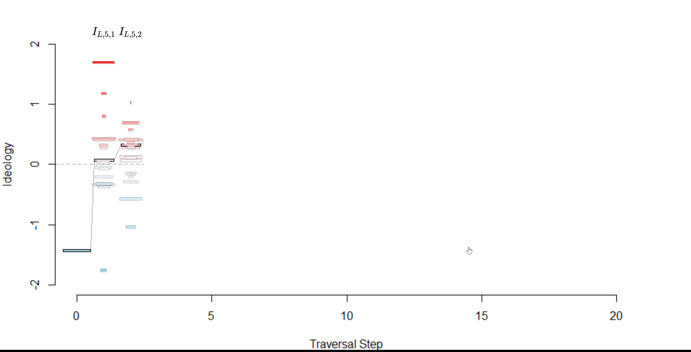
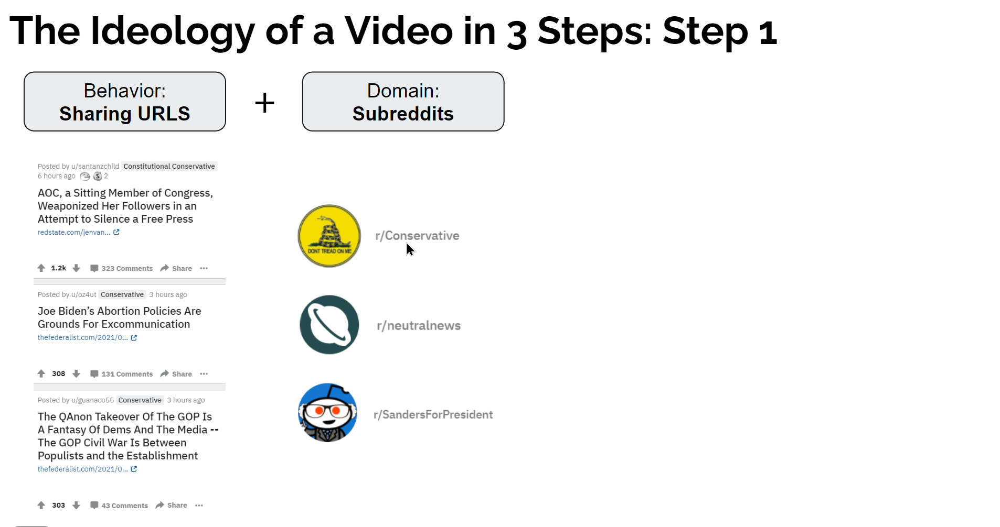

```{css,echo = F}
.small .remark-code { /*Change made here*/
  font-size: 85% !important;
}
.tiny .remark-code { /*Change made here*/
  font-size: 50% !important;
}
```

```{r,include=F}
set.seed(123)
options(width=60)
knitr::opts_chunk$set(fig.align='center',fig.width=9,fig.height=5,message=F,warning=F)
def.chunk.hook  <- knitr::knit_hooks$get("chunk")
knitr::knit_hooks$set(chunk = function(x, options) {
  x <- def.chunk.hook(x, options)
  ifelse(options$size != "normalsize", paste0("\n \\", options$size,"\n\n", x, "\n\n \\normalsize"), x)
})
```

# Agenda

1. Meet the instructor

2. Course Motivation

  - What is data science (DS) & why should we care?

3. Course Objectives

  - **Content:** Critical thinking, analysis, presentation

  - **Skills:** Computing and analysis in R

4. ChatGPT and data science
  
5. Course Expectations & Syllabus review

---

# Meet the instructor

- Education

--

  - PhD from NYU Politics in 2019

  - Postdocs at Princeton Niehaus & NYU CSMaP
  
--

- Published some things

--

  - Methods-ey: external validity [1](https://www.journals.uchicago.edu/doi/full/10.1086/691280?af=R), [2](https://www.cambridge.org/core/journals/american-political-science-review/article/testing-social-science-network-theories-with-online-network-data-an-evaluation-of-external-validity/4BF517F10F38DFB574FED4A3D805B613); measurement [3](https://www.cambridge.org/core/journals/american-political-science-review/article/barp-improving-mister-p-using-bayesian-additive-regression-trees/630866EB47F9366EDB3C22CFD951BB6F), [4](https://www.cambridge.org/core/journals/political-analysis/article/geographic-boundaries-and-local-economic-conditions-matter-for-views-of-the-economy/32C8C058B8E16CAD48374F95B2B1B3EF)

  - Substantive: economics & populism [1](https://www.tandfonline.com/doi/full/10.1080/13501763.2019.1678662); Covid-19 & U.S. politics [2](https://www.journals.uchicago.edu/doi/10.1086/716969),  [3](https://www.cambridge.org/core/journals/american-political-science-review/article/flight-to-safety-covidinduced-changes-in-the-intensity-of-status-quo-preference-and-voting-behavior/AE84D93BAF8B27284DD8F6A75DE5D18A); IPE [4](https://doi.org/10.1017/S0020818319000109); academic naval-gazing [5](https://www.cambridge.org/core/journals/perspectives-on-politics/article/abs/polisci-twitter-a-descriptive-analysis-of-how-political-scientists-use-twitter-in-2019/C8A193C3E939C1ABCD4600DFE8AEF79A?utm_source=hootsuite&utm_medium=twitter&utm_campaign=PPS_Dec20)

  - Popular press: [1](https://www.washingtonpost.com/news/monkey-cage/wp/2018/04/04/losing-jobs-to-free-trade-makes-americans-more-protectionist-and-nativist/), [2](https://www.washingtonpost.com/politics/2020/04/02/sanders-was-losing-biden-anyway-he-lost-more-areas-with-coronavirus-cases/?utm_medium=social&utm_source=twitter&utm_campaign=wp_monkeycage), [Podcasts](https://www.niskanencenter.org/did-chinese-trade-competition-increase-nativism-and-elect-trump/)
  
--

- Work

--

  - World Bank / IFC
  
  - MarketCast

---

# Meet the instructor

- Current research

--

  - .red[YouTube] + .blue[polarization]

--

  - .red[Twitter] + .blue[misinformation]
  
--

  - .red[Telegram] + .blue[white supremacists]
  
--

  - .red[Stocks] + .blue[politicians]

---

# Why are you here?

--

background-image: url(./figs/fight_ds_econ.PNG)
background-size: contain

--

background-image: url(./figs/fight_ds_ps.PNG)
background-size: contain

--

background-image: url(./figs/fight_ds_cs.PNG)
background-size: contain

--

background-image: url(./figs/fight_ds_stats.PNG)
background-size: contain

--

background-image: url(./figs/fight_ds_stem.PNG)
background-size: contain

---

# Is this all just a fad?

--

- No


<center></center>


---

# Is this all just a fad?

- But there are faddish qualities

<center></center>


---

# So what IS data science?

- Split into two camps

--

1. .blue[Research] camp

--

  - Focused on **answering a research question**
  
  - Follows the "scientific method"
  
  - Goal: contribute to knowledge
  
  - Domain: academia
  
--
  
2. .red[Prediction] camp

--

  - Focused on **making a prediction**
  
  - Typically unconcerned with theory or *why* a model works
  
  - Goal: inform a decision / policy
  
  - Domain: private sector

--
  
(3. .red[Learning] camp)

--

  - Let the data "speak"
  
  - (More of a subset of camps 1 and 2)
  
---

# The Two Camps

<center></center>

---

# The Two Camps

<center></center>

---

# The Two Camps

<center></center>

---

# .blue[Research] Camp

- The scientific method

  1. .red[Observation] &rarr; .blue[Question]

--

  2. .blue[Theory] &rarr; .blue[Hypothesis]

--

  3. .red[Data Collection / Wrangling] &rarr; .red[Analysis]

--

  4. .red[Results] &rarr; .blue[Conclusion]
  
--

```{r,echo=F,fig.height=3,fig.align='center',warning=F,message=F}
require(tidyverse)
data.frame(step = c('Observation','Question','Theory','Hypothesis','Data Collection',
                    'Analysis','Results','Conclusion'),
           Framework = c('Data','Science','Science','Science','Data','Data','Data','Science'),
           x = c(.5,1.5,2.5,3.5,4.5,5.5,6.5,7.5),
           xend = c(1.5,2.5,3.5,4.5,5.5,6.5,7.5,8.5),
           y = c(-.5,-1,-2,-.75,-2,-1,-.75,-.5),
           yend = c(.5,1,2,.75,2,1,.75,.5)) %>%
  ggplot(aes(x = x,y = y,fill = Framework)) + 
  geom_rect(aes(xmin = x,ymin = y,xmax = xend,ymax = yend)) + 
  # geom_rect(xmin = c(2.5),ymin = c(-2),xmax = c(3.5),ymax = c(2),fill = NA,color = 'black',lwd = 2,
  #           inherit.aes = F) + 
  # geom_rect(xmin = c(4.5),ymin = c(-2),xmax = c(5.5),ymax = c(2),fill = NA,color = 'black',lwd = 2,
  #           inherit.aes = F) + 
  scale_fill_manual(values = c('red','blue')) +
  theme(axis.text.y = element_blank(),
        panel.background = element_rect(fill = 'grey90'),
        panel.grid.major = element_blank(), panel.grid.minor = element_blank(),
        axis.ticks = element_blank(),
        plot.background = element_rect(
          fill = "grey90" #,
          # colour = "black",
          # size = 1
        ),
        axis.text.x = element_text(angle = 45,hjust = 1,size = 14)) + 
  scale_x_continuous(breaks = seq(1,8,by = 1),labels = c('Observation','Question','Theory','Hypothesis','Data Prep',
                                                         'Analysis','Results','Conclusion')) + 
  xlab(NULL) + ylab(NULL)
```


---

# .blue[Research] Camp

- The scientific method

  1. .red[Observation] &rarr; .blue[Question]

  2. .blue[Theory] &rarr; .blue[Hypothesis]

  3. .red[Data Collection / Wrangling] &rarr; .red[Analysis]

  4. .red[Results] &rarr; .blue[Conclusion]

```{r,echo=F,fig.height=3,fig.align='center',warning=F,message=F}
require(tidyverse)
data.frame(step = c('Observation','Question','Theory','Hypothesis','Data Collection',
                    'Analysis','Results','Conclusion'),
           Framework = c('Data','Science','Science','Science','Data','Data','Data','Science'),
           x = c(.5,1.5,2.5,3.5,4.5,5.5,6.5,7.5),
           xend = c(1.5,2.5,3.5,4.5,5.5,6.5,7.5,8.5),
           y = c(-.5,-1,-2,-.75,-2,-1,-.75,-.5),
           yend = c(.5,1,2,.75,2,1,.75,.5)) %>%
  ggplot(aes(x = x,y = y,fill = Framework)) + 
  geom_rect(aes(xmin = x,ymin = y,xmax = xend,ymax = yend)) + 
  geom_rect(xmin = c(2.5),ymin = c(-2),xmax = c(3.5),ymax = c(2),fill = NA,color = 'black',lwd = 2,
            inherit.aes = F) + 
  geom_rect(xmin = c(4.5),ymin = c(-2),xmax = c(5.5),ymax = c(2),fill = NA,color = 'black',lwd = 2,
            inherit.aes = F) + 
  scale_fill_manual(values = c('red','blue')) +
  theme(axis.text.y = element_blank(),
        panel.background = element_rect(fill = 'grey90'),
        panel.grid.major = element_blank(), panel.grid.minor = element_blank(),
        axis.ticks = element_blank(),
        plot.background = element_rect(
          fill = "grey90" #,
          # colour = "black",
          # size = 1
        ),
        axis.text.x = element_text(angle = 45,hjust = 1,size = 14)) + 
  scale_x_continuous(breaks = seq(1,8,by = 1),labels = c('Observation','Question','Theory','Hypothesis','Data Prep',
                                                         'Analysis','Results','Conclusion')) + 
  xlab(NULL) + ylab(NULL)
```


---

# .blue[Research] Camp

--

<center></center>

---

# .blue[Research] Camp

1. **.red[Observation]** &rarr; **.blue[Question]**
  
--

  - Observation is facilitated by .red[data] (Descriptive analysis)

--


---

# .blue[Research] Camp

1. **.red[Observation]** &rarr; **.blue[Question]**

  - Observation is facilitated by .red[data] (Descriptive analysis)


---

# .blue[Research] Camp

1. **.red[Observation]** &rarr; **.blue[Question]**

  - Observation is facilitated by .red[data] (Descriptive analysis)


---

# .blue[Research] Camp

1. **.red[Observation]** &rarr; **.blue[Question]**

  - The question pertains to .blue[science]
  
--

  - I.e., does YouTube's algorithm put users into "echo chambers"?

--

<center></center>

---

# .blue[Research] Camp

<ol start = 2>

<li> **.blue[Theory]** &rarr; **.blue[Hypothesis]**
  
--

  - Theorizing requires abstraction & simplification

  - I.e., people (in general) avoid conflict

--

<center></center>

---

# .blue[Research] Camp

<ol start = 2>

<li> **.blue[Theory]** &rarr; **.blue[Hypothesis]**

  - Theorizing requires abstraction & simplification

  - I.e., people (in general) avoid conflict

<center></center>

---

# .blue[Research] Camp

<ol start = 2>

<li> **.blue[Theory]** &rarr; **.blue[Hypothesis]**

  - Theorizing requires abstraction & simplification

  - I.e., people (in general) avoid conflict

<center></center>

---

# .blue[Research] Camp

<ol start = 2>

<li> **.blue[Theory]** &rarr; **.blue[Hypothesis]**

  - Theorizing requires abstraction & simplification

  - I.e., people (in general) avoid conflict

<center></center>


---

# .blue[Research] Camp

<ol start = 2>

<li> **.blue[Theory]** &rarr; **.blue[Hypothesis]**

  - Theorizing requires abstraction & simplification

  - I.e., people (in general) avoid conflict

<center></center>

---

# .blue[Research] Camp

<ol start = 2>

<li> **.blue[Theory]** &rarr; **.blue[Hypothesis]**

  - Theorizing requires abstraction & simplification

  - I.e., people (in general) avoid conflict
  
  - YouTube wants users to watch more videos

--

.leftcol[

]

--

.rightcol[

]


---

# .blue[Research] Camp

<ol start = 2>

<li> **.blue[Theory]** &rarr; **.blue[Hypothesis]**

  - Theorizing requires abstraction & simplification

  - I.e., people (in general) avoid conflict
  
  - YouTube wants users to watch more videos

- Hypotheses fall out naturally from well-done theory

--

- **H1:** *YouTube's recommendation algorithm should suggested liberal content to liberals and conservative content to conservatives.*


---

# .blue[Research] Camp

<ol start = 3>

<li> **.red[Data Collection / Wrangling]** &rarr; **.red[Analysis]**

  - Data collection separates "Data Science"...
  
  - ...from "Science, with data"
  
<center></center>

---

# .blue[Research] Camp

<ol start = 3>

<li> **.red[Data Collection / Wrangling]** &rarr; **.red[Analysis]**

  - Data collection separates "Data Science"...
  
  - ...from "Science, with data"
  
<center></center>

---

# .blue[Research] Camp

<ol start = 3>

<li> **.red[Data Collection / Wrangling]** &rarr; **.red[Analysis]**

  - Data collection separates "Data Science"...
  
  - ...from "Science, with data"
  
<center></center>

---

# .blue[Research] Camp

<ol start = 3>

<li> **.red[Data Collection / Wrangling]** &rarr; **.red[Analysis]**

  - Data collection separates "Data Science"...
  
  - ...from "Science, with data"
  
<center></center>

---

# .blue[Research] Camp

<ol start = 3>

<li> **.red[Data Collection / Wrangling]** &rarr; **.red[Analysis]**

--

- Analysis is informed by the .red[data] you have collected...

- ...and the .blue[hypotheses] you have generated

--

<center></center>

---

# .blue[Research] Camp

<ol start = 3>

<li> **.red[Data Collection / Wrangling]** &rarr; **.red[Analysis]**

- Analysis is informed by the .red[data] you have collected...

- ...and the .blue[hypotheses] you have generated

<center></center>

---

# .blue[Research] Camp

<ol start = 3>

<li> **.red[Data Collection / Wrangling]** &rarr; **.red[Analysis]**

- Analysis is informed by the .red[data] you have collected...

- ...and the .blue[hypotheses] you have generated

<center></center>

---

# .blue[Research] Camp

<ol start = 3>

<li> **.red[Data Collection / Wrangling]** &rarr; **.red[Analysis]**

- Analysis is informed by the .red[data] you have collected...

- ...and the .blue[hypotheses] you have generated

<center></center>

---

# .blue[Research] Camp

<ol start = 3>

<li> **.red[Data Collection / Wrangling]** &rarr; **.red[Analysis]**

- Analysis is informed by the .red[data] you have collected...

- ...and the .blue[hypotheses] you have generated

<center></center>

---

# .blue[Research] Camp

<ol start = 3>

<li> **.red[Data Collection / Wrangling]** &rarr; **.red[Analysis]**

- Analysis is informed by the .red[data] you have collected...

- ...and the .blue[hypotheses] you have generated

<center></center>

---

# .blue[Research] Camp

<ol start = 3>

<li> **.red[Data Collection / Wrangling]** &rarr; **.red[Analysis]**

- Analysis is informed by the .red[data] you have collected...

- ...and the .blue[hypotheses] you have generated

<center></center>

---

# .blue[Research] Camp

<ol start = 3>

<li> **.red[Data Collection / Wrangling]** &rarr; **.red[Analysis]**

- Analysis is informed by the .red[data] you have collected...

- ...and the .blue[hypotheses] you have generated

<center></center>

---

# .blue[Research] Camp

<ol start = 3>

<li> **.red[Data Collection / Wrangling]** &rarr; **.red[Analysis]**

- Analysis is informed by the .red[data] you have collected...

- ...and the .blue[hypotheses] you have generated

<center></center>

---

# .blue[Research] Camp

<ol start = 3>

<li> **.red[Data Collection / Wrangling]** &rarr; **.red[Analysis]**

- Analysis is informed by the .red[data] you have collected...

- ...and the .blue[hypotheses] you have generated

<center></center>

---

# .blue[Research] Camp

<ol start = 3>

<li> **.red[Data Collection / Wrangling]** &rarr; **.red[Analysis]**

- Analysis is informed by the .red[data] you have collected...

- ...and the .blue[hypotheses] you have generated

<center></center>

---

# .blue[Research] Camp

<ol start = 3>

<li> **.red[Data Collection / Wrangling]** &rarr; **.red[Analysis]**

- Analysis is informed by the .red[data] you have collected...

- ...and the .blue[hypotheses] you have generated

<center></center>

---

# .blue[Research] Camp

<ol start = 3>

<li> **.red[Data Collection / Wrangling]** &rarr; **.red[Analysis]**

- Analysis is informed by the .red[data] you have collected...

- ...and the .blue[hypotheses] you have generated

<center></center>

---

# .blue[Research] Camp

<ol start = 3>

<li> **.red[Data Collection / Wrangling]** &rarr; **.red[Analysis]**

- Analysis is informed by the .red[data] you have collected...

- ...and the .blue[hypotheses] you have generated

<center></center>


---

# .blue[Research] Camp

<ol start = 4>

<li> **.red[Results]** &rarr; **.blue[Conclusion]**

  - Results fall out naturally from the analysis...
  
  - ...and must be interpreted in terms of the theory and hypotheses...
  
  - ...to draw conclusions

<center></center>

---

# .blue[Research] Camp

<ol start = 4>

<li> **.red[Results]** &rarr; **.blue[Conclusion]**

  - Results fall out naturally from the analysis...
  
  - ...and must be interpreted in terms of the theory and hypotheses...
  
  - ...to draw conclusions

<center></center>

---

# The Two Camps

<center></center>

---

# .red[Prediction] Camp

- **Goal/Problem/Challenge**: Measure the ideology of a YouTube video

---

# .red[Prediction] Camp

- **Data Wrangling**: Get matrix of links shared on political subreddits

--

<center></center>

---

#.red[Prediction] Camp

- **Data Wrangling**: Get matrix of links shared on political subreddits

<center></center>

---

#.red[Prediction] Camp

- **Data Wrangling**: Get matrix of links shared on political subreddits

<center></center>

---

#.red[Prediction] Camp

- **Data Wrangling**: Correspondence Analysis to estimate ideology scores for subreddits

<center></center>

---

#.red[Prediction] Camp

- **Data Wrangling**: Get matrix of YouTube videos shared on scored subreddits

<center></center>

---

#.red[Prediction] Camp

- **Data Wrangling**: Get matrix of YouTube videos shared on scored subreddits

<center></center>

---

#.red[Prediction] Camp

- **Data Wrangling**: Get matrix of YouTube videos shared on scored subreddits

<center></center>

---

#.red[Prediction] Camp

- **Data Wrangling**: Get matrix of 60k YouTube videos shared on scored subreddits

<center></center>

---

#.red[Prediction] Camp

- **Data Wrangling**: Calculate video ideology as weighted mean of subreddits

<center></center>

---

#.red[Prediction] Camp

- **Model Training**: BERT transformer trained on 60k videos

<center></center>

---

#.red[Prediction] Camp

- **Prediction**: Measure the ideology of a YouTube video

<center></center>


---

# Course Objectives

- This course is the menu, not the food

--

  - Look over many different fields, methods, and tools

--

  - You pick those you like, and take more advanced classes to dig into them

--

- But we are very **hands on**

--

  - You must download `R` and `RStudio` prior to next class (Problem Set 0)
  
--

  - You must work through first HW using an `.Rmd` file
  
---

# Learning goals

1. Generate a sophisticated research question based on clearly described assumptions and a narrowly defined hypothesis.

--

2. Describe the data used to investigate this research question, including univariate and multivariate visualizations and summary statistics.

--

3. Apply the appropriate methods to answer the research question and evaluate the hypothesis.

--

4. Acknowledge limitations of method and results, and describe a superior empirical setting that would overcome these limitations.


---

# ChatGPT in the classroom

- Are we at the precipice of a new era in human-computer relations?

--

  - ChatGPT can achieve these learning goals!
  
--

  - But it needs to be used wisely...it is still a tool
  
--

- It can make coding (the hardest part of this class) easier

--

- But it can also prevent you from learning

---

# AI in the labor market

- McKinsey told AT&T in 1980 that, by 2000, cell phones would be a niche market of 900,000 subscribers

--

- Is AI-assisted work is the future?

--

  - Profound gains in productivity already

--

- Will this be like automation and globalization for US manufacturing?
  
--

  - What skills will be valuable in 5 years? 10 years?
  
---

# AI in the labor market

--

- My answer: prepare you for both possibilities

--

  - If AI is a "fad", make sure you can do this work unassisted
  
  - If AI is the new normal, make sure you can work with it productively
  
--

- The one thing you **shouldn't** do

--

  - Take shortcuts / cheat
  
--

- You will still have an interview in which you are asked something like the following: "How is overfitting different from underfitting, and why should we care?"

--

  - **You** need to know this answer


---

# Grades

<center></center>

---

# Grades: PSets

- 9 in total, only 8 are graded (one freebie)

--

  - Pset 0 doesn't count
  
--

  - 5 points each + 1 EC
  
--

- Posted to **Brightspace** on Mondays at noon

--

- Due **Friday by midnight**

  - Each day late is -1 point

  - After 3 days, scored zero
  
--

- Restrictions:

  - Open book / open note / open Campuswire

  - Can collaborate but submissions must be your own
  
--

- **Must submit a record of ChatGPT work with the problem set**
  
---

# Grades: Exams

- 2 in total: midterm on October 8th, final on December 10th

--

- Midterm is 20 points + 5 EC

- Final (cumulative) is 25 points + 5 EC


---

# Grades: Quizzes

- Taken at beginning of each lecture

- Each quiz is worth one point

- 19 total quizzes, only 15 count toward final grade (four freebies)

--

- Password protected

  - Only students in class can take them
  
  - 50% of quiz grade is just taking it (effectively a way to track attendance)
  
  - 50% of quiz grade are questions related to **homework**


---

# Not Graded: HW

- You should work through the homeworks prior to each lecture

--

- Open the `.Rmd` file and Knit it

--

- Read the output and try and answer the prompts

--

- **Not graded**, but enormously helpful in preparing you to keep up with lectures


---

# The Syllabus

- (Go to Github)

---

# Honor Code

--

- Students are assumed to have read and agreed with the [Vanderbilt University Academic Honesty policy](https://www.vanderbilt.edu/student_handbook/the-honor-system/)

--

- Violations of this policy may result in:

--

  - An F for the semester (at minimum)
  
  - Suspension for a semester
  
  - Expulsion
  
--

- However, except where **explicitly noted**, this course is collaborative

--

  - Open book, open note, open internet
  
  - Can rely on Campuswire for help
  
  - Can work together on problem sets (but must submit own work)
  
--

- **Can't collaborate on exams**

---

# Resources

- Campuswire (place for **questions**)

  - Post questions on the class feed
  
--

- Brightspace (place for **submissions**)

  - Submit problem sets, quizzes, and exams
  
--

- GitHub (place for **materials**)

  - Find all in-class materials
  
--

- TA recitations / labs (place for **hands-on help**)

- Office hours (place for **hands-on help**)
  
---

# Teaching Philosophy

<center></center>

---

# Teaching Philosophy

- This course is **inherently** hard

--

  - Learning `R` is challenging
  
--

- But the goal is to **encourage** you to pursue data science

--

- As such, the **nature** of the material is at odds with the **goal** of the class

--

- My solution: grade leniently

--

  - I.e., lots of extra credit

---

# Previous Semester

<center></center>


---

# Conclusion

- Let's have a great semester!

--

- Homework:

--

  1. Work through ds1000_hw_1.Rmd
  
  2. Complete Problem Set 0 (on Brightspace)
  
  3. Create an OpenAI account (https://platform.openai.com/signup)
