```{r,include=F}
options(width=60)
knitr::opts_chunk$set(fig.align='center',fig.width=9,fig.height=5)
```


# Agenda

- Ethics

  1. Ethics & .red[data] .blue[science]

--

  2. Ethics & machine learning

--

  - NB: some of this could be triggering (and it is certainly vulgar)
  

  
---

# Why should we focus on ethics?

--

- First, why should anyone?

--

- Second, why should researchers?

--

  - Researchers contribute to **human knowledge**

--

<center></center>


---

# Why should we focus on ethics?

- First, why should anyone?

- Second, why should researchers?

  - Researchers contribute to **human knowledge**

  - This is power, and with it comes responsibility
  
--
  
- Third, why should .red[data] .blue[scientists] in particular?

--

<center></center>


---

background-image: url("https://eoimages.gsfc.nasa.gov/images/imagerecords/149000/149062/issmosaic6x3.jpg")
background-size: 95%

# 


--

> [J]ust as the invention of the telescope revolutionized the study of the heavens, so too by **rendering the unmeasurable measurable**, the technological revolution in mobile, Web, and Internet communications has the potential to revolutionize our understanding of ourselves and how we interact.

> `r tufte::quote_footer('-- Duncan Watts (2011, p. 266)')`

---


# Readymade Data

--

- Data generated by human behaviors **without their knowledge**

--

<iframe width="900" height="600" src="https://james-bisbee.shinyapps.io/shiny_chord/" frameborder="0"></iframe>


---

# Readymade Data

--

- Twitter accounts are public

--

  - If anyone can read this tweet, why can't I study it?

--

  - "They should know better."
  


---

# Readymade Data

- Privacy as a human right

--

  1. Right to solitude

  2. Right to intimacy
  
  3. Right to anonymity
  
  4. Right to reserve
  
  > [Frank T. McAndrew (2019) "On the Nature of Privacy"](https://www.psychologytoday.com/us/blog/out-the-ooze/201905/the-nature-privacy)
  
--

- Human capacity vs technological capacity for change

--

- "Should know" is not grounds for an ethical argument


---

# How is ethics practiced in data science today?

--

<center></center>


---

# How is ethics practiced in data science today?

- In academia

--

  - Primarily **rules-based** approach
  
--

- Elsewhere

--

  - **Ad hoc** approach
  
--

- Increasing push for a **Principles-based** approach
  
---

# Rules-Based Approach

--

- IRBs + federal law (in the U.S.)

--

- Limitations

--

  - Slow to change
  
  - Hard to explain
  
---

# Ad Hoc Approach

--

- People thinking about ethics independently

--

- Limitations

--
  
  - No community feedback

--

  - Hard to do!

---

# Principles-Based Approach

--

- Implicit in both **rules-based** and **ad hoc** approaches

--

- Puts the principles first

--

  - Principles developed by ethics community
  
---

# Principles-Based Approach

--

1. Respect for persons

--

  - People's autonomy should be respected

--

2. Beneficence

--

  - Define / measure costs and benefits
  
--

  - Evaluate whether benefits outweight costs

--

3. Justice

--

  - Distribution of costs and benefits

--

4. Respect for Law & Public Interest

--

  - Compliance with laws, terms of service
  
--

  - Transparency about methods, procedures to ensure accountability
  
---

# Principles-Based Approach

--

- In practice, ensuring all 4 principles is **very difficult**

--

  - I.e., sharing replication materials creates tension between #4 (transparency) and #1 & #2 (respect for persons and costs)
  
--

- Ethical Frameworks

--

  1. Deontology (focus on means)
  2. Consequentialism (focus on ends)

--

<center>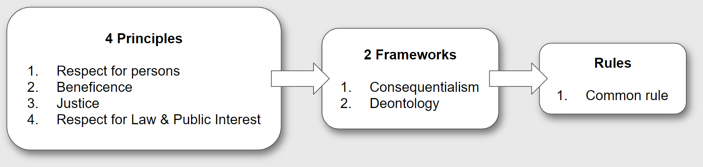</center>

---

# The Importance of Explanation

--

- Balancing principles with Ethical Frameworks requires explanation

--

  - Elicits feedback &rarr; new **perspectives**
  
--

  - Consistent with Principle #4: transparency & accountability
  
--

- Prevents **dogmatism** & **extremism**

--

  - Extreme consequentialism: organ donor example
  
--

  - Extreme deontology: public safety example

---

# Applying Principles is Hard

--

- Simple idea + counter example(s) &rarr; improved idea

--

**`1.`** Informed Consent

--

.leftcol[

- **Simple Idea:** Informed consent from all participants

]

--

.rightcol[
**Counter Example**

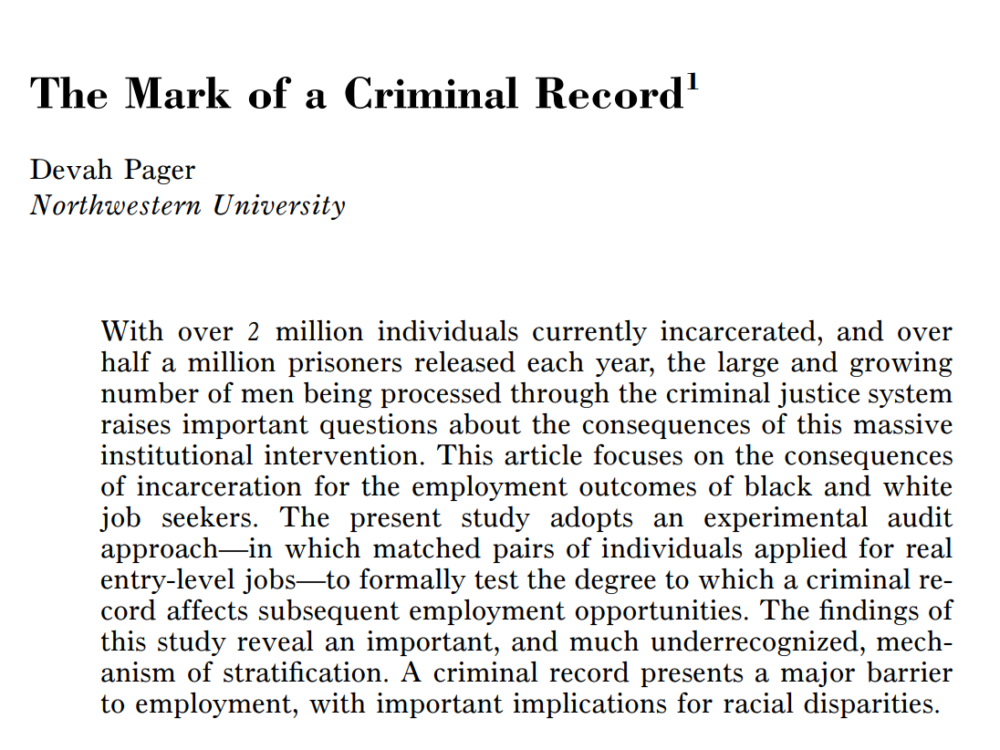

]

---

# Applying Principles is Hard

- Simple idea + counter example(s) &rarr; improved idea

**`1.`** Informed Consent

.leftcol[

- **Simple Idea:** Informed consent from all participants

- **Principles-Based Defense**: 

  - Limited harm to employers
  
  - Great social benefit
  
  - Lack of alternative methods
  
  - Consistent with setting norms

]

.rightcol[
**Counter Example**


]


---

# Applying Principles is Hard

- Simple idea + counter example(s) &rarr; improved idea

**`1.`** Informed Consent

.leftcol[

- ~~**Simple Idea:** Informed consent from all participants~~

- **Improved Idea:** Some form of consent for most research

]

.rightcol[
**Counter Example**


]


---

# Applying Principles is Hard

- Simple idea + counter example(s) &rarr; improved idea

**`2.`** Informational Risk

--

  1. Economic
  
  2. Social
  
  3. Psychological
  
  4. Criminal


---

# Applying Principles is Hard

- Simple idea + counter example(s) &rarr; improved idea

**`2.`** Informational Risk

.leftcol[

- **Simple Idea:** Data can be anonymized

]

--

.rightcol[
**Counter Example**

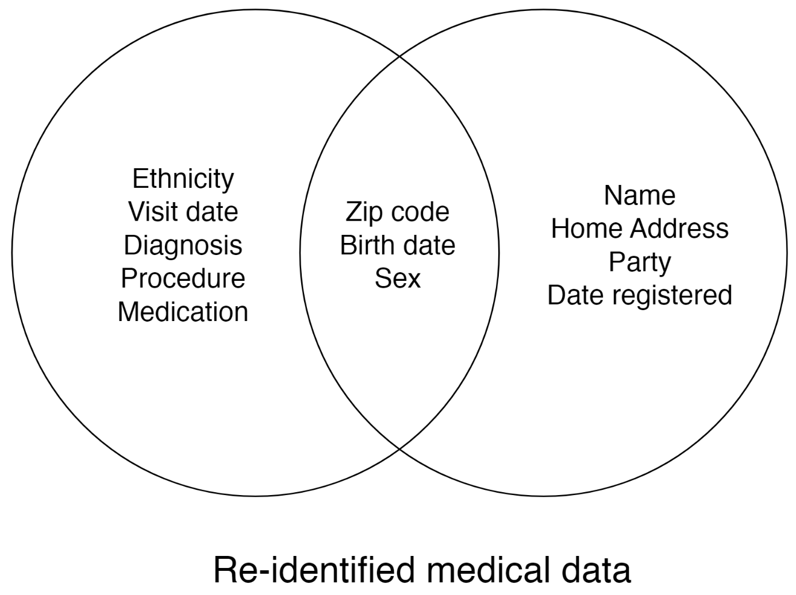

- [Sweeney (2002)](https://epic.org/wp-content/uploads/privacy/reidentification/Sweeney_Article.pdf)
]


---

# Applying Principles is Hard

- Simple idea + counter example(s) &rarr; improved idea

**`2.`** Informational Risk

.leftcol[

- **Simple Idea:** Data can be anonymized

- **Simple Idea:** We can tell which data is sensitive

]

--

.rightcol[
**Counter Example**

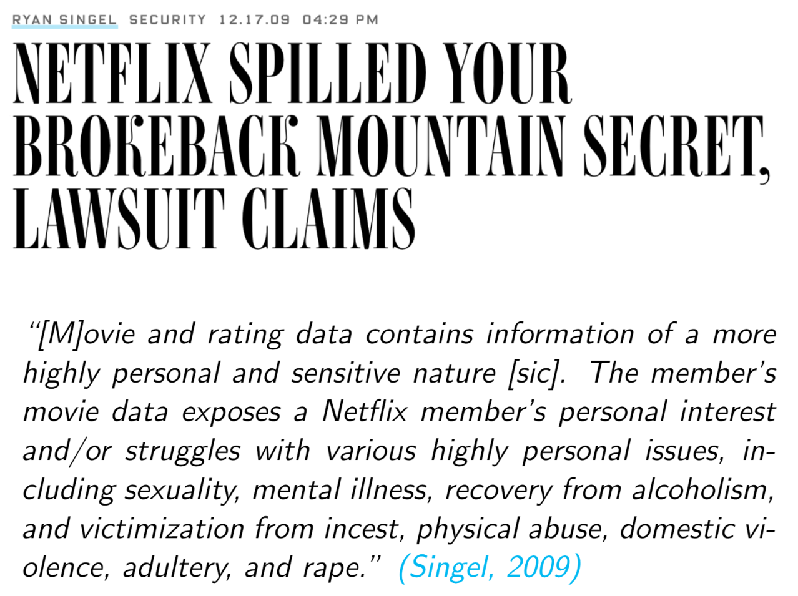

]

---

# Applying Principles is Hard

- Simple idea + counter example(s) &rarr; improved idea

**`2.`** Informational Risk

.leftcol[

- ~~**Simple Idea:** Data can be anonymized~~

- ~~**Simple Idea:** We can tell which data is sensitive~~

- **Improved Idea:** All data are potentially identifiable & sensitive

]

--

.rightcol[

- **Data Protection Plans** can minimize Informational Risk 

- "Five Safes" *[(Desai et al 2016)](https://core.ac.uk/download/pdf/323894811.pdf)*

  1. Safe Projects

  2. Safe People

  3. Safe Data

  4. Safe Settings

  5. Safe Output

]

---

# Applying Principles is Hard

- Simple idea + counter example(s) &rarr; improved idea

**`3.`** Privacy

--

.leftcol[

**Simple Idea:** Privacy is defined by public/private dichotomy

]

--

.rightcol[

**Counter Example**

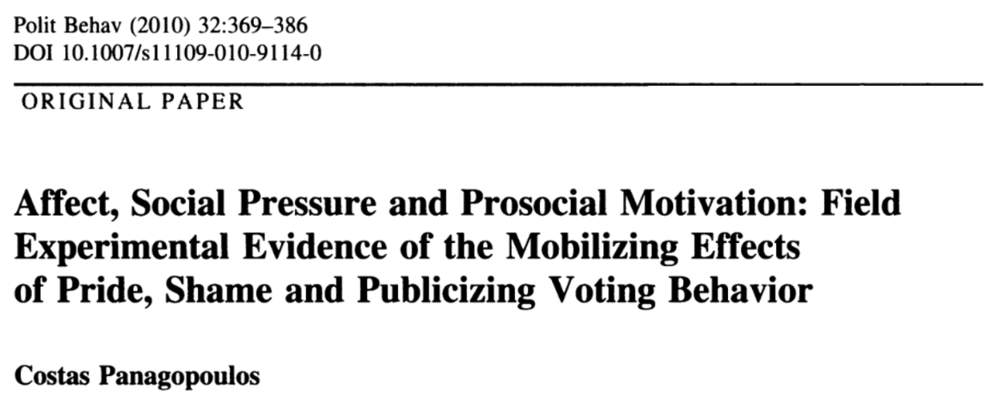

]


---

# Applying Principles is Hard

- Simple idea + counter example(s) &rarr; improved idea

**`3.`** Privacy

.leftcol[

**Simple Idea:** Privacy is defined by public/private dichotomy

]

.rightcol[

**Counter Example**

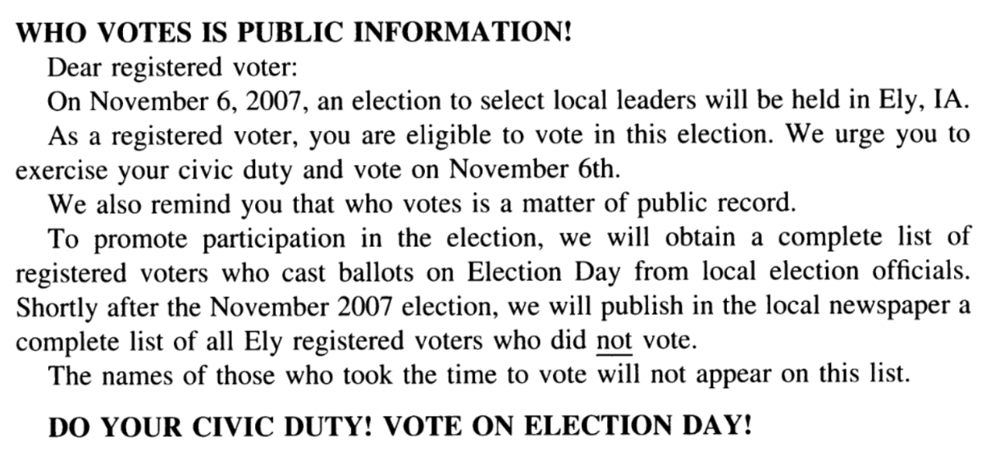

]


---

# Applying Principles is Hard

- Simple idea + counter example(s) &rarr; improved idea

**`3.`** Privacy

.leftcol[

~~**Simple Idea:** Privacy is defined by public/private dichotomy~~

**Improved Idea:** Contextual integrity *[(Nissenbaum)](https://www.degruyter.com/document/doi/10.1515/9780804772891/html?lang=en)*

]

.rightcol[

**Contextual Information Norms**

- Actors

- Attributes

- Transmissions

]

---

# Some examples

--

- From academia

--

  **`1`**. [Emotional Contagion](https://www.pnas.org/doi/10.1073/pnas.1320040111) (Kramer et al, 2014)
  
<center>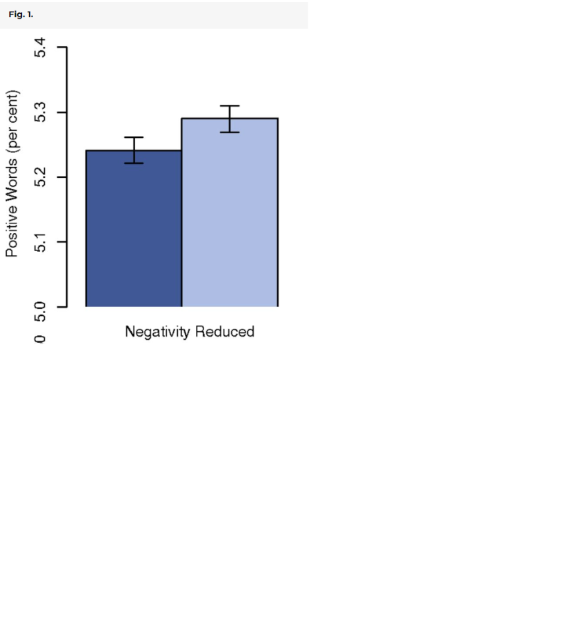</center>

---

# Some examples

- From academia

  **`1`**. [Emotional Contagion](https://www.pnas.org/doi/10.1073/pnas.1320040111) (Kramer et al, 2014)
  
<center>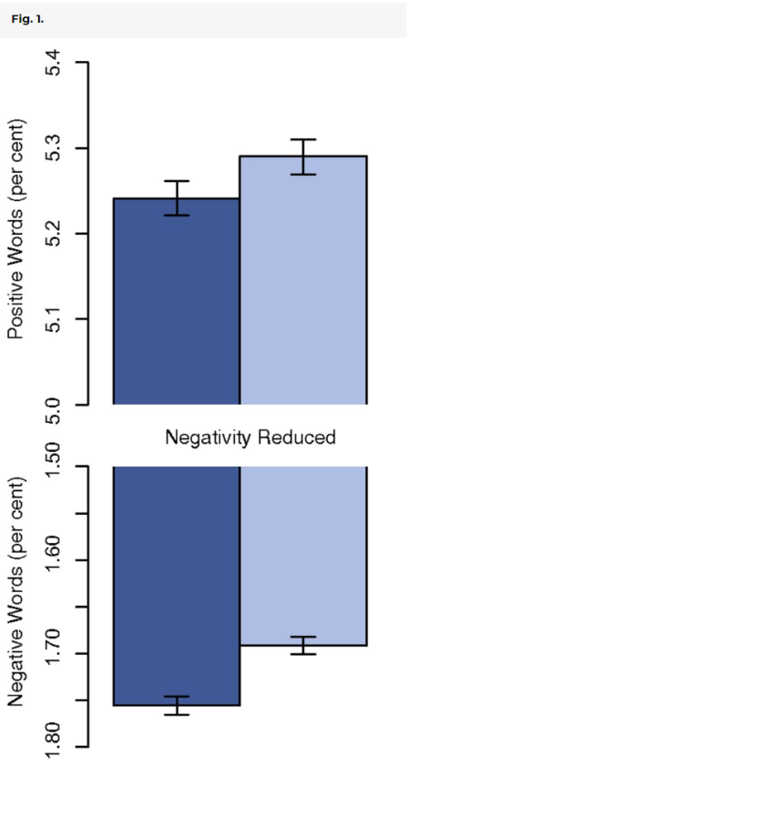</center>

---

# Some examples

- From academia

  **`1`**. [Emotional Contagion](https://www.pnas.org/doi/10.1073/pnas.1320040111) (Kramer et al, 2014)
  
<center>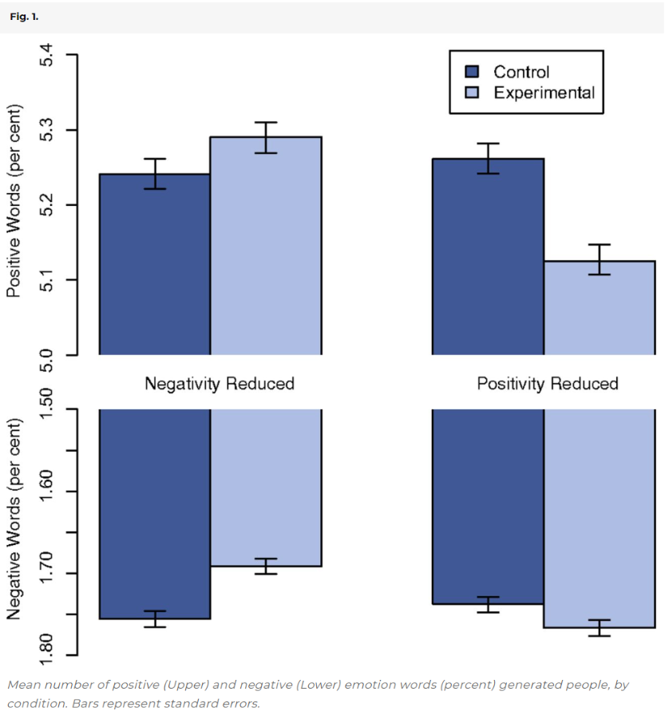</center>


---

# Some examples

- From academia

  **`2`**. [Tastes, Ties & Time](https://www.sciencedirect.com/science/article/pii/S0378873308000385?via%3Dihub) (Lewis et al, 2008)
  
<center>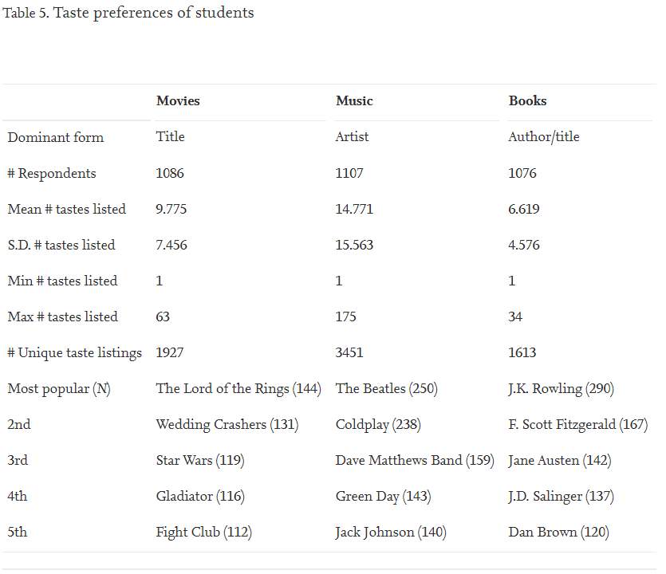</center>


---

# Some examples

- From academia

  **`3`**. [Encore](https://dl.acm.org/doi/10.1145/2785956.2787485) (Burnett & Feamster, 2015)
  
<center>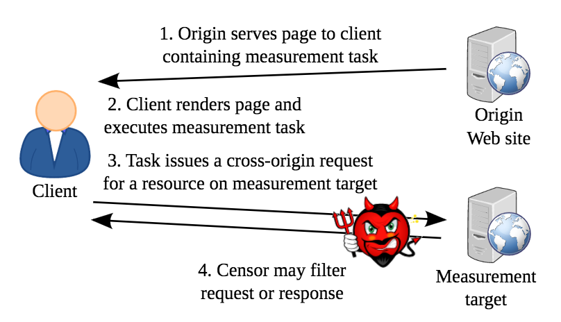</center>


---

# Outside Academia

--

- "Machine Learning" + prediction

--

  - "Learn" patterns from A, then use to predict values for B
  
--

<center>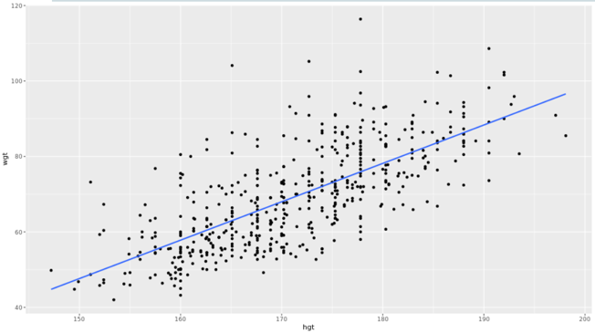</center>

---

# Outside Academia

- "Machine Learning" + prediction

  - Linear regression does this
  
<center></center>


---

# Outside Academia

- "Machine Learning" + prediction

  - But the intuition maps to fancier examples
  
<center>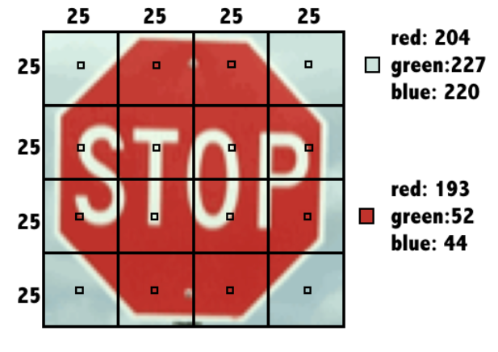</center>


---

# Outside Academia

- "Machine Learning" + prediction

  - Make a prediction &rarr; Evaluate &rarr; Adjust

  - Repeat as many times as it takes!
  
<center>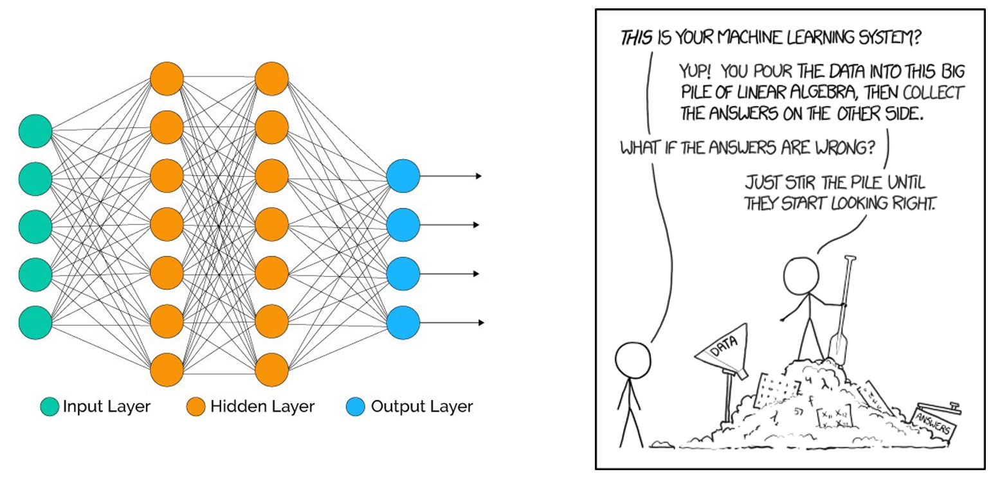</center>

---

# Outside Academia

--

- "Evaluate" is an ethical concept

--

- ...that we delegate to an algorithm

--

- What happens if the algorithm's evaluation is disconnected from ethics?

--

<center>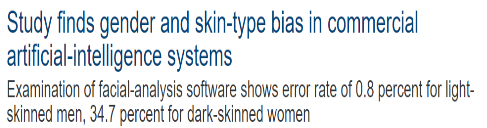</center>

---

# Outside Academia

- "Evaluate" is an ethical concept

- ...that we delegate to an algorithm

- What happens if the algorithm's evaluation is disconnected from ethics?

<center></center>

---

# Outside Academia

- "Evaluate" is an ethical concept

- ...that we delegate to an algorithm

- What happens if the algorithm's evaluation is disconnected from ethics?

<center>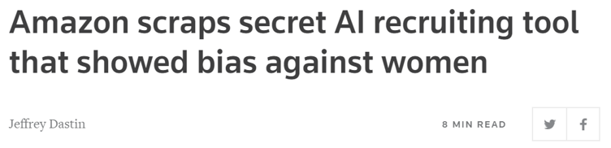</center>

---

# Outside Academia

- "Evaluate" is an ethical concept

- ...that we delegate to an algorithm

- What happens if the algorithm's evaluation is disconnected from ethics?

<center>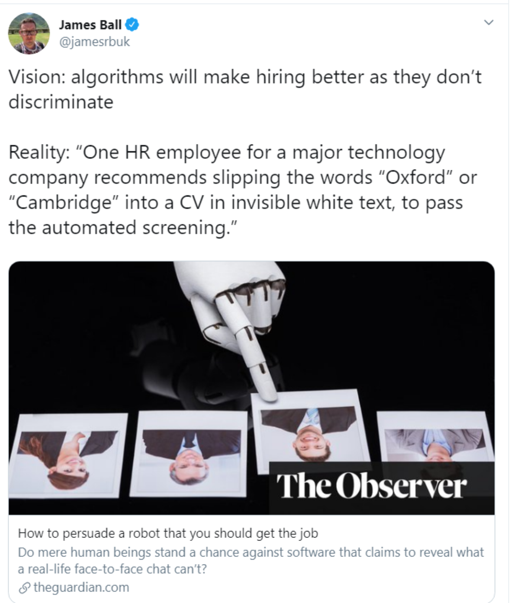</center>

---

# Outside Academia

- "Evaluate" is an ethical concept

- ...that we delegate to an algorithm

- What happens if the algorithm's evaluation is disconnected from ethics?

<center>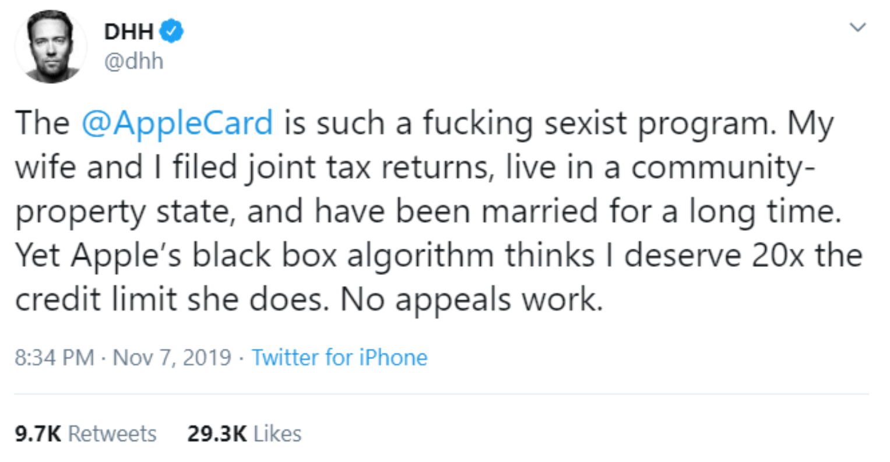</center>

---

# And Within Academia

<center>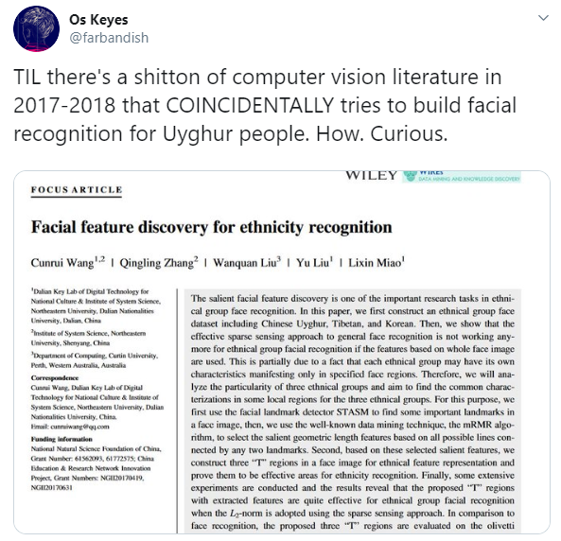</center>

---

# And Within Academia

<center>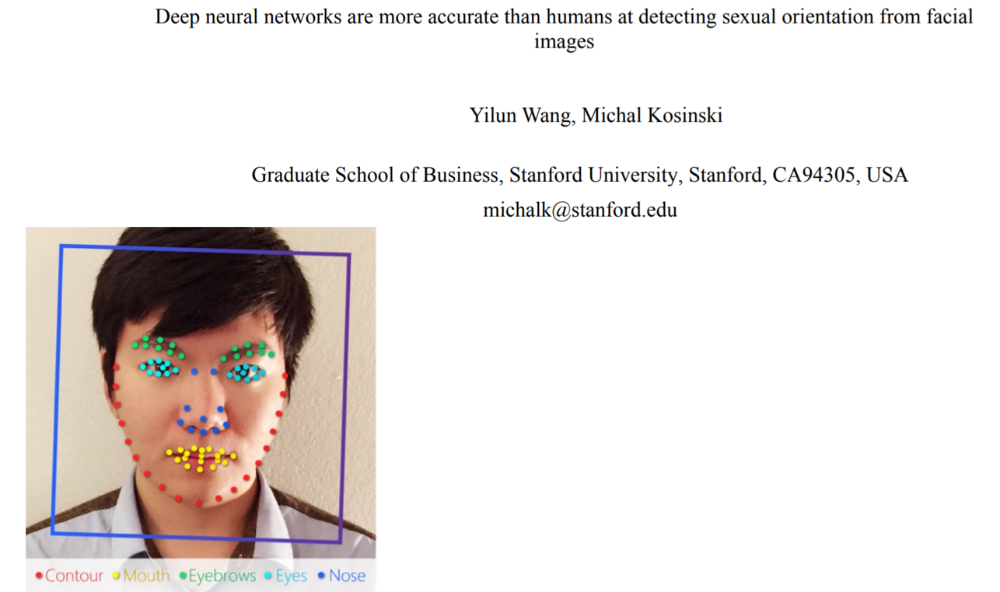</center>

---

# Excitement Blinds Us

--

> “Identifying links between facial features and psychological traits by employing methodology similar to the one used here could boost our understanding of the origins and nature of a broad range of psychological traits, preferences, and psychological processes” -- [Wang & Kosinski](https://psycnet.apa.org/fulltext/2018-03783-002.pdf?auth_token=571b81d82fbc15105c730cae3e02da05e69f0e36), 2018

--

<center>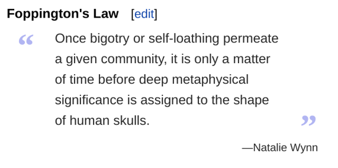</center>

---

# Excitement Blinds Us


> “Identifying links between facial features and psychological traits by employing methodology similar to the one used here could boost our understanding of the origins and nature of a broad range of psychological traits, preferences, and psychological processes” -- [Wang & Kosinski](https://psycnet.apa.org/fulltext/2018-03783-002.pdf?auth_token=571b81d82fbc15105c730cae3e02da05e69f0e36), 2018

<center></center>

---

# Reflection

- All semester: state your assumptions

--

- This is **reflection**

--

  - **Why** do you think the way you do?
  
--

- **Reflection** is the hearth of morality

--

  - Think about the *questions* you **ask**, the *goals* you seek to **achieve**, and the *methods* you **use** to do so

---

# Thank you!

