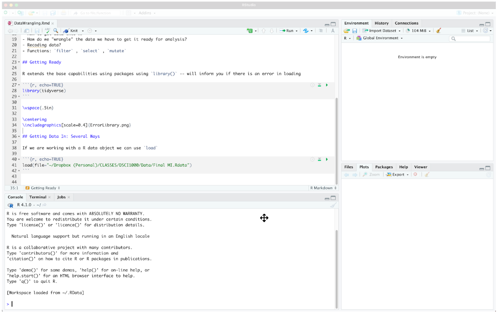

```{css,echo = F}
.small .remark-code { /*Change made here*/
  font-size: 85% !important;
}
.tiny .remark-code { /*Change made here*/
  font-size: 50% !important;
}
```

```{r,include=F}
set.seed(123)
options(width=60)
knitr::opts_chunk$set(fig.align='center',fig.width=9,fig.height=5,message=F,warning=F)
def.chunk.hook  <- knitr::knit_hooks$get("chunk")
knitr::knit_hooks$set(chunk = function(x, options) {
  x <- def.chunk.hook(x, options)
  ifelse(options$size != "normalsize", paste0("\n \\", options$size,"\n\n", x, "\n\n \\normalsize"), x)
})
```

# Agenda

1. What is "data wrangling"?

2. Why `R`?

3. `tibbles` (table dataframes)

4. Political + data **science**

  - Michigan exit polls
  
---

# What is "data wrangling"?

<center></center>

--

- Preparing data for analysis

--

  - DANGER: Most important but least appreciated step!
  
---

# Danger!

--

- Data wrangling gone bad

--

<center></center>

---

# Danger!

- Data wrangling gone bad

<center></center>

---

# Danger!

- Data wrangling gone bad

<center></center>

---

# Danger!

- How do we avoid these mistakes?

--

- Three principles

--

  1. Replicability
  
--

  2. Understandability
  
--

  3. Robustness
  
--

- The big picture

--

  - Load **raw data** into an `RStudio` script
  
--

  - Wrangle the data within this script
  
--

  - Save a **new version** of the wrangled data with a **.red[different file name]**
  
--

- The point: Someone else should be able to recreate your work from scratch!
  
---

# Why `R`?

--

- Checks all three boxes

--

- But even `R` can be corrupted...

--

- ...with `Save workspace image`

--

- **.red[NEVER `Save workspace image`]**

--

  - If you do, the next time you open `R`, it will load the modified data
  
---

# NEVER SAVE WORKSPACE IMAGE

<center></center>


---

# NEVER SAVE WORKSPACE IMAGE

<center></center>

---

# Why `R`?

- **.green[ALWAYS]** start with an `empty environment`

--

  - How do you know if the environment is empty?

--

<center></center>

---

# Why `R`?

- **.green[ALWAYS]** start with an `empty environment`

  - How do you know if the environment is empty?

<center></center>

---

# Why `R`?

--

- `R` scripts or `RMarkDown` scripts should be: 

--

  1. Single purpose (but definitions can vary)

--

  2. Well-commented (make it easy for anyone to understand)
  
--

  3. Iteratively built (constant bug checking)
  
---

# Let's get started

--

- Set up three subfolders
  
--
  
<center></center>

--

- Download [`MI2020_ExitPoll.rds`](https://github.com/jbisbee1/DS1000_F2024/blob/master/data/MI2020_ExitPoll.rds) to your `data` folder

---

# Pausing for .blue[science]

--

- What are these data?

--

- "Exit poll" data from Michigan in the fall of 2020

--

  - Polls fielded either on or just before an election
  
--

  - Used to understand *why* voters chose a candidate...
  
--

  - ...not to *predict* who will win (voting data is used for that)
  
---

# Michigan

--

- A "swing state" in 2020, following unexpected support for Trump in 2016

--

<center></center>

---

# Exit Polls

--

- These polls ask voters to check a box in response to a question

--

<center></center>

---

# Exit Polls

- These polls ask voters to check a box in response to a question

<center></center>


---

# Exit Polls

--

- **Predictive**: Use data to *predict* an outcome of interest.

--

  1. How many voters report voting for each candidate?
  2. What predicts support for Trump? For Biden?
  
--

- **Descriptive**: Use data to *describe* an event.

--

  1. How did Trump support vary by: gender? Age? Education?
  2. When did voters make up their minds?
  3. Why did voters support Trump or Biden?
  4. How do Trump and Biden voters vary in their opinions on: Covid? Race relations?
  
---

# Getting Started


- Open `RStudio` and `require(tidyverse)`

```{r,message=F,warning=F}
require(tidyverse)
require(labelled)
```

--

- Load the data

```{r}
MI_raw  <- read_rds('https://github.com/jbisbee1/DS1000_F2024/raw/main/data/MI2020_ExitPoll.rds')
```

--

- And take a look

```{r}
MI_raw
```

---

# Tabular Data

--

- Remember that we are using tabular data, where rows are observations (i.e., survey respondents) and columns are variables (i.e., vote choice)

--

- What is the **unit of observation** in these data?

--

  - Voters...which voters?
  
--

  - Voters in Michigan...all of them?
  
--

  - No just a random sample of those leaving the ballot box in 2020

---

# The Process: Steps 1-3

- Step 1: **Look** at the data

--

- Step 2: **Wrangle** the data

--

- Step 3: **Analyze** the data

---

# Step 1: Look at the data

- Goals:

--

1. Understand variable "types"

--

  - Most important: continuous versus categorical

--

2. Identify **missingness**: either `NA` or "unit non-response"

--

  - Unit non-response: observations who didn't provide information
  
--

3. Identify **skew** or other phenomena that require wrangling

--

  - Highly skewed data should be logged
  
  - Some variables should be transformed to **rates** or **proportions**

  
---

# Step 1: Look at the data

- Methods:

--

  1. Just look: see the first few rows and the first few columns
  
--

  2. `glimpse()`: see the first few rows for every column
  
--

  3. `summary()`: see the lowest, highest, mean, median, and quartiles, along with missingness (**better for continuous data**)
  
--

  4. `count()`: see the number of observations in each category (**categorical data only**)
  
---

# Step 1: Look at the data

```{r}
glimpse(MI_raw)
```

---

# Step 1-1: Variable Types

- **Continuous Variables**

--

  - `dbl`: numeric data stored with great precision. Can be manipulated with mathematical functions.
  
  - `int`: numeric data stored as integers. `R` typically treats `dbl` and `int` as interchangeable.
  
--

- **Categorical Variables**
  
  - `chr`: string data, consisting of letters (and/or numbers). **Cannot** be manipulated with mathematical functions.
  
  - `fct`: string data that is stored with a number. Typically used to define group membership.
  
--

- **Mixtures**
  
  - `lbl`: string data that is stored with a number. Similar to `fct` but less commonly occurring in base `R`.
  
---

# Step 1-2: Missingness

- Two ways to indicate an observation is missing data

--

  1. `NA` code
  
  2. Some bespoke code for "unit non-response" (often `9`, or `99`, or some large value ending in `9` that is dissimilar from the rest of the data)


---

# Step 1-2: Missingness

- To identify `NA`-style missingness, use `summary()`

```{r,error=TRUE}
summary(MI_raw %>% select(LALVOTERID,SEX,AGE10,PARTYID,LGBT,QLT20))
```

---

# Step 1-2: Missingness

- To identify unit non-response, can use `count()`

```{r}
MI_raw %>%
  count(PARTYID)
```

--

- The number `9` indicates unit non-response for `PARTYID`

---

# Step 1-2: Missingness

- To identify unit non-response, can use `count()`

```{r}
MI_raw %>%
  count(AGE10)
```

--

- The number `99` indicates unit non-response for `AGE10`


---

# Step 1-2: Missingness

- To identify unit non-response, can use `count()`

```{r}
MI_raw %>%
  count(LGBT)
```

--

- The number `9` indicates unit non-response for `LGBT` **AND** this variable also has `NA`


---

# Step 1-2: Missingness

- If the data isn't labelled, can still **look** to identify unit non-response

--

- Re-introducing...`ggplot()`

--

  - Only interested in **single variable**
  
--

- For now, we need two parts:

--

  1. `aes(x = [x-axis variable])`
  
  2. `geom_histogram()` (for continuous) or `geom_bar()` (for categorical)
  
---

# `ggplot()` Intro

```{r,message = F,warning = F,error=TRUE}
MI_raw %>%
  ggplot(aes(x = AGE10)) + 
  geom_bar()
```

---

# `ggplot()` Intro

```{r,message = F,warning = F}
MI_raw %>%
  ggplot(aes(x = LGBT)) + 
  geom_bar()
```

---

# `ggplot()` Intro

```{r,message = F,warning = F}
MI_raw %>%
  ggplot(aes(x = PARTYID)) + 
  geom_bar()
```

---

# Step 1-3: Skew & Transformations

- To identify **skew**, we will also need `ggplot()`

--

```{r,echo = F,message = F,warning = F}
tibble(`1 - Skewed` = exp(runif(n = 1000,min = 1,max = 10)),
           `2 - Somewhat Skewed` = exp(runif(n = 1000,min = 0,max = 2)),
           `3 - Not Skewed` = rnorm(n = 1000)) %>%
  gather(type,val) %>%
   ggplot(aes(x = val)) + 
   geom_histogram() + 
  facet_wrap(~type,scales = 'free') + 
  theme(axis.text = element_blank())
```

--

- We will return to this later

---

# Step 2: Wrangle

- Why wrangle data?

```{r}
MI_raw %>%
  summarise(avgAge = mean(AGE10,na.rm=T))
```


---

# Step 2: Wrangle

- We over-estimate the average age category because `R` doesn't realize these are codes!

```{r}
MI_raw %>%
  count(AGE10)
```

---


# Step 2: Wrangle

- We need to convert **codes** for missing data to `NA`

--

- Use `mutate()` and `ifelse()` to replace `99` with `NA`

--

- `mutate()`:

--

  - Either creates a new column
  
  - Or changes an existing column
  
--

- `ifelse()`:

--

  - Does exactly as it says
  
  - `ifelse([LOGIC],[VALUE IF TRUE],[VALUE IF FALSE])`
  
---

# Step 2: Wrangle

- If: `AGE10` is `99` (i.e., the unit non-response code)

--

- Then: give me an `NA` value

--

- Otherwise: give me whatever `AGE10` is

--

```{r}
MI_raw %>%
  mutate(AGE10_new = ifelse(AGE10 == 99,NA,AGE10)) %>%
  select(AGE10,AGE10_new) %>%
  slice(c(35,1:20)) # Don't need to know slice() yet, ignore
```


---

# Step 2: Wrangle

- The Assignment Operator (`<-`): `R`'s version of "Save As..."

--

- If we don't either:

--

  1. Overwrite the `MI_raw` object...
  
  2. Or create a new object...
  
--

  - `R` will not remember this new `AGE10_new` variable we created

--

```{r,error=T}
MI_raw %>% select(AGE10_new)
```

---

# Step 2: Wrangle

- Thus we need to use the **assignment operator** (`<-`)

```{r}
MI_final <- MI_raw %>%
  mutate(AGE10_new = ifelse(AGE10 == 99,NA,AGE10))

MI_final %>%
  select(AGE10,AGE10_new) %>%
  slice(c(35,1:20)) # Don't need to know slice() yet, ignore
```


---

# Step 2: Wrangle

- We can now get a more accurate measure of the average age category

--

```{r}
MI_final %>%
  summarise(avgAge = mean(AGE10_new,na.rm=T))
```

---

# Variable Classes

- **How should we interpret this number?**

--

  - Does this mean that the average age of respondents is 7?
  
--

  - **NO**: we want to keep the definitions!
  
---

# Converting to `chr`

- There is a helpful package called `haven` which will extract these labels as `factors` 

--

- Install it with `install.packages("haven")` but DON'T `require()` it

--

- We can call on useful functions without `require()` by using two `::`

--

```{r}
haven::as_factor(MI_final$AGE10) %>% head()
```

---

# Step 2: Wrangle

- Goal: Create a new column that converts the value for `AGE10` to a label

--

- To do this, use `mutate()` + the `haven::as_factor()` function + the `as.character()` function

--

  - Step 1: `as_factor()` function (from `haven`) converts to `fct` class
  
  - Step 2: `as.character()` function (from base `R`) converts to `chr` class

--

```{r}
MI_final <- MI_final %>%
  mutate(AGE10_labs = as.character(haven::as_factor(AGE10)))
```

--

- **NB:** we **overwrite** `MI_final` to **add** the new column `AGE10_labs`

---

# Step 2: Wrangle

```{r,fig.height=4}
MI_final %>%
  ggplot(aes(x = AGE10_labs)) + 
  geom_bar(stat = 'count')
```

---

# Aside on `geom_bar()`

- Default: `stat = "count"` means show total observations in each category

--

- Override: `stat = "identity"` forces to show a specific value set in `aes()`

```{r}
MI_final %>%
  count(AGE10_labs) %>%
  ggplot(aes(x = AGE10_labs,y = n)) + 
  geom_bar(stat = 'identity')
```


---

# Step 2: Wrangle

- Say we want the category labels for `PRSMI20`, `QLT20`, and `LGBT`

--

```{r,error = TRUE}
MI_final <- MI_final %>%
  mutate(preschoice = as.character(haven::as_factor(PRSMI20)),
         Qlty = as.character(haven::as_factor(QLT20)),
         LGBT_lab = as.character(haven::as_factor(LGBT)))

MI_final %>%
  select(preschoice,Qlty,LGBT_lab)
```


---

# Preparing a new `tibble`

- .blue[Science] guides us toward which variables to focus on

```{r}
names(MI_final)
```

---

# Let's Wrangle!

- We are interested in presidential vote choice (`PRSMI20` or `preschoice`) and the quality of the candidate the respondent likes most (`QLT20` or `Qlty`)

--

- Look at these first

```{r}
MI_final %>% select(preschoice,Qlty)
```


---

# Let's Wrangle!

- We can get some preliminary descriptive info with `count()`

```{r}
MI_final %>%
  count(preschoice)
```

---

# Let's Wrangle!

- We can get some preliminary descriptive info with `count()` (.blue[science!])

```{r}
MI_final %>%
  count(preschoice,SEX)
```

---

# Choosing the right function

- But `count()` is less useful for continuous variables

```{r}
MI_final %>%
  count(WEIGHT)
```

---

# Choosing the right function

- Use `summary()` instead

```{r}
MI_final %>%
  select(WEIGHT) %>%
  summary(WEIGHT)
```

---

# Let's Wrangle!

- Recall some of the other helpful functions in `tidyverse`

```{r}
MI_final %>%
  count(preschoice) %>%
  arrange(desc(n))
```


---

# Let's Wrangle!

- Let's look for missing data

```{r}
MI_final %>%
  count(Qlty)
```


---

# Let's Wrangle!

- Drop rows where the respondent didn't answer the "quality" question

```{r}
MI_final %>%
  drop_na(Qlty) %>%
  count(Qlty)
```

---

# Let's Wrangle!

- But we still have the `[DON'T READ] Don't know/refused` respondents

--

- Convert "unit non-response" codes to `NA`

--

  - Need to look at them first!

```{r}
MI_final %>%
  count(Qlty)
```

---

# Let's Wrangle!

- Convert "unit non-response" codes to `NA`

```{r}
MI_final <- MI_final %>%
  mutate(Qlty = ifelse(grepl("DON'T READ",Qlty),NA,Qlty))
MI_final %>%
  count(Qlty)
```

---

# Let's Wrangle!

- Drop rows where the respondent didn't answer the "quality" question

```{r}
MI_final %>%
  drop_na(Qlty) %>%
  count(Qlty)
```

---

# Let's Wrangle!

- This is equivalent to `filter(!is.na(Qlty))`

```{r}
MI_final %>%
  filter(!is.na(Qlty)) %>%
  count(Qlty)
```

---

# Aside on filtering `NA`

- Make sure to specify which column has the missing data!

--

- Otherwise get "complete cases" (respondents with no missing data)

```{r}
MI_final %>%
  drop_na() %>%
  count(QLT20)
```

--

- Same as

```{r}
MI_final %>%
  filter(complete.cases(.)) %>%
  count(QLT20)
```


---

# Let's Wrangle!

- Finally, let's subset the data to focus only on the other variables we are interested in


```{r}
MI_final <- MI_final %>%
  select(SEX,AGE10,PARTYID,
         WEIGHT,QRACEAI,EDUC18,LGBT,
         BRNAGAIN,LATINOS,RACISM20,
         QLT20,Qlty,PRSMI20,preschoice)
```

--

- This is our **wrangled** data

```{r}
MI_final
```


---

# Finishing up

--

- And now save both the raw data and our prepared data together

```{r}
save(MI_raw,MI_final,file = '../data/MI_prepped.RData')
```

--

- An `.RData` file can contain multiple objects

--

- When we load it, we get access to all the objects we've created

```{r}
rm(MI_raw,MI_final)

load('../data/MI_prepped.RData')
```

--

- **NB: different file extensions require different functions!**

--

  - `load` for `.RData` files
  
  - `read_rds` for `.rds` files
  
  - `read_csv` for `.csv` files


---

# Conclusion

--

- What you need to know from today

--

  1. Why `RStudio` + `R` are great for **wrangling**
  
--
  
  2. `mutate()`
    
--

  3. `ifelse()`
  
--

  4. Assignment Operator ("Save As..."): `<-`
  
---

# Quiz & Homework

- Go to Brightspace and take the **4th** quiz

--

  - The password to take the quiz is #### <!-- `r paste(sample(1:9,size = 4,replace = T),collapse = '')` -->
  
--

- **Homework:**

--
  
  1. Work through ds1000_hw_5.Rmd
  
  2. Problem Set 3 due Friday by midnight
