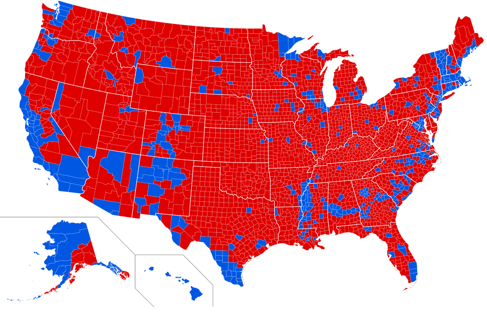
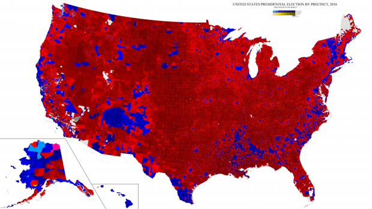
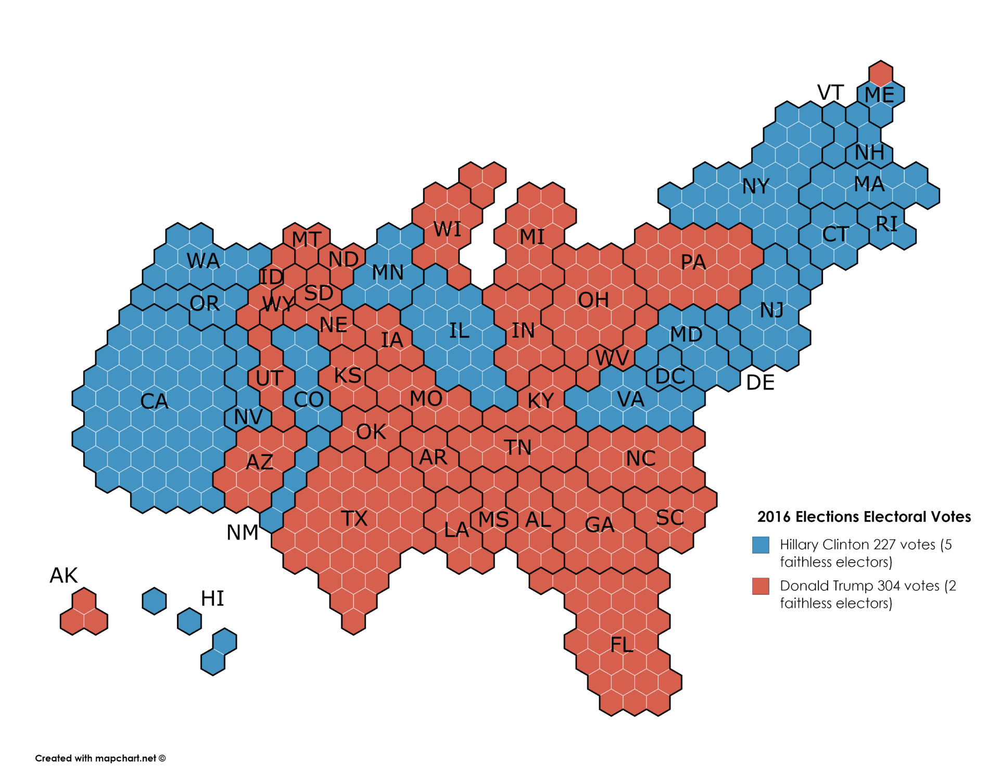

```{css,echo = F}
.small .remark-code { /*Change made here*/
  font-size: 85% !important;
}
.tiny .remark-code { /*Change made here*/
  font-size: 50% !important;
}
```

```{r,include=F}
set.seed(123)
options(width=60)
knitr::opts_chunk$set(fig.align='center',fig.width=9,fig.height=5,message=F,warning=F)
def.chunk.hook  <- knitr::knit_hooks$get("chunk")
knitr::knit_hooks$set(chunk = function(x, options) {
  x <- def.chunk.hook(x, options)
  ifelse(options$size != "normalsize", paste0("\n \\", options$size,"\n\n", x, "\n\n \\normalsize"), x)
})
```

# Agenda

1. Overtime Polls + `weighted.mean()`

2. Predicting winner with Electoral College Votes

---

# 2020 polling

--

- Back into the data!

--

  - Download and open [`Pres2020_PV.Rds`](https://github.com/jbisbee1/DS1000_F2024/blob/main/data/Pres2020_PV.Rds)
  - Wrangle to get the popular vote margin, expressed in decimals
  
--

```{r,message=F,warning=F}
require(tidyverse)
poll <- read_rds('https://github.com/jbisbee1/DS1000_F2024/raw/main/data/Pres2020_PV.Rds')

poll <- poll %>%
  mutate(Trump = Trump/100,
         Biden = Biden/100,
         margin = Biden - Trump)
```


---

# .blue[Theory]

--

- Previous results indicate that polls which predict greater support for Biden **also** predict greater support for Trump

--

  - Is this consistent with the theory?
  
--

  - Recall that **Biden-biased** polls should underpredict Trump support and overpredict Biden support
  
--

  - In the .red[data], this would suggest a **negative** relationship
  
--

  - But we find a **positive** relationship
  
--

- **Inconsistent** with the theory, but raises another puzzle

--

- Why do polls that underpredict support for Biden also underpredict support for Trump?

--

  - .blue[Third party bias?] Polls bias against 3rd party candidates
  
--

  - .blue[Timing of poll?] Fewer uncertain responses closer to election


---

# Dates and More Dimensions

--

- To test the .blue[timing of polls theory], let's look at how predicted support varies over time

--

```{r}
poll %>%
  select(StartDate,EndDate,DaysinField)
```

---

# Dates

--

- Need to convert `StartDate` and `EndDate` into `date` class

--

```{r}
election.day <- as.Date("11/3/2020", "%m/%d/%Y")  
election.day

election.day16 <- as.Date("11/8/2016", "%m/%d/%Y")
election.day16

election.day - election.day16
```

---

# Wrangling

```{r}
toplot <- poll %>%
                mutate(EndDate = as.Date(EndDate, "%m/%d/%Y"), 
                      StartDate = as.Date(StartDate, "%m/%d/%Y"),
                      DaysToED = as.numeric(election.day - EndDate),
                      margin = Biden - Trump)
```

--

- How many polls were conducted over time?

---

# Polls by Date (`geom_bar`)

```{r}
toplot %>%
  ggplot(aes(x = StartDate)) + 
  geom_bar() + labs(title = 'Number of 2020 Polls by Date',x = 'Start Date of Poll',y = 'Number of Polls')
```

---

# Polls by Date (`geom_histogram`)

```{r}
toplot %>%
  ggplot(aes(x = StartDate)) + 
  geom_histogram(bins = 30,color = 'white') + labs(title = 'Number of 2020 Polls by Date',x = 'Start Date of Poll',y = 'Number of Polls')
```

---

# Polls by Time to Election

```{r}
toplot %>%
  ggplot(aes(x = DaysToED)) + 
  geom_histogram(bins = 30,color = 'white') + labs(title = 'Number of 2020 Polls Over Time',x = 'Days to Election',y = 'Number of Polls') + 
  scale_x_reverse()
```

---

# Margin by Time to Election

```{r,fig.height = 4.5}
toplot %>%
  ggplot(aes(x = DaysToED,y = margin)) + 
  geom_point() + #<<
  labs(title = 'Biden Margin in 2020 Polls Over Time',
       x = 'Days to Election',y = 'Margin: Biden - Trump') + 
  scale_x_reverse() + geom_hline(yintercept = 0,linetype = 'dashed')
```

---

# Margin by Time to Election

```{r,fig.height = 4.5}
toplot %>%
  ggplot(aes(x = DaysToED,y = margin)) + 
  geom_point(alpha = .3,size = 3) + #<<
  labs(title = 'Biden Margin in 2020 Polls Over Time',
       x = 'Days to Election',y = 'Margin: Biden - Trump') + 
  scale_x_reverse() + geom_hline(yintercept = 0,linetype = 'dashed')
```

---

# Margin by Time to Election

```{r,fig.height = 4.5}
toplot %>%
  ggplot(aes(x = DaysToED,y = margin)) + 
  geom_jitter(height = .005) + #<<
  labs(title = 'Biden Margin in 2020 Polls Over Time',
       x = 'Days to Election',y = 'Margin: Biden - Trump') + 
  scale_x_reverse() + geom_hline(yintercept = 0,linetype = 'dashed')
```

---

# Highlight Trends

```{r,fig.height = 4.5}
toplot %>%
  ggplot(aes(x = DaysToED,y = margin)) + 
  geom_point(alpha = .3) + 
  geom_line() + #<<
  labs(title = 'Biden Margin in 2020 Polls Over Time',
       x = 'Days to Election',y = 'Margin: Biden - Trump') + 
  scale_x_reverse() + geom_hline(yintercept = 0,linetype = 'dashed')
```

---

# Highlight Trends

```{r,fig.height = 4.5,message = F}
toplot %>%
  ggplot(aes(x = DaysToED,y = margin)) + 
  geom_point(alpha = .3) + 
  geom_smooth() + #<<
  labs(title = 'Biden Margin in 2020 Polls Over Time',
       x = 'Days to Election',y = 'Margin: Biden - Trump') + 
  scale_x_reverse() + geom_hline(yintercept = 0,linetype = 'dashed')
```


---

# Highlight Trends

```{r,fig.height = 4.5,message = F}
toplot %>%
  ggplot(aes(x = DaysToED,y = margin)) + 
  geom_point(alpha = .3) + 
  geom_smooth(span = .1) + #<<
  labs(title = 'Biden Margin in 2020 Polls Over Time',
       x = 'Days to Election',y = 'Margin: Biden - Trump') + 
  scale_x_reverse() + geom_hline(yintercept = 0,linetype = 'dashed')
```

---

# Multiple Variables over time

--

- We can look at multiple continuous variables at the same time

--

  - Use `color` or `fill` to distinguish
  
```{r}
BidenTrumpplot <- toplot %>%
  ggplot()  +
  geom_point(aes(x = EndDate, y = Trump), 
             color = "red", alpha=.4)  +
  geom_point(aes(x = EndDate, y = Biden), 
             color = "blue", alpha=.4) +
  labs(title="% Support for Biden (blue) and Trump (red)",
       subtitle = "2020 National Popular Vote Polls Over Time",
       y = "Pct. Support",
       x = "Poll Ending Date") +
  scale_x_date(date_breaks = "2 week", date_labels = "%b %d") + 
  scale_y_continuous(breaks=seq(.3,.7,by=.05),
                     labels= scales::percent_format(accuracy = 1)) 
```

---

# Multiple Variables over time

```{r}
BidenTrumpplot
```

---

# Highlighting Trends

```{r,message = F}
BidenTrumpplot +  
  geom_smooth(aes(x = EndDate, y = Trump), 
              color = "red",se=T) + 
  geom_smooth(aes(x = EndDate, y = Biden), 
              color = "blue",se=T)
```

---

# Typing back to .blue[theory]

--

- Evidence of **both** Biden and Trump support increasing toward election

--

- Does this mean third party support waned?

--

- Does this mean that undecided voters made a decision?


---

# 2. Overtime Errors

- Wrangling to convert character dates to `date` class

--

- Plotting prediction errors over time

```{r,message = F,warning = F}
toplot <- poll %>%
  mutate(EndDate = as.Date(EndDate, "%m/%d/%Y"), 
         StartDate = as.Date(StartDate, "%m/%d/%Y"),
         DaysToED = as.numeric(as.Date('11/3/2020',format = '%m/%d/%Y') - EndDate),
         margin = Biden - Trump,
         errDem = Biden - DemCertVote / 100,
         errRep = Trump - RepCertVote / 100)
```

---

# Overtime Errors

- Wrangling to convert character dates to `date` class

- Plotting prediction errors over time

```{r,message = F,warning = F}
pErrOverTime_Raw <- toplot  %>%
  ggplot(aes(x = StartDate)) + 
  geom_point(aes(y = errDem),color = 'blue') + 
  geom_point(aes(y = errRep),color = 'red') + 
  geom_hline(yintercept = 0,linetype = 'dashed') + 
  geom_smooth(aes(y = errDem),color = 'blue') + 
  geom_smooth(aes(y = errRep),color = 'red') + 
  labs(title = 'Error Over Time',subtitle = 'Raw Prediction Error',x = 'Start Date',y = 'Prediction Error') + 
  ylim(c(-.2,.1))
```

---

# Overtime Errors

```{r,message = F,warning = F}
pErrOverTime_Raw
```

---

# Poll Quality

- Polls got better

--

  - ...but more for Biden than for Trump
  
--

- Poll quality:

--

  - Sample size
  
  - "Margin of Error" (`MoE`)

---

# Weighting by Sample Size

```{r,message = F,warning = F}
pErrOverTime_SampleSize <- toplot %>%
  group_by(StartDate) %>%
  summarise(errDem = weighted.mean(errDem,w = SampleSize),
            errRep = weighted.mean(errRep,w = SampleSize)) %>%
  ggplot(aes(x = StartDate)) + 
  geom_point(aes(y = errDem),color = 'blue') + 
  geom_point(aes(y = errRep),color = 'red') + 
  geom_hline(yintercept = 0,linetype = 'dashed') + 
  geom_smooth(aes(y = errDem),color = 'blue') + 
  geom_smooth(aes(y = errRep),color = 'red') + 
  labs(title = 'Error Over Time',subtitle = 'Sample-Weighted Prediction Error',x = 'Start Date',y = 'Prediction Error') + 
  ylim(c(-.2,.1))
```

---

# Weighting by Inverse of `MoE`

```{r,message = F,warning = F}
pErrOverTime_MoE <- toplot %>%
  group_by(StartDate) %>%
  summarise(errDem = weighted.mean(errDem,w = 1/MoE),
            errRep = weighted.mean(errRep,w = 1/MoE)) %>%
  ggplot(aes(x = StartDate)) + 
  geom_point(aes(y = errDem),color = 'blue') + 
  geom_point(aes(y = errRep),color = 'red') + 
  geom_hline(yintercept = 0,linetype = 'dashed') + 
  geom_smooth(aes(y = errDem),color = 'blue') + 
  geom_smooth(aes(y = errRep),color = 'red') + 
  labs(title = 'Error Over Time',subtitle = 'MoE-Weighted Prediction Error',x = 'Start Date',y = 'Prediction Error') + 
  ylim(c(-.2,.1))
```

---

# Comparing

```{r,message = F,warning = F,fig.width=11}
require(patchwork)
pErrOverTime_Raw + pErrOverTime_SampleSize + pErrOverTime_MoE
```


---

# 3. The Electoral College

--

- U.S. presidents determined by the **Electoral College** (EC)

--

  - Each state allocated votes equal to their "congressional delegation"
  
--

  - One vote per Senator + one vote per **M**ember **o**f **t**he **H**ouse (MotH)

--

  - 100 Senators + 435 MotHs + 3 votes for DC = 538 total votes
  
--

  - To win the presidency, you need at least 270 EC votes
  
--

- What does this mean for representation?

--

  - Population divided equally\* across 435 MotHs
  
--

  - In 2020, each MotH represented 761,179 people

--

  - Geographic distribution of this population is **non-uniform**
  
---

# Assigning Districts

--

- Every 10 years, U.S. takes a census of its population

--

- Based on these results, congressional districts are reapportioned

--

- In 2010, Florida's pop. was ~19m & average pop. per MotH was ~710k

--

  - How many MotHs? `ceiling(19000000 / 710000)` = ``r ceiling(19000000 / 710000)``
  
--

  - Every state has 2 senators, so FL had 27 + 2 = 29 EC votes
  
--

  - In 2020, FL pop. was 21m &rarr; each resident had 0.00000137 of a vote

--

- What about Vermont?

--

  - 3 EC votes / 624,340 residents = 0.00000481
  
--

- Vermonters have roughly 3.5 times the influence of Floridians!

---

# Data Viz Misleads!

<center></center>

---

# Data Viz Misleads!

<center></center>


---

# Data Viz Misleads!

<center></center>

---

# Data Viz Misleads!

<center></center>

---

# Data Viz Misleads!

<center></center>

---

# Correcting Maps

- Fundamental challenge due to distribution of population across land

<center></center>

---

# Correcting Maps

- Fundamental challenge due to distribution of population across land

<center></center>


---

# Introducing Data

--

- We will attempt to use state polls to predict 2020 winner

--

- National polls are great at predicting popular vote share...

--

- ...but presidents aren't elected based on popular vote

--

- With a few exceptions, states have a "winner take all" system

--

  - Winner of state's popular vote gets **all** of the state's EC votes
  
--

- Thus we need good state-level polls

--

- Load [`Pres2020_StatePolls.Rds`](https://github.com/jbisbee1/DS1000_F2024/blob/main/data/Pres2020_StatePolls.Rds) to `statePoll` object

```{r,message = F,warning=F}
require(tidyverse)
statePoll <- read_rds('https://github.com/jbisbee1/DS1000_F2024/raw/main/data/Pres2020_StatePolls.Rds')
```

---

# Look at the data

```{r}
glimpse(statePoll)
```


---

# .blue[Scientific] Goal: Predict Winner

--

- Need to calculate predicted probability of Biden victory

--

  1. Fraction of polls with Biden in the lead
  
  2. Fraction of respondents supporting Biden
  
  3. Fraction of twoway respondents supporting Biden
  
--

- Wrangling time!

```{r}
statePoll <- statePoll %>%
  mutate(Biden2W = Biden / (Biden+Trump),
         Biden = Biden / 100,
         Trump = Trump/100)

stateProbs <- statePoll %>%
  group_by(StateName,State) %>%
  summarise(BidenProb1 = mean(Biden > Trump),
            BidenProb2 = mean(Biden),
            BidenProb3 = mean(Biden2W),
            EV = mean(EV),.groups = 'drop') # This is just the value of EV
```

---

# Looking at data

```{r}
stateProbs
```

---

# Visualizing Data

--

- `R` has fancy packages that allow for interactive plots (`plotly`)

```{r,message = F}
# install.packages('plotly')
require(plotly)

gg <- stateProbs %>%
  ggplot(aes(x=BidenProb2, y=BidenProb3,text=paste(StateName))) + #<<
  geom_point() +
  geom_abline(intercept=0,slope=1) +
  labs(x= "Probability as % Support",
       y = "Probability as Two-Party % Support",
       title = "Comparing Probability of Winning Measures")
```

---

# Visualizing Data

```{r,message = F,warning=F}
ggplotly(gg,tooltip = 'text')
```


---

# Visualizing Data

--

- What about the % of polls that predict a Biden victory?

--

  - I.e., we know Trump won't win California or Biden won't win Tennessee

```{r,message = F}
gg <- stateProbs %>%
  ggplot(aes(x=BidenProb2, y=BidenProb1,text=paste(StateName),color = BidenProb1)) + #<<
  geom_point() +
  geom_abline(intercept=0,slope=1) +
  labs(x= "Probability as % Support",
       y = "Probability as % Polls Winning",
       title = "Comparing Probability of Winning Measures") + 
  scale_color_gradient2(guide = 'none',low = "darkred",mid = "white",high = "darkblue",midpoint = .5) + 
  theme_bw()
```

---

# Visualizing Data

```{r,message = F}
ggplotly(gg,tooltip = 'text')
```

---

# Visualizing Data

--

- Comparing to two-way

```{r,message = F}
gg <- stateProbs %>%
  ggplot(aes(x=BidenProb3, y=BidenProb1,text=paste(StateName),color = BidenProb1)) + #<<
  geom_point() +
  labs(x= "Probability as Two-Party % Support",
       y = "Probability as % Polls Winning",
       title = "Comparing Probability of Winning Measures") + 
  scale_color_gradient2(guide = 'none',low = "darkred",mid = "white",high = "darkblue",midpoint = .5) + 
  theme_bw() + 
  geom_hline(yintercept = .5,linetype = 'dashed',alpha = .5) + 
  geom_vline(xintercept = .5,linetype = 'dashed',alpha = .5)
```

---

# Visualizing Data

```{r,message = F}
ggplotly(gg,tooltip = 'text')
```

---

# Translate to EC Votes

--

- Start with a single state to get the idea

--

- **Expected Value** (EV...could also be Expected Votes): Probability * Value

```{r}
stateProbs %>%
  filter(State == 'PA') %>%
  mutate(BEV1 = BidenProb1 * EV,
         BEV2 = BidenProb2 * EV,
         BEV3 = BidenProb3 * EV) %>%
  select(EV,matches('^B.*\\d'))
```

--

- Probability matters! Biden could get between 18.3 and 9.98 votes in PA!

---

# Translate to EC Votes

- Do this for every state

```{r}
stateProbs %>%
  mutate(BidenEV1 = BidenProb1 * EV,
         BidenEV2 = BidenProb2 * EV,
         BidenEV3 = BidenProb3 * EV,
         TrumpEV1 = EV - BidenEV1,
         TrumpEV2 = EV - BidenEV2,
         TrumpEV3 = EV - BidenEV3) %>%
  summarise_at(vars(matches('EV\\d')),sum) # Fancy shortcut!
```

--

- Overall EC votes *always* favored Biden (always above 270)

--

- But none of our estimates are close to the true outcome of 306 to 232

---

# .blue[Science] Questions

--

- We know that **national** polls changed closer to election

--

- Can we do better if we look only at **state** polls close to election day?

--

- .red[Data] limitations!

```{r}
pollsPerState <- statePoll %>%
  filter(DaysToED <= 3) %>%
  count(State) %>%
  ggplot(aes(x = n,y = reorder(State,n))) + 
  geom_bar(stat = 'identity',alpha = .7) + 
  labs(title = 'Number of Polls per State',
       subtitle = 'Last 3 Days before Election Day',
       x = 'Number of Polls',
       y = '')
```

---

# .red[Data] Limitations

```{r,fig.height=7,echo = F}
pollsPerState
```


---

# Do better with recent polls?

```{r}
statePoll %>%
  filter(DaysToED <= 3) %>% #<<
  group_by(StateName,State) %>%
  summarise(BidenProb1 = mean(Biden > Trump),
            BidenProb2 = mean(Biden),
            BidenProb3 = mean(Biden2W),
            EV = mean(EV),.groups = 'drop') %>%
  mutate(BidenEV1 = BidenProb1 * EV,
         BidenEV2 = BidenProb2 * EV,
         BidenEV3 = BidenProb3 * EV,
         TrumpEV1 = EV - BidenEV1,
         TrumpEV2 = EV - BidenEV2,
         TrumpEV3 = EV - BidenEV3) %>%
  summarise_at(vars(matches('EV\\d')),sum)
```


---

# Conclusion

--

- Still not nailing the true votes!

--

  - Not even within the distributions of the bootstrapped estimates!
  
--

- Why?

--

  1. Polls have their own uncertainty (could weight by total respondents?)
  
  2. Polls might not be representative of voters
  
  3. Polls might not be independent of each other
  
  
---

# Quiz & Homework

- Go to Brightspace and take the **8th** quiz

--

  - The password to take the quiz is #### <!-- `r paste(sample(1:9,size = 4,replace = T),collapse = '')` -->
  
--

- **Homework:**

--
  
  1. Work through ds1000_hw_9.Rmd
  
  2. Problem Set 5 (Brightspace)
