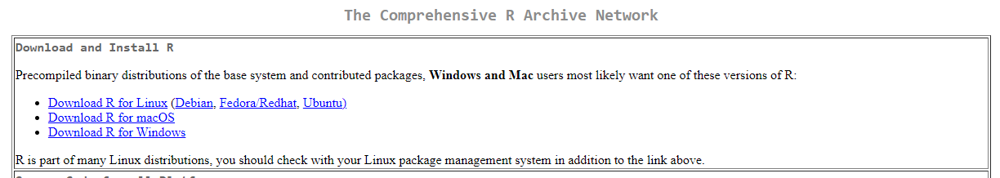
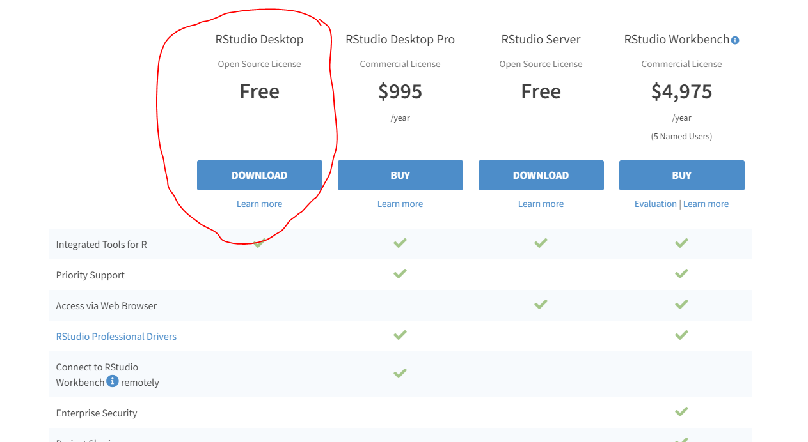
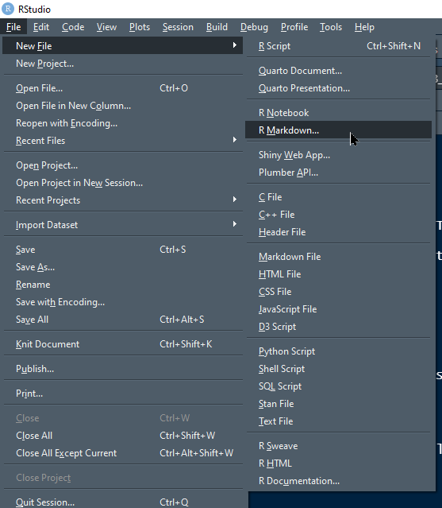
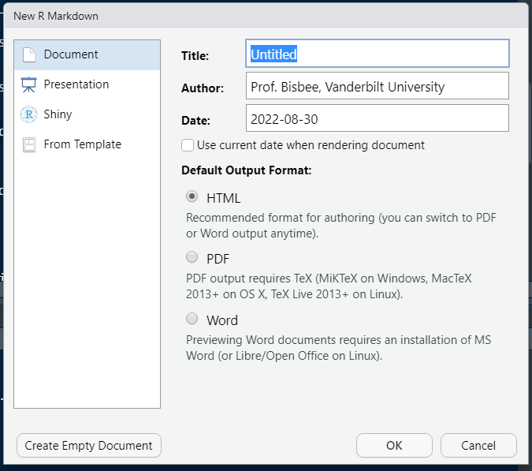
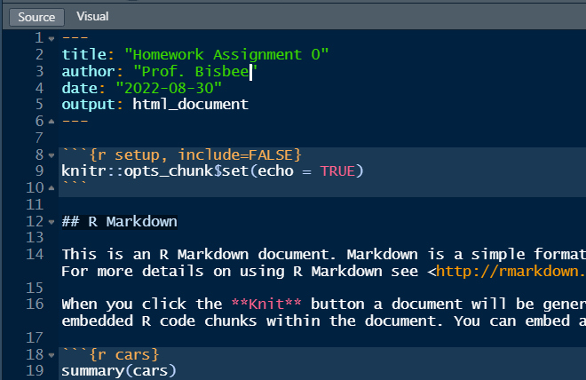
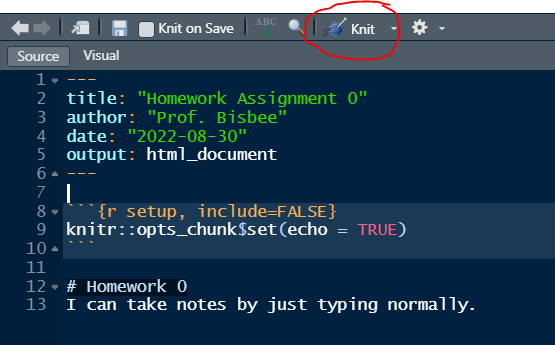
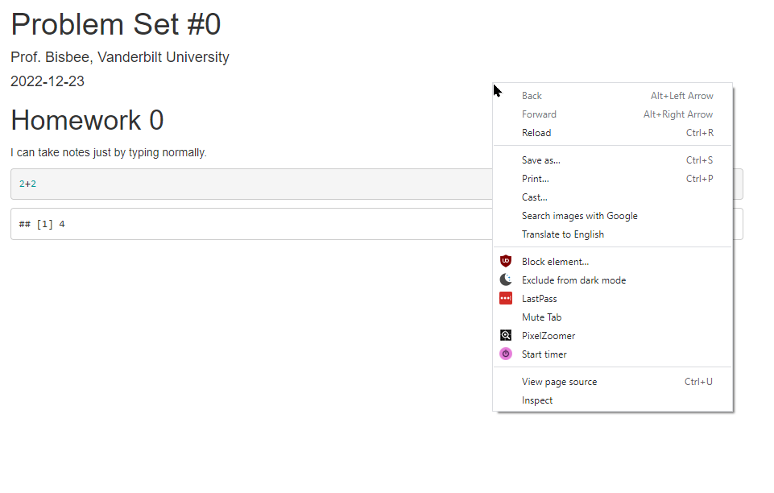
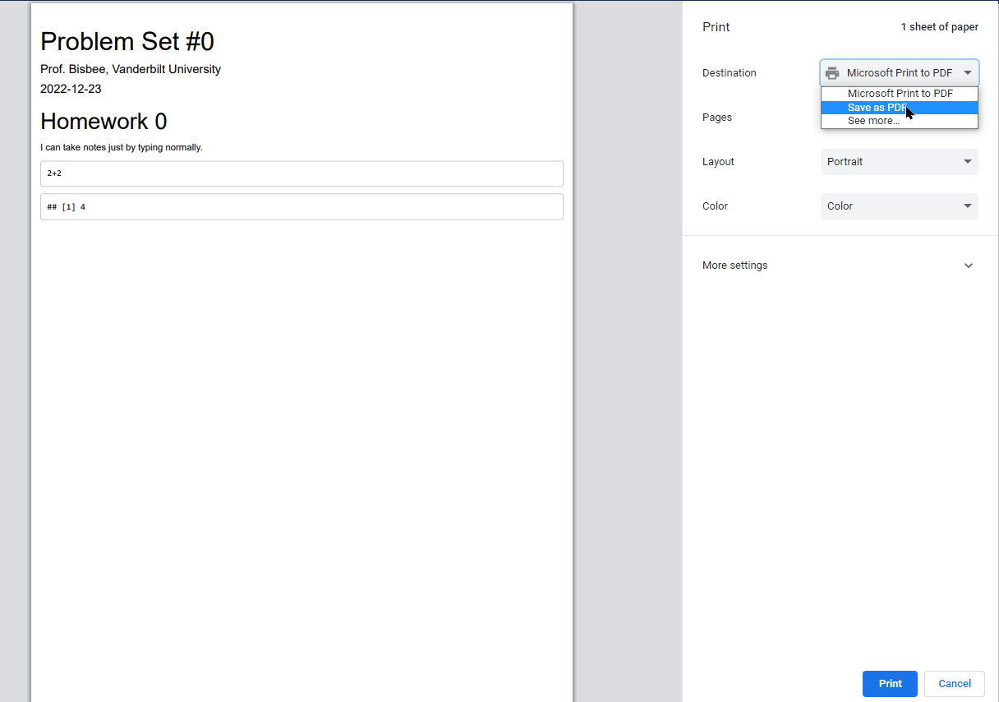
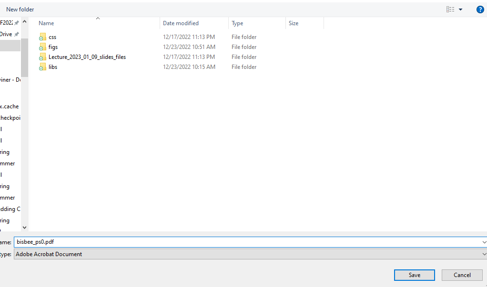

---
output:
  html_document: default
---

##  Problem Set 0: Getting Set Up!

The rest of the semester will see you working on data science questions using `R`. As such, your first homework assignment is:

1. Install `R` on your computer.
2. Install `RStudio` on your computer.
3. Create a `directory` (i.e., a folder with a set of subfolders) for this class.
4. Create a new `.Rmd` file and `Save as...`.
5. Modify the `.Rmd` file and `knit` it.

## 1. Installing R

`R` is going to be the only programming language we will use. `R` is an extensible statistical programming environment that can handle all of the main tasks that we'll need to cover this semester: getting data, analyzing data and communicating data analysis.

Download R here: <https://cran.r-project.org/>. Make sure to choose the version that works with your operating system!

<center></center>

## 2. Installing RStudio

When we work with `R`, we communicate via the command line. To help automate this process, we can write scripts, which contain all of the commands to be executed. These scripts generate various kinds of output, like numbers on the screen, graphics or reports in common formats (pdf, word). Most programming languages have several **I** ntegrated **D** evelopment **E** nvironments (IDEs) that encompass all of these elements (scripts, command line interface, output). The primary IDE for R is RStudio.

Download RStudio here: <https://rstudio.com/products/rstudio/download/>. You need the free RStudio desktop version.

<center></center>

## 3. Setting up Directories

In each class, we're going to include some code and text in one file, and data in another file. You'll need 
to download both of these files to your computer. You need to have a particular place to put these files. Computers are organized using named directories (sometimes called folders).  Don't just put the files in your Downloads directory. One common solution is to created a folder on your computer named after the class: `ds_1000`. 

You could just throw everything related to the class into this folder. However, this will quickly get messy. I recommend you create a "sub-folder" (or "sub-directory") within `ds_1000` called `Lecture_1`. (You might also want to create similar sub-folders for `Lecture_2`.) Inside `Lecture_1`, create two additional sub-folders: `code` and `data`. When you're done, your class directory should look like this:

```
- ds_1000
  - Lecture_1
    - code
    - data
```

## 4. Create an `.Rmd` file

Open `RStudio`, then create a new `.Rmd` file. To do this, click on `File` &rarr; `New File` &rarr; `R Markdown...`.

<center></center>

### Settings for `.Rmd` file
You will then be asked to determine a bunch of settings for this `.Rmd` document. For example, you can choose whether you want to create a "Document", "Presentation", "Shiny", or "From Template" on the left. You can set the "Title:" "Author:" and "Date:" on the top-right. And you can choose the "Default Output Format:" to be either "HTML", "PDF", or "Word". You should **not change any of these settings**. Their defaults ("Document", "Untitled", "[Your name]", "[Today's Date]", and "HTML") are sufficient. Just click "OK".

<center></center>

### Saving `.Rmd` file
This will open a new `.Rmd` file! Now you should change the title of the file to "Homework Assignment 0" and the author to your name. You should then save the file in your `code` folder with the file name `[Last Name]_PS0.Rmd` by clicking `File` &rarr; `Save As...`.

<center></center>

## 5. Modify and `knit`
Now, **delete all of the default text** in your `.Rmd` file from line 12 down to the bottom. Then write the following on line 12:

```
# Problem Set 0
I can take notes by just typing normally.
```

Now let's `knit` the file by clicking the `Knit` button on the top of the window. You should see a new window pop-up that shows the processed code! This `.html` document should also appear in your `code` folder with the same file name as your `.Rmd` file.

<center></center>

### Inserting R Code
The final part of the homework assignment is to insert a `chunk` of `R` code. On line 15 type the following:

````{verbatim}
```{r}
2+2
```
````

Then `knit` a final time and open the .html file that is created in your `code` folder. It should be called [Your Last Name]_PS0.html. You should open this in Google Chrome, and then right-click anywhere on the opened file and click "Print...".


<center></center>


Then choose "Save as PDF..."

<center></center>

and save it as `[Your Last Name]_ps0.pdf`. 

<center></center>


Finally, upload the PDF to Brightspace under the Problem Set 0 assignment!
